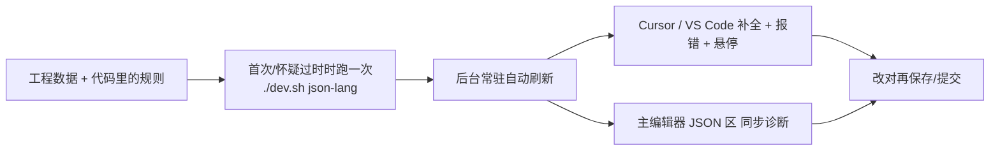

# JSON 即语言

雾津大量内容写在 JSON 里——任务、场景、动作、条件、各种 id 引用。纯文本编辑容易**拼错 id、填错字段、漏必填、删错东西没人告诉你还有地方在用**。**JSON 即语言**把工程里真实的数据规则"烤"进一份随时更新的活规范，让你在 **Cursor / VS Code**（以及主编辑器里带提示的 JSON 区）获得自动补全、实时报错、中文旁注、一键查引用、安全改名这一整套写作辅助——本页只讲"这对你写内容有什么用"，不讲它内部怎么实现。

---

## 这是什么（30 秒看懂）

把它想成一个**贴身校对**：你在 JSON 里打字，它比人眼更快地帮你盯着三件事——"这个字段该填的类型对不对""这个 id 在工程里真的存在吗""这一类内容必填的东西你漏了没有"。发现问题它会当场用波浪线标出来，不用等你保存、更不用等到进游戏才发现某个 NPC id 写错了。

比如你在写一条任务的奖励动作，刚打出"给予物品"这个动作类型，后面该填哪些参数、"物品 id"下拉里有哪些合法选项，它立刻列给你看，不用去翻物品表数字对数字地核对。你要把某个 NPC 改名，它能告诉你"这个 id 在场景里用了 3 处、对话图里用了 2 处"，改名前心里有数，不会改漏。

它**不替代**任何一道正式的保存校验——主编辑器的保存规则、正式的数据校验仍然是最终裁决。它做的是把这些问题**提前到你打字的那一刻**就看见，而不是等保存、等跑校验、甚至等进游戏才炸出来。

---

## 入门：手把手用上它

1. 确认已经按项目说明装好了本机的开发环境，并且给 Cursor / VS Code 装过一次项目提供的编辑器插件（这是唯一需要在电脑上手动装一次的东西，装好后长期有效，不用每次都重装）。
2. 命令行跑一次 `./dev.sh json-lang`，让规范根据当前工程的最新代码和数据重新生成一遍。日常开发时不需要手动反复跑这个命令——只要编辑器/工具在改数据，语言服务会在后台自己盯着文件变化，过几秒自动跟上；这个命令主要在**换了台新机器第一次用**、或者**怀疑补全列表过时**时手动兜底跑一遍。
3. 打开工程里任意一份内容 JSON（比如某个任务、某个场景），试着在动作字段里打字——应该能看到动作类型的下拉候选，选中一种类型后，后面该填的参数会自动列出来，且只显示这一类动作合法的字段，不会把别的动作类型的参数也混进来。
4. 故意填一个不存在的 NPC id，保存前就应该能看到红色或黄色的波浪线提示"这个引用查无此 id"。
5. 鼠标悬停在某个 id 上，应该弹出一张小卡片：这个 id 的中文名是什么、属于哪一类内容、大概在哪定义的。
6. 想知道某个 id 被谁用到——用编辑器提供的"查引用"功能（也可以在主编辑器 Tools 菜单里找到"查引用（JSON 语言）"入口），会列出工程里所有引用它的位置，改名或删除前先看一眼，心里有数再动手。
7. 主编辑器里也有带提示的 JSON 编辑区，改完哪怕还**没点保存**，语言服务这边也已经能看到这些改动——补全、悬停、查引用都会立刻反映你正在编辑的内容，不用先存盘才生效。

---

## 进阶：把每一项都讲透

**自动补全帮你少手打**
- **字段名与动作/条件类型**：写动作数组、条件表达式时，合法的类型名会作为下拉候选出现，不用死记有多少种动作、多少种条件。
- **id 引用的下拉**：物品、任务、场景、出生点、NPC、旗标键、过场、小游戏、对话图、档案条目、音频、气味、位面、信号……这些 id 字段都能弹出工程里真实存在的候选列表，不用打开对应的数据表去数着抄。
- **一键插入完整骨架**：在动作列表、条件区域可以一键插入一个带好必填参数占位的完整模板，照着占位填就不会漏掉某个必填字段。
- **中文旁注**：补全候选旁边直接显示这个 id 的中文名（比如"铜钱""茶馆""玩家魔法名"），不用凭 id 硬猜它是什么。

**实时报错帮你当场发现问题**
- **类型不对**：该填数字的地方填了文字之类的低级错误，当场标红。
- **必填缺失**：这一类内容规定必须填的字段没填，当场提示。
- **引用不存在（悬垂引用）**：填的 id 在工程里查无此人，当场标出，不用等运行时才发现"这个 NPC 找不到"。
- **跨字段收窄检查**："选了场景 A，却填了场景 B 的出生点"这种张冠李戴，也会当场报——比如场景确定后，热区/区域/出生点这些引用只会收窄到该场景内部的选项；某类条目的类型确定后，后续字段只收窄到该类型合法的取值范围。
- **叙事状态与剧本阶段收窄**：填叙事图 id 后，对应的状态字段只会显示这张图声明过的状态；填剧本 id 后，阶段字段只显示这个剧本声明过的阶段。这类"改名/删状态后遗留的死引用"，过去往往要等到运行时才报，现在打字当场就能看到。

**跳转与查找，改名前先看清楚影响面**
- **跳转定义**：按住功能键点一个 id，直接跳到它大概的定义位置（对应条目、场景文件、图文件、旗标登记处等），不用自己在工程里翻着找。
- **全项目查引用**：给一个 id，列出工程里所有引用它的地方（包括结构化字段引用，也包括藏在富文本标签里的引用），删除、改名前评估影响面用得上，比自己一个个文件搜靠谱。
- **按 id 或中文名全局搜索**：不确定某个东西准确的 id 拼写，直接按中文名也能搜到并跳转，省去来回切换数据表核对拼写的功夫。
- **全文子串搜索**：想找"哪里出现过这段文字/这个数字"，可以对整个工程的数据做一次子串搜索，命中位置会给出上下文和精确定位，主编辑器的"全局搜索"用的也是这一套。

**安全改名（F2）**
- 对一批"安全"的实体类型（比如物品、任务、规矩、遭遇、商店、长按类、信号提示、文档揭示、气味、位面、旗标静态键、档案条目、剧本、音频键、过场 id 等），可以用编辑器的重命名功能一次性改掉这个 id 在全工程里的所有引用，改完自动生成可撤销的编辑，不需要你一个个文件手动替换。
- 有些类型**故意不支持**这种一键改名（比如场景/对话图/小游戏——它们的 id 和文件名绑得比较死；叙事实体、出生点——涉及更复杂的关联关系；叙事图——它对外广播的信号名是派生出来的），改这些类型的 id 需要走专门的实体重构流程，语言服务会明确告诉你去哪，而不是硬改导致工程出岔子。
- 改完之后建议再跑一次工程的数据校验兜底，双重保险。

**对话图连边检查**
- 除了字段本身对不对，还有一类问题是"结构对不对"——对话图里一条连边指向了不存在的节点、某个外部入口指向了一个进不去的图、有节点从任何入口都走不到——这些过去属于主编辑器保存校验也抓不到的盲区，现在能在打字阶段就被检查出来：断边和悬空的外部入口会报成错误，走不到的节点会报成提醒级别的警告。

**它怎么"知道"你正在写什么，还没保存的内容会不会被忽略**
- 语言服务是**常驻**在后台盯着的，不需要你每改一次数据就手动重建一次规范；工程数据变化后，它会在后台自己感知到并重新计算，通常几秒内新补全就跟上了。
- 更关键的是：**你在主编辑器里还没点保存的改动，语言服务这边也已经能看到**——刚新建的一个物品，哪怕还没存盘，补全候选里立刻就能选到它；反过来说，也正因为这样，"编辑器里改了但还没存盘""语言服务里已经能查到"这两件事是一致的，你可以放心地一边改一边看提示，而不用担心提示还停留在存盘前的旧状态。

**它不做什么、和正式校验门的关系**
- 它**不做**"信号生产和消费是否对得上"这类更深的运行时语义校验——这类检查工程里已经有专门的机制在管，语言服务不重复造轮子。
- 它是**打字时的提前预警层**，不是**最终裁决者**——真正决定内容能不能存、能不能进游戏的，仍然是主编辑器的保存规则和正式的数据校验流程。语言服务报的问题里，有的是错误级别（基本可以确定有问题），有的是警告级别（值得留意但不一定真的错），具体以正式校验结果为准。

**和别的工具/面板配合**
- 补全里出现的动作类型、条件类型，和[怎么编排动作](../concepts/actions)、[怎么设条件](../concepts/conditions)里讲的是同一套概念，写这两类内容时配合看效率更高。
- 校验结果不能代替[危险区](../concepts/danger-zone)里说的保存规则——语言服务说"格式对了"，不代表专用面板保存时不会重建丢掉某些字段，两者是两回事，都要留意。
- 只在外部编辑器里改完 JSON 是不够的——如果这份内容也要给游戏用，记得回主编辑器里对应面板 Apply 一下，游戏运行时读的是主编辑器落盘的那份。

---

## 什么时候用它 / 和别的工具配合

| 情况 | 建议 |
|---|---|
| 刚拉最新代码，或者别人改了数据规则 | 手动跑一次 `./dev.sh json-lang` 兜底刷新 |
| 手写一长串动作/条件 | 靠补全和收窄，不用死记字段名和合法取值 |
| 要删 NPC、改任务 id | 先用查引用看清楚影响面，再动手改 |
| 图对话保存时报错 | 先看诊断是字段问题还是连边结构问题，两者提示位置不同 |
| 只是改台词文本本身 | 不一定需要，除非这句台词本来就嵌在结构化字段里 |

**边界与当心**
- 长时间没跑构建，且怀疑补全列表过时（比如刚拉了别人加了一堆新 id 的分支）：手动跑一次刷新命令。
- 忽视黄色/红色提示：能保存不代表游戏一定能正常运行，尤其是警告级别的提示，值得抽空看一眼。
- 和[危险区](../concepts/danger-zone)是两回事：语言服务校验通过，不代表某个专用面板保存时不会把你手写的额外字段悄悄抹掉。
- 只在外部编辑器里改完记得回主编辑器同步：语言服务能看到你的改动不等于游戏能读到，游戏读的是主编辑器落盘的数据。

---

## 常见问题

**Q：为什么我明明加了新物品，补全列表里却搜不到？**
A：语言服务通常几秒内会自己感知到数据变化并刷新；如果等了一会还是没有，手动跑一次 `./dev.sh json-lang` 兜底刷新一遍。

**Q：红色波浪线和黄色波浪线有什么区别？**
A：大体上红色代表比较确定的问题（比如引用查无此 id、结构上的断边），黄色更多是提醒级别（比如某个节点当前走不到但不一定是错误），具体轻重程度以实际提示文案为准。

**Q：改名功能为什么有的 id 能一键改，有的不行？**
A：能一键改的是关联关系相对简单、不牵涉文件名或跨文件耦合的类型；场景、对话图、小游戏这类和文件名绑得比较死，叙事图这类涉及派生的广播信号名，语言服务故意不做一键改名，避免帮倒忙，会提示你走专门的流程处理。

**Q：主编辑器里的 JSON 区和外部编辑器（Cursor/VS Code）看到的提示是不是两套？**
A：不是，两边背后依据的是同一份实时规则，你在主编辑器里改动即使没保存，语言服务这边也已经能感知到，诊断结果是一致的。

**Q：语言服务说"格式对了"，为什么进游戏还是有问题？**
A：语言服务只做打字阶段的提前预警，不是最终裁决——真正决定内容是否有效的仍然是正式的数据校验和主编辑器保存规则，两者不完全等价，遇到这种落差应以正式校验结果为准。

---

## 相关

- [危险区](../concepts/danger-zone)
- [怎么编排动作](../concepts/actions)
- [怎么设条件](../concepts/conditions)
- [工具打开方式](../launch-architecture)
