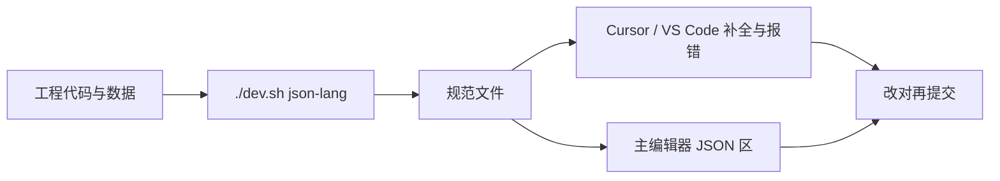

# JSON 即语言

雾津大量内容写在 JSON 里——任务、场景、动作、条件。纯文本编辑器容易 **拼错 id、填错字段、漏必填**。**JSON 即语言** 把工程里的真实数据 **烤进一份活的规范**，让你在 **Cursor / VS Code**（以及主编辑器里带提示的 JSON 区）获得：

- **自动补全**：字段名、枚举值、引用 id 下拉可选。
- **实时报错**：类型不对、必填缺失、引用不存在，红线标出。
- **中文旁注**：悬停看字段什么意思。
- **跨字段收窄**：选了某个动作类型，后面参数只出现该类型合法字段。

不讲底层怎么实现——你只需知道 **怎么构建、怎么在写稿时受益**。

---

## 干什么

- **构建规范**：根据当前工程代码与数据，生成/更新 JSON 规范文件。
- **编辑时补全**：写 `actions`、`conditions`、各种 id 引用时少手打。
- **编辑时报错**：保存前就发现「这个 NPC id 不存在」。
- **查引用**：给定一个 id，列出工程里哪些地方用到（方便改名前评估影响）。
- **图连线检查**（可选）：对话图、叙事图里断边、悬空节点等结构问题。

主编辑器内嵌预览时，**未保存**的改动也会同步给语言服务，改完立刻见诊断。

---

## 怎么开

**构建规范（改完数据类型或大批量加 id 后建议跑一遍）**

```bash
./dev.sh json-lang
```

等价于执行工程里的 schema 构建流程；终端跑完即更新规范。

**日常写作**

- 在 **Cursor / VS Code** 打开工程 JSON，确保已启用项目推荐的扩展与设置（首次克隆后按仓库说明装一次即可）。
- 或在 **主编辑器** 里编辑带下划线的 JSON 字段，看补全与波浪线报错。

**查某 id 被谁引用**

在终端用项目提供的引用查询命令（参数为要查的 id），输出所有引用位置——改名、删条目前先跑这个。

---

## 一步步：新人怎么用上

1. 克隆雾津工程，按 README 装好 Python / Node 环境。
2. 跑一次 `./dev.sh json-lang`，生成最新规范。
3. 用 Cursor 打开 `data/` 下任意 JSON，试输入 `"type":` 看是否弹出动作/条件枚举。
4. 故意填错 NPC id，看是否报「未知引用」。
5. 改了大量角色 id 后，再跑 `./dev.sh json-lang`，补全列表跟着更新。
6. 主编辑器改场景 NPC，未保存时预览区旁若已有诊断，先清红再 F5。

---

## 何时用

| 情况 | 建议 |
|---|---|
| 刚拉代码 / 别人改了数据模式 | 跑 `./dev.sh json-lang` |
| 手写一长串 actions | 靠补全和收窄，别硬背字段 |
| 删 NPC、改任务 id | 先查引用，再改 |
| 图对话存盘报错 | 看诊断是字段问题还是图结构问题 |
| 纯改台词文本 | 不一定需要，除非台词在 JSON 结构里 |

---

## 当心什么

| 当心 | 说明 |
|---|---|
| 未构建规范 | 补全列表过时，新 id 没有 |
| 忽视黄线/红线 | 能保存不代表游戏能跑 |
| 与 [危险区](../concepts/danger-zone) 叠加 | 校验通过仍可能被专面板保存时重建丢字段 |
| 只在外部编辑器改 | 记得主编辑器 Apply，否则游戏读不到 |

---

## 工作流



---

## 雾津例子

1. 在任务 JSON 里加 `giveItem` 动作，补全弹出合法 `itemId`，选「油纸伞」避免手打错别字。
2. 条件写 `questState`，收窄后只显示该任务合法状态枚举。
3. 要把 `guan_ergou` 改成 `guan_ergou_v2`，先查引用——场景 3 处、图对话 2 处，改全再构建。
4. 叙事图迁移缺 `to` 目标，图级检查报断边，保存前修好。

---

## 和相关工具怎么配合

| 工具 / 概念 | 关系 |
|---|---|
| [主编辑器](../main-editor/overview) | 内嵌编辑同步诊断 |
| [危险区](../concepts/danger-zone) | 校验不替代危险区保存规则 |
| [动作](../concepts/actions)、[条件](../concepts/conditions) | 补全内容与这些概念对齐 |

---

## 相关

- [危险区](../concepts/danger-zone)
- [怎么编排动作](../concepts/actions)
- [工具打开方式](../launch-architecture)
