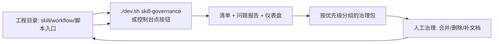

# Skill/Workflow 治理台

雾津工程里除了游戏内容，还有一批给 **AI Agent / 自动化** 用的 **Skill、Workflow、命令行入口**——散落在各种文件里，时间一长谁在用、是否过期、有没有和别的东西重复，谁也说不清。**治理台**扫描整个工程，生成一份可审计的清单、一份问题报告、一个浏览器仪表盘，并且顺带给 Agent 准备好一份"工作台快照"，让人和 Agent 都能一眼看懂当前的自动化版图。

---

## 这是什么（30 秒看懂）

把它想成一次**工程体检**：治理台跑一遍，把工程里所有"给 Agent 用的能力入口"（不管它是写成 Skill 文档、Workflow 说明，还是一个脚本、一条 `package.json` 里的命令）都扫出来，列成一张清单，再挑出里面看着有问题的项——比如引用的路径已经不存在了、文档写得含含糊糊没写清楚触发条件、两个 Skill 看起来在做同一件事。扫描结果落在一份报告和一个网页仪表盘里，供你决定"哪些该合并、哪些该删、哪些该补文档"。

它和游戏内容**完全无关**——不会在这里找到任务、场景这类配置，纯粹是工程自身"自动化能力"的治理工具，日常写雾津剧情内容不需要碰它，是给管理和维护这批工具/Skill 的人用的。

---

## 入门：手把手做第一次

1. 命令行跑 `./dev.sh skill-governance`，工具会扫描一遍工程，结束后自动尝试打开生成好的浏览器仪表盘；也可以先 `./dev.sh console` 打开 Web 控制台，再点"Skill/Workflow 治理"按钮，控制台会自动跑一遍扫描并打开仪表盘。
2. 等终端打印"扫描完成"和报告路径，浏览器如果没自动弹出，就按终端给出的路径手动打开仪表盘页面。
3. 仪表盘顶部是**清单（Inventory）**——所有扫描到的 Skill、Workflow、脚本入口、项目命令，按类型分类列出。
4. 往下是**问题（Issues）**——扫描过程中发现的确定性问题和低置信度风险，按严重程度（错误/警告/提示）排好序，方便你优先处理最要紧的。
5. 再往下是**治理包**——把零散的问题按优先级分组打包成一批批"治理任务"，不用你自己从一条条原始问题里归纳该先做什么。
6. 对着标记出的异常项，回工程里改文件、合并重复的、删掉确认没人用的，或者补一下缺失的说明和触发条件。
7. 改完之后**再跑一遍**治理台，确认仪表盘已经反映最新状态——仪表盘是扫描那一刻的快照，中间改了文件不会自动更新。

---

## 进阶：把每一项都讲透

**仪表盘看什么**
- **清单（Inventory）**：所有扫到的东西按类型摊平列出——文档形式的 Skill、流程说明性质的 Workflow、脚本入口、项目命令，方便你一眼看总量和分布。
- **问题（Issues）**：具体问题按严重程度排序——确定性的问题（比如引用的文件路径已经不存在）排得更靠前，低置信度的风险（比如"这两个东西看起来可能重复，但不确定"）排在后面供你自行判断。
- **治理包**：把原始问题按优先级分组打包，不需要你自己逐条问题去想"这一堆到底先处理哪个"，直接按包处理效率更高。
- **证据库**：保留最原始的问题列表，方便你需要的时候把某一条具体证据完整地引用给同事或者 Agent 看，而不是只看归纳后的结论。
- **Agent Workbench（工作台）**：仪表盘上方专门有一块"Agent 的工作环境快照"区域，展示当前registered 的应用、可读的资源、可调用的工具、以及配好的提示词模板，你可以在这里启用/停用某个应用、添加自定义应用。这一块不是给你看的静态报告，而是给后续要接手治理任务的 Agent 用的"上下文说明书"。
- **Agent 原始输出**：如果你用页面上的 Agent 执行入口让 Codex / Claude 等外部命令行 Agent 实际去处理某个治理任务，它们的原始输出会显示在这里，方便你核对 Agent 到底做了什么、有没有跑偏。

**扫描范围（它到底看了哪些地方）**
- 各家风格的 Skill 说明文件（Cursor / Claude / Codex 各自的 Skill 目录）、项目级的说明文档（比如给 Agent 看的总纲性文档）、CI 相关的工作流配置、文档目录里带"流程/checklist/指南"这类关键词的页面、各工具自己的说明文件、脚本目录、项目命令列表，都在扫描范围内。
- 换句话说，凡是"教 Agent 或人怎么用某个自动化能力"的文字和入口，理论上都逃不过这次扫描——这也是它能发现"重复""过期""缺触发条件"这类问题的原因：它看得比任何一个人脑子里记的都全。

**"过期""滞后"是怎么判断的**
- 报告里的"久未更新"提示，靠的是一个可调的天数阈值——超过这个天数没更新的条目会被标出来提醒你看看是不是已经没人维护了；这个阈值可以调大调小，调成 0 就是关掉这条提示，不想被这类提醒打扰时可以让项目负责人帮你改。
- 另一类提示是"文档可能落后于它引用的文件"——判断依据是文档和它引用的实际文件谁的修改时间更新，同样有一个可调的天数窗口，超过这个窗口的落差才会被标记，避免文档和代码差几分钟就被误报。
- 这两类阈值都不是写死的，具体怎么调找项目负责人，本页不建议自己随手改，避免不同人跑出来的报告口径对不上。

**Agent Workbench 具体在干什么**
- 它相当于把仪表盘变成一个"Agent 也能看懂的画布"：里面登记着哪些**应用**（内置的治理应用，或者外部接入的命令/MCP 应用）当前是启用状态，哪些结构化**资源**可以被读取（比如整体概览、当前筛选状态、按包分组的治理任务、原始问题列表），哪些**工具**动作可以被调用（比如重新扫描、读取某个资源、打开某处源码定位、应用一次修补、添加一个自定义应用），还有一批**提示词**模板（治理总览、自动/需确认分流、修复计划，以及每个治理包对应的专属提示词）。
- 当你在页面上把任务发给 Codex / Claude 处理时，页面会把你当前选中的引用、筛选条件、启用的应用，连同这些资源/工具/提示词一起打包进发给 Agent 的上下文——Agent 不需要靠猜、也不需要靠截图来理解这个仪表盘里到底有什么，直接拿到的就是结构化信息。

**给外部 Agent client 的稳定入口**
- 除了页面本身，工具还准备了一份专门给 Codex / Claude 这类命令行 Agent 读的稳定文档，每次扫描完都会自动刷新，里面写清楚了客户端的工作边界、各类产出文件在哪、可用的资源和工具清单、每个治理包对应的提示词摘要。
- 支持标准 MCP 协议的客户端也可以直接连接治理台提供的一个**stdio MCP server**，通过标准的资源读取、工具调用、提示词获取接口访问同一批数据，不需要额外再学一套接口约定。

**写入边界（什么能自动改、什么只能人工改）**
- 治理台默认是**只读分析**模式——扫描、生成报告、给建议，不会自己动手改你的工程文件。
- 只有在你明确切到"允许修改"的模式下，Agent 才被允许在工程范围内修改被引用到的治理项（比如帮你合并重复的 Skill 说明、补一段缺失的触发条件描述）；修复完成后控制台会自动重新跑一遍扫描，刷新诊断结果，让你立刻看到修复有没有生效。
- 这道边界是硬性的——不管是人还是 Agent，都不会绕开"只读分析"和"允许修改"这两种模式的区分。

**和别的工具/面板配合**
- 和[JSON 语言服务](./json-lang)是完全不同的两件事：一个管游戏内容用的 JSON 数据怎么写得对，一个管工程里的 Skill/Workflow 治理，各管各的，不要混着找问题。
- 是[Web 控制台](../concepts/web-console)上众多按钮里的一个，控制台本身不是治理台的替代品，只是另一个进入它的入口。

---

## 什么时候用它 / 和别的工具配合

| 情况 | 建议 |
|---|---|
| 新同事问"项目里有哪些自动化能力" | 直接打开仪表盘指给他看，比口头解释清楚 |
| 重构 Skill/Workflow 目录结构 | 改动前后各扫一次，对比问题数量和分布的变化 |
| 怀疑某个 Workflow 已经没人在用 | 报告里的"久未更新"和引用线索能提供判断依据 |
| 日常改雾津剧情内容 | 不需要开，这是工程治理向的工具，和游戏内容无关 |
| 要让 Agent 批量处理一堆治理任务 | 用页面上的治理包+Agent 执行入口，比一条条手动改快 |

**边界与当心**
- 仪表盘是**扫描那一刻的快照**：扫完之后你又改了文件，仪表盘不会自动跟着变，需要重新跑一遍。
- 报告本身**不会自动修工程**：只读模式下纯粹是盘点和建议，删改仍然需要人（或明确切到允许修改模式的 Agent）动手。
- 路径改动没有及时重新扫描：仪表盘会一直显示旧路径，直到你重新跑一次扫描。
- 和游戏数据无关：不要在这里找任务、场景这类配置，找错地方。

---

## 常见问题

**Q：治理台会不会自己把我的 Skill 文件删掉或改乱？**
A：默认是只读分析模式，不会自动改动任何文件；只有明确切到允许修改的模式，Agent 才能在工程范围内修改被引用到的治理项，且修复后会自动重新扫描让你立刻核对结果。

**Q："久未更新"的阈值能不能自己调？**
A：能，这是一个可调的天数参数，调大调小甚至关掉都可以，具体怎么改找项目负责人帮你处理，避免团队里每个人各调各的导致报告口径不一致。

**Q：仪表盘上的"证据库"和"问题"有什么区别？**
A："问题"是按严重程度排好序的归纳结果，"证据库"保留的是更原始的问题列表，需要把某条具体依据完整引用给同事或 Agent 时用证据库里的条目更准确。

**Q：Agent Workbench 是不是就是仪表盘换了个名字？**
A：不是，仪表盘的清单和问题部分是给人看的静态报告；Agent Workbench 是专门给后续接手处理的 Agent 用的结构化上下文快照，两者互补，不是同一个东西。

**Q：多久应该跑一次治理台？**
A：没有固定频率，通常在"新增了一批 Skill/Workflow""怀疑有重复或过期内容""要给新同事讲解自动化版图"这几种情况下跑一次最划算，日常写游戏内容不需要惦记它。

---

## 相关

- [Web 控制台](../concepts/web-console)
- [JSON 语言服务](./json-lang)
- [工具打开方式](../launch-architecture)
