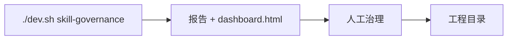

# Skill/Workflow 治理台

雾津工程里除了游戏内容，还有一批给 **AI Agent / 自动化** 用的 **Skill、Workflow、入口脚本**——文件散在各处，久了谁在用、是否过期说不清。**治理台** 扫描整个工程，生成 **报告 + 浏览器仪表盘**，让你一眼看到有哪些能力、路径在哪、健康度如何。

---

## 干什么

- **扫描**工程内 Skill、Workflow、Agent 相关入口。
- **生成报告**（含可打开的 `dashboard.html` 汇总页）。
- **仪表盘查看**：分类、状态、依赖关系（以页面展示为准）。
- 供 **人** 做治理决策：合并重复的、删掉废弃的、补文档链接。
- 也可被 **Agent** 通过 MCP 类接口查询（你用浏览器看仪表盘即可，不必自己起 MCP）。

---

## 怎么开

**方式一：命令**

```bash
./dev.sh skill-governance
```

执行后会扫描并尝试 **自动打开** 仪表盘页面。

**方式二：Web 控制台**

```bash
./dev.sh console
```

点 **Skill/Workflow 治理**（或控制台里同名按钮）。

---

## 一步步怎么用

1. `./dev.sh skill-governance` 或控制台点按钮。
2. 等待终端显示扫描完成、报告路径。
3. 浏览器打开 **仪表盘**（若未自动弹出，按终端给出的 `dashboard.html` 路径打开）。
4. 按分类浏览：哪些 Skill、哪些 Workflow、是否缺描述、是否重复。
5. 对标记异常项回工程改文件或归档，必要时更新团队索引文档。
6. 大改 Skill 布局后 **再跑一遍** 治理台，确认仪表盘已更新。

---

## 何时用

| 情况 | 建议 |
|---|---|
| 新同事问「有哪些自动化能力」 | 开仪表盘指给他 |
| 重构 tools / skills 目录 | 改前改后各扫一次对比 |
| 怀疑某 Workflow 已无人用 | 报告里查引用与最后修改线索 |
| 日常改雾津剧情 | 不必开；这是工程治理向 |

---

## 当心什么

| 当心 | 说明 |
|---|---|
| 仪表盘是快照 | 扫完才新；中间改文件要重扫 |
| 报告不自动修工程 | 只盘点，删改仍须人手 |
| 路径变动未提交 | 仪表盘仍显示旧路径直到重扫 |
| 与游戏数据无关 | 别在治理台里找任务/场景配置 |

---

## 工作流



---

## 雾津例子

1. 策划不管这块；程序在加「视频转动画」新 Workflow 后跑治理台。
2. 仪表盘显示与旧「抽帧」Skill 重复，合并为一个入口。
3. 废弃的 chronicle 实验 Skill 标红，确认无人调用后删目录。
4. 下次 onboarding 直接发仪表盘链接，新人 10 分钟摸清自动化版图。

---

## 和相关工具怎么配合

| 工具 | 关系 |
|---|---|
| [Web 控制台](../concepts/web-console) | 另一键入口 |
| [JSON 即语言](./json-lang) | 各管各的：一个管游戏 JSON，一个管 Skill/Workflow |

---

## 相关

- [Web 控制台](../concepts/web-console)
- [工具打开方式](../launch-architecture)
