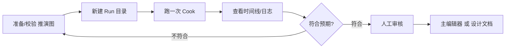

# 编年史 v3

**编年史 v3** 用**节点图**描述世界规则和事件链，在**命令行**里跑推演——适合已经把逻辑画成图、要**批量、可脚本化**跑模拟的场景。没有 v2 那种大 GUI，主打"图 + 命令行"这条更硬核、更适合接进自动化流程的路线。

:::caution[任务名易混]
`./dev.sh chronicle-sim` 打开的是 **v3**（本页，不带版本号）。要 **v2 桌面 GUI** 请用 `./dev.sh chronicle-sim-v2`（[编年史 v2](./chronicle-sim-v2)）。控制台上也是分开的两个按钮——"编年史 v3" 和 "编年史 v2"。
:::

---

## 这是什么（30 秒看懂）

如果说编年史 v2 是"摆几个角色、按周看他们自己演"，编年史 v3 更像"你自己先把世界运转的规则画成一张流程图，再让命令行按这张图跑"。你在图里用不同类型的节点表达"什么条件下触发什么事件""谣言怎么在角色之间传播""角色关系怎么随事件变化"，图画好之后整个推演过程都是**可重复、可脚本化**的——同一张图、同样的输入，理论上能重复跑出可对照的结果，这一点是 v2 那种"让语言模型自由发挥"路线做不到的。

它没有可视化编辑图的窗口——图本身通常在专门的图编辑工具或数据文件里维护（具体走哪条路问项目维护者），v3 负责的是"拿到图之后怎么跑、怎么看结果、怎么管理一次次的运行"。

---

## 入门：手把手做第一次

1. 准备好一份**推演图**（可以从模板复制一份雾津相关的示例图开始，不熟悉图节点语义时不要自己盲改，先问项目维护者）。
2. 命令行跑 `./dev.sh chronicle-sim`，不带任何参数时会进入帮助界面，列出所有可用的子命令分组：**Run 目录管理**、**Graph 文件管理与校验**、**Node 注册表查询**、**Cook 执行与管理**、**Agent 路由/调用/用量/审计**、**Provider（API 提供商）管理与 ping**、**LLM 路由（开发调试入口）**。
3. 先建一个**Run 目录**（一次实验的容器，会在里面生成配置文件），给它起个显示名，方便后续区分是哪一次实验。
4. 用**Graph 管理**子命令校验一下你准备的推演图有没有明显错误，避免带着错误图直接跑。
5. 在这个 Run 目录下对指定的图跑一次**Cook**（也就是执行一轮推演），可以带上一些顶层输入参数。跑起来后终端会打印这次执行的 **cook id**、状态和产出的输出。
6. 用 Cook 相关的查询子命令看这次执行产出的**时间线**和**日志**，对照预期检查触发的事件、走过的分支是否符合设想。
7. 如果某次 cook 中途出问题，可以用 **cook id** 让它从原地**恢复**继续跑，不用从头重来；也可以主动**取消**一个还在跑的 cook。
8. 与预期不符就回去改推演图里的条件、阈值，改完重新跑一轮 Cook 对比结果。
9. 最终确定要保留的规则和事件表，写成设计文档，交给策划在[主编辑器](../main-editor/overview)的**规则**、**任务**等面板里按定稿实现——图文件本身留在版本库里归档，不会被游戏运行时读取。

---

## 进阶：把每一项都讲透

**命令行子命令分组**
- **Run 目录管理**：新建、列出、查看、删除、复制一个 Run 目录。Run 目录是"一次实验的容器"，里面存着这次实验用的配置（LLM 相关配置、Cook 相关配置）；同一个 Run 目录下可以反复跑很多次 Cook。
- **Graph 文件管理与校验**：对推演图文件做管理和结构校验，跑推演前先校验一遍能提前发现图里的明显问题（比如某个节点的连线指向了不存在的目标）。
- **Node 注册表查询**：查工具当前认识哪些节点类型、每种节点接受什么样的输入输出接口，图里用到了不认识的节点类型会在这里查得到线索。
- **Cook 执行与管理**：真正"跑一轮推演"的地方——执行、恢复、列举历史、看时间线、看输出、取消，都在这个分组下。每次执行都有独立的 cook id，方便你追溯"这个结果是哪一次跑出来的"。
- **Agent 路由/调用/用量/审计**：如果推演图里用到了需要语言模型参与判断或生成内容的节点，这里管的是这些调用背后走的是哪个逻辑 agent、实际调用了多少次、花费与审计记录。
- **Provider（API 提供商）管理与 ping**：管理接入的模型服务提供方配置，并且可以直接测试连通性（ping），跑推演前先确认能通，避免跑到一半才发现某个提供方连不上。
- **LLM 路由（开发调试入口）**：更底层的模型路由调试入口，日常摆内容不需要碰，主要是排障和开发调试用。

**图里能用的节点类型（大类）**
推演图由不同类型的节点搭起来，常见的大类包括：**agent**（代表一个会做判断/生成内容的智能体角色）、**belief**（角色的信念/认知状态）、**data**（读取或写入结构化数据）、**event / eventtype**（事件本身与事件的分类）、**flow**（流程控制，比如条件分支、循环）、**io**（输入输出衔接）、**math**（数值运算）、**npc**（NPC 相关的状态与行为）、**pacing**（节奏控制，比如多久触发一次）、**random**（随机数与概率判定）、**rumor**（谣言的产生与传播）、**social**（角色之间的社交关系）、**text**（文本生成与处理）、**tier**（分层/等级相关判定）。具体每种节点接受什么参数，用 **Node 注册表查询** 子命令能查到当下工具认识的完整清单，比记文档更新更准。

**Run 与 Cook 的关系**
- 一个 **Run 目录**相当于"这次实验的工作间"，里面固定着这次实验用的模型配置和执行配置。
- 每次真正执行一轮推演产生的是一个 **Cook**，同一个 Run 目录下可以有很多个 Cook 记录，方便你反复调整图或参数后对比多轮结果，而不用每次都新建一个 Run。
- 中途失败的 Cook 可以按 cook id 恢复继续跑，不用从头重新执行一遍已经跑过的部分。

**和别的工具/面板配合**
- v3 跑出来的结果同样**不会自动进入正式工程数据**——想沿用的规则和事件表，需要人工整理成设计文档，再由策划在[主编辑器](../main-editor/overview)的**规则**面板、**任务**面板等按定稿手动实现。
- 想要"桌面点按钮、看角色自由发挥写作文"的路线而不是这种图驱动、命令行为主的路线，看[编年史 v2](./chronicle-sim-v2)。
- 图节点类型比较多，改错一条连线可能让整个推演结果整体偏移，建议先在小图上试跑，确认逻辑没问题再套到完整的雾津设定图上。

---

## 什么时候用它 / 和别的工具配合

| 情况 | 建议 |
|---|---|
| 规则已经画成图，要无人值守批量跑 | 用 v3 命令行，配合 Run/Cook 管理反复对比 |
| 想要桌面点按钮、看 Agent 自由发挥写作文 | 用[编年史 v2](./chronicle-sim-v2) |
| 正式改玩家玩的寻狗记内容 | 回[主编辑器](../main-editor/overview) |
| 不熟悉图节点语义 | 先问项目维护者，别盲改现有的图 |
| 想知道当前工具认识哪些节点类型 | 用 Node 注册表查询子命令，比翻文档更准 |

**边界与当心**
- v2 / v3 命令名很像，开错命令会进到完全不同的界面，见页首 caution。
- 图节点类型多，改错一条边可能让整个推演结果整体偏移，先用小图试跑再套完整图。
- 沙盘/推演产出终归是草稿，必须经策划审核才能进正式工程数据。
- 没有可视化改图的界面，图文件通常在专门工具或数据文件里维护，流程不清楚先问团队，别自己瞎编格式手改。

---

## 常见问题

**Q：`./dev.sh chronicle-sim` 和 `./dev.sh chronicle-sim-v2` 到底哪个是 v3？**
A：不带版本号的 `chronicle-sim` 是 v3（本页）；要开 v2 桌面 GUI 必须带上 `-v2` 后缀。控制台上也分成两个独立按钮，点之前看清楚标签。

**Q：一次 Cook 中途失败了，要重跑整个流程吗？**
A：不用，记下这次执行的 cook id，用恢复相关的子命令从原地续跑，不用从头重新执行已经跑过的部分。

**Q：图里用到某个节点类型报错说不认识，怎么查？**
A：用 Node 注册表查询子命令看当前工具认识的节点类型清单，比对图里写的类型名是否有出入，通常是拼写或版本不匹配导致的。

**Q：Run 目录和 Cook 是什么关系，要不要每次都新建 Run？**
A：不需要。Run 目录是长期的工作间，装着这次实验的配置；同一个 Run 下可以反复跑很多次 Cook 来对比不同参数或图版本的结果，没必要每调一次参数就新建一个 Run。

**Q：v3 的推演结果能直接导进主编辑器吗？**
A：不能，和 v2 一样，产出的规则和事件表需要人工整理成设计文档，再由策划在主编辑器里的对应面板手动实现成正式内容。

---

## 相关

- [编年史 v2](./chronicle-sim-v2)
- [规则面板](../panels/rule)
- [主编辑器](../main-editor/overview)
- [工具打开方式](../launch-architecture)
