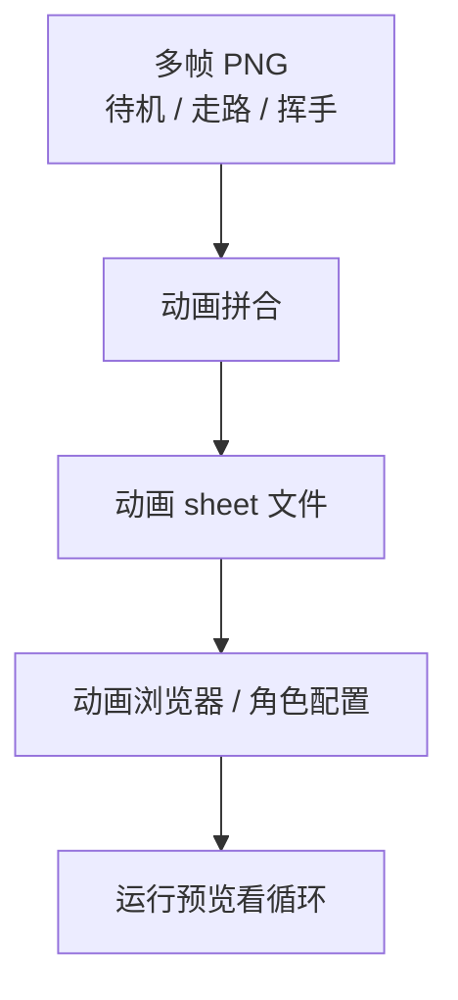

# 动画拼合

角色在雾津码头不能只会站——走路、挥手、发呆得有一排帧。**动画拼合** 把多张单帧 PNG 拼成一条动画 sheet，对齐间距和帧序，再回 **[动画浏览器](../panels/anim-browser)** 或角色配置里引用。

---

## 这块 Tab 管什么

- 多帧图片拼合成横向或网格动画条
- 设定帧宽、帧高、间距、排列方式
- 预览拼完的整体尺寸，导出给游戏管线用

单张抠图去 **[图片工具](./image-tools)**；整批 AI 出图去 **[素材任务](./asset-task)**。

---

## 怎么操作

1. `./dev.sh workbench` → **动画拼合**
2. 导入或选择多帧源图（按命名顺序或手动排帧）
3. 设每帧宽高、间距、行列布局
4. 预览拼合结果 → 导出 sheet
5. 主编辑器里更新动画引用，预览里看循环是否顺滑

---

## 拼之前 checklist

| 检查项 | 为什么 |
|---|---|
| 每帧画布尺寸一致 | 否则拼出来会跳 |
| 脚点 / 锚点对齐 | 走路循环不会滑步 |
| 帧序正确 | 拼反了预览里像倒放 |
| 透明底干净 | 先在 **图片工具** 裁过边更省心 |

---

## 雾津例子

铁环男孩要有「低头搓铁环」四帧循环：

1. **素材任务** 按帧数 4、透明底要求生成四张单帧，**素材候选** 验收通过。
2. **动画拼合** 导入四帧 → 帧宽 64、帧高 96、横排 → 导出 `ringboy_polish_sheet.png`。
3. 主编辑器 **[动画浏览器](../panels/anim-browser)** 登记 sheet，设帧率 8fps、循环。
4. **[角色登记](../panels/character)** 把待机动作指到新动画 → 预览里男孩在码头低头搓环。

---

## 相关

- [生产工作台总览](./overview)
- [图片工具](./image-tools)
- [素材候选](./asset-candidate)
- [动画浏览器](../panels/anim-browser)
