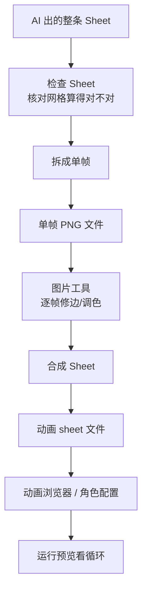

# 动画拼合

角色在雾津码头不能只会站——走路、挥手、发呆得有一排帧。**动画拼合** 管的是动画整图（俗称 sheet）和单帧图片之间的转换，而且是**双向**的：AI 一次性画出来的一整条动画图，可以在这里拆成一张张单帧核对、修图；改好之后的单帧，也可以在这里重新拼回一条完整的动画 sheet，再回 **[动画浏览器](../panels/anim-browser)** 或角色配置里引用。

---

## 这是什么（30 秒看懂）

**动画拼合是一台"拆装机"，两个方向都走。** 很多时候 AI 素材任务一次出的不是一张张散帧，而是一整条排好格子的动画图——比如"四帧走路"直接画成一张横排四格的大图。这张大图要核对帧序对不对、要单独修某一帧的瑕疵，都得先**拆**成单帧；反过来，如果你是先分别拿到了一张张单帧（比如手动改好的几张图），要交给游戏用，又得重新**拼**成一条 sheet。

打个比方：雾津灯笼铺子交来一整卷画好的走马灯画片，你要检查每一格画得对不对，得先把画卷拆开一张张看；检查完确认没问题，再把画片重新卷回一整卷装进走马灯里转起来。动画拼合就是这台"拆卷/卷回去"的机器——单张抠图去 **[图片工具](./image-tools)**；这里只管"整图 ⇄ 单帧"这一层转换。

---

## 入门：手把手做第一次

### 方向一：拆——检查/拆开一整条 sheet

1. `./dev.sh workbench` → 顶部标签切到 **动画拼合**。
2. 左侧 **Sheet 源图** 点 **选择...**，挑一张 AI 出的整条动画图。
3. 告诉工具这张图怎么切：填**网格**（帧数/列/行）或**单帧尺寸**（单帧宽/单帧高），三选一组合都行，下面"进阶"会讲清楚每种填法什么时候用。
4. 先点 **检查 Sheet**——不会真的拆文件，只是让工具算一遍网格，告诉你它读出来的整图尺寸、网格列行数、单帧尺寸、帧数是否和你预期一致。算错了就回头改参数。
5. 确认没问题，填好 **拆帧输出目录** 和 **拆帧前缀**，点 **拆成单帧**——每一帧会存成一张独立编号的 PNG。

### 方向二：拼——把单帧合成一条 sheet

1. 右侧 **帧目录** 选好存放单帧图片的文件夹（文件按名字顺序读取，所以帧文件名最好带序号）。
2. **合成输出** 填好要生成的 sheet 文件路径。
3. 填 **合成参数**：帧数（0 表示用目录里全部图）、列数、间距。
4. 点 **合成 Sheet**——工具会把这些单帧按你给的列数拼成网格，行数自动算，输出一张完整的动画图。

### 雾津小例子

铁环男孩要有「低头搓铁环」四帧循环，AI 一次性出了一整条横排 4 格的图：

1. **动画拼合** 左侧选中这张 Sheet 源图，网格里填帧数 4、列 4（一行四格）。
2. 点 **检查 Sheet**——报告显示整图 256×96，网格 4×1，单帧 64×96，帧数 4，没有警告，说明填对了。
3. 填拆帧输出目录、前缀，点 **拆成单帧**，得到四张独立的 PNG。
4. 发现第 3 帧手部边缘有脏边，去 **[图片工具](./image-tools)** 单独修一下这一张，其它三帧不用动。
5. 回 **动画拼合** 右侧，帧目录指到刚才这四张（含修过的第 3 帧），列数填 4，间距 0，点 **合成 Sheet**，导出 `ringboy_polish_sheet.png`。
6. 主编辑器 **[动画浏览器](../panels/anim-browser)** 登记 sheet，设帧率 8fps、循环。
7. **[角色登记](../panels/character)** 把待机动作指到新动画 → 预览里男孩在码头低头搓环。

---

## 进阶：每一项都讲透

### 拆分方向：三种告诉工具"怎么切"的方式

网格怎么切不是只有一种填法，工具会按你填了什么来推算，下面几种任选其一，不用都填：

| 你填了什么 | 工具怎么算 | 什么时候用这种 |
|---|---|---|
| **单帧宽 + 单帧高** | 用整图尺寸除以单帧宽高，直接算出列数和行数 | 你已经确切知道每一帧多大（比如和角色其它动画统一了尺寸规格） |
| **列 + 行** | 用整图尺寸除以列数行数，反推出单帧宽高 | 你知道整图是几行几列排的，但不确定单帧具体像素 |
| **帧数 + 列（或帧数 + 行）** | 先算出另一边（行数或列数），再反推单帧宽高 | 你知道总共几帧、想排成几列，剩下交给工具算 |
| **只填帧数**（且整图宽或高正好能被帧数整除） | 判断是横排一行还是竖排一列，直接切 | 最简单的单行或单列 sheet，懒得算列行时用这个 |

不管用哪种填法，前提都是**整图尺寸必须能被算出来的单帧尺寸整除**，否则工具会报错提示"整图尺寸不能被单帧尺寸整除"——遇到这种情况，先回头确认 AI 出的图本身尺寸对不对，不是这里的参数填错了。

如果你填的帧数比"列×行"算出来的格子总数少，工具不会报错，只会提示"帧数小于网格容量，尾部几格会忽略"——也就是说多出来的空格子会被跳过不拆，这在 AI 多画了几个空白占位格时很常见。

**检查 Sheet** 和 **拆成单帧** 用的是同一套推算逻辑，区别只在于：检查只是算一遍告诉你结果对不对，不会真的生成文件；确认参数没问题了，再点拆成单帧真正落盘。养成先检查、确认无误再拆的习惯，能避免拆错了还要删掉重来。

### 合成方向：每个参数的用途

| 字段 | 用途 | 填了会怎样 |
|---|---|---|
| **帧目录** | 存放待拼合单帧的文件夹 | 工具会读取里面所有图片文件，按文件名顺序排列——所以帧文件命名最好带能正确排序的编号（如 001、002），否则拼出来的顺序可能和你预期的不一样 |
| **合成输出** | 生成的 sheet 文件要存到哪 | 必须在工程目录内 |
| **帧数** | 只用目录里的前几张 | 0 表示全部都用；如果这个数字比目录里实际图片数还多，工具会报错提醒你目录里图不够 |
| **列** | 每行排几帧 | 0 或不填时，默认把所有帧排成一行（列数等于帧数）；行数由帧数和列数自动算出，不用你手填 |
| **间距** | 每帧之间留多少像素空隙 | 0 表示帧与帧紧贴；填了会在整张 sheet 里每帧之间插入这么多像素的透明间隔 |
| **允许覆盖输出 sheet** | 输出文件已存在时是否直接覆盖 | 不勾选时，如果目标文件已经存在，工具会报错拒绝执行，避免误覆盖 |

合成的硬性要求：**参与合成的所有帧，像素尺寸必须完全一致**——只要有一张大小不同，工具就会报错并指出是哪一张、尺寸差在哪。这也是为什么"进阶前先过一遍 checklist"（见下方）很重要。

### 拼之前的 checklist

| 检查项 | 为什么 |
|---|---|
| 每帧画布尺寸一致 | 否则合成会直接报错，指出是哪一张不一致 |
| 脚点 / 锚点对齐 | 走路循环不会滑步 |
| 帧序正确（文件名能正确排序） | 合成是按文件名顺序读取的，序号乱了拼出来就乱了 |
| 透明底干净 | 先在 **[图片工具](./image-tools)** 裁过边更省心，合成后再统一处理会更麻烦 |

### 两个方向怎么串起来用

大多数场景下，"拆"和"拼"是配套使用的：AI 一次出一整条 sheet → 拆开逐帧核对/修图 → 改完重新拼回去。也有只用单边的情况：如果 AI 本来就是分开出的单帧，直接跳过"拆"，单帧攒齐了直接走"合成"；如果你只是想核对一张已有 sheet 的网格是不是排对了，用"检查 Sheet"看一眼就够，不需要真的拆文件。

### 效率窍门与老手技巧

- **命名前缀要有意义**：拆帧时填的前缀会成为每一帧文件名的开头，起个能一眼看出"这是谁的哪套动作"的前缀（比如 `ringboy_polish`），比默认用源文件名更方便管理。
- **拼合前先统一间距思路**：如果这套动画要交给游戏引擎按固定网格读取，间距通常填 0；间距只在你需要给每帧留视觉分隔（比如美术核对用）时才有意义。
- **贴合 [素材审计](./asset-audit) 的动画分类规则**：被认成"动画 sheet"的文件不会被审计工具当普通静态图去核对透明/尺寸规则，所以拼合输出的 sheet 建议延续项目里约定的命名习惯（例如以 `atlas`、`sheet` 这类词收尾，或者放进动画分类目录下），方便后续审计正确识别它是动画整图。
- **单边尺寸别无限大**：动画整图和普通贴图一样有游戏引擎的加载限制，别为了塞更多帧就无限拉宽单张图的边长，帧数多时优先考虑多行排布而不是一行到底。

---

## 常见问题

**报错"整图尺寸不能被单帧尺寸整除"，是我的参数错了吗？**
先确认整图本身的实际尺寸——如果 AI 出的图尺寸本身就不规整（比如多了几像素的画布边），参数怎么填都会报这个错，得先回 **[图片工具](./image-tools)** 把整图裁成规整尺寸，再来拆帧。

**拆出来的帧数比我想要的少，怎么回事？**
检查你填的"帧数"是不是小于网格算出来的容量——多出来的格子会被当成空白占位忽略，不会拆出来。如果这些格子里其实有画面，说明帧数该填大一点。

**合成时报错说"帧尺寸不一致"？**
说明帧目录里有图片和其它的宽高不一样。回 **[图片工具](./image-tools)** 把这张图统一缩放/裁剪成和其它帧一样的尺寸再合成。

**合成出来的帧顺序不对？**
合成是严格按文件名字母/数字顺序读取的，检查帧目录里的文件命名是不是带了正确顺序的编号（比如 `_01`、`_02`……而不是 `_1`、`_2`、`_10` 这种排序会出问题的命名）。

**"检查 Sheet"和"拆成单帧"有什么区别，是不是点了检查就等于拆了？**
不是。"检查"只是让工具算一遍网格参数对不对，不会生成任何文件；"拆成单帧"才会真正把图片切开保存。建议每次都先检查确认无误，再点拆。

**能不能跳过拆帧，直接对整条 sheet 调色/裁剪？**
不建议。整条 sheet 一起调色容易破坏帧与帧之间的对齐；正规流程是先拆开逐帧处理，改完再合成回去。

---

## 相关

- [生产工作台总览](./overview)
- [图片工具](./image-tools)
- [素材候选](./asset-candidate)
- [素材审计](./asset-audit)
- [动画浏览器](../panels/anim-browser)
