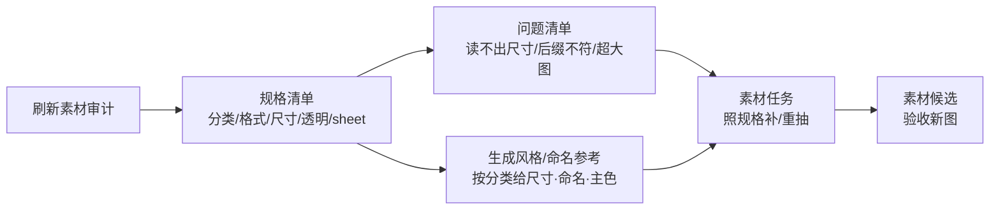

# 素材审计

雾津城的道具库开工前，老师傅得先把糖料、模具、颜料都点一遍数——不是查"这批糖画卖没卖出去"，而是查"库里现在到底有什么、够不够齐"。**素材审计** 干的就是这件事：扫一遍工程里所有图片和音频，告诉你尺寸整不整齐、透明通道对不对、格式有没有暗地里对不上、有没有个头异常大的图在拖慢加载——出图或重抽之前，先在这里摸清规格家底。

---

## 这是什么（30 秒看懂）

**素材审计管的是"规格"，不是"引用"。** 它不会告诉你"这张图有没有场景在用它""这个角色的立绘链接对不对不对"——那是主编辑器各面板和 **[危险区](/docs/reference/danger-zone)** 管的事。它管的是更底层的一件事：把工程目录翻一遍，逐张读文件头，告诉你——

- 这批图分布在哪些分类目录下、各有多少张；
- 常见的图片格式和常见的尺寸是什么；
- 有多少张确认带透明通道；
- 哪些图其实是"动画整图"（一整条 sheet），不该被当成普通静态图处理；
- 哪些图读不出尺寸（可能是文件损坏或格式不支持）；
- 哪些图文件名后缀和实际编码对不上（比如文件名叫 `.png` 但内容其实是 JPEG 编码）；
- 体积最大的一批图是谁，值不值得压缩。

雾津码头开工前，铁匠铺伙计不会先去问"这把锤子今天有没有人拿去用"，而是先把工具架上的锤子、钳子、火钳都清点一遍尺寸和成色——素材审计就是这道"清点工具架"的工序。清点完之后，缺什么、要不要重打，才轮到 **[素材任务](./asset-task)** 去办。

---

## 入门：手把手做第一次

1. `./dev.sh workbench` → 顶部标签切到 **素材审计**。
2. 点 **刷新素材审计** —— 稍等片刻，它会把工程素材目录整个扫一遍。
3. 从上到下看报告：
   - **目录组织**：按分类（背景、场景、角色、道具、小游戏、插画、动画、音频、其它）各计数；
   - **图片格式**：PNG / JPEG / WebP / GIF / SVG 各有多少张；
   - **常见尺寸**：出现频率最高的宽高组合；
   - **透明通道**：能确认带 alpha 的图有多少张；
   - **动画 sheet**：被判定为整条动画图的文件列表；
   - **无法读取尺寸** 和 **扩展名/实际格式不一致**：两份问题清单，值得优先看；
   - **最大图片**：体积排名前列的图，附带尺寸和是否透明。
4. 想给 AI 出图定风格口径时，点 **生成风格/命名参考** —— 会按分类给出常见尺寸、常见目录、常见命名用词，以及从代表性样本里抽出的主色色号。
5. 看完记下要点，转 **[素材任务](./asset-task)** 或 **[素材候选](./asset-candidate)** 继续处理。

### 雾津小例子

码头场景预览里铁环男孩立绘显示不出来，你怀疑是素材本身有问题（不是引用断了）：

1. **素材审计** → **刷新素材审计**。
2. 在"扩展名/实际格式不一致"那栏看到一条：文件名叫 `.png`，但文件头识别出来其实是 JPEG 编码——这类文件在某些加载路径下会丢透明通道，显示成一块方形背景而不是镂空的立绘。
3. 去 **[图片工具](./image-tools)** 打开这张图，另存成真正的 PNG 格式，确认预览里透明边正常。
4. 回主编辑器 **[角色登记](../panels/character)** 确认引用没变，运行预览里男孩立绘正常显现。

---

## 进阶：每一项都讲透

### 报告里每一段在说什么

| 段落 | 含义 | 你该怎么用 |
|---|---|---|
| 目录组织 | 按素材所在目录归的类：背景、场景、角色、道具、小游戏、插画、动画、音频、其它 | 如果"其它"堆了一大批，说明这些图没放进约定目录，找时间搬回对应分类目录，方便后续统一处理 |
| 图片格式 | 每种格式各有多少张 | 项目里格式越统一越好管理；如果 JPEG/GIF 掺得多，留意它们大概率不支持透明 |
| 常见尺寸 | 出现频率最高的宽高组合排行 | 给新图定规格时，优先对齐同分类里最常见的尺寸，别自己另起一套 |
| 透明通道 | 能确认带 alpha 的张数 | 角色、道具这类该透明的分类，透明张数应该接近总数；如果偏低，说明有一批图漏了透明处理 |
| 动画 sheet | 被认成"整条动画图"而非普通静态图的文件 | 这些图不该拿去按静态插画的规格要求（比如强制方形、强制不透明），应该走 **[动画拼合](./anim-sheet)** 的检查流程 |
| 无法读取尺寸 | 文件头解析失败的图 | 大概率是文件损坏、格式不支持或压根不是图片，打开确认，必要时重新导出 |
| 扩展名/实际格式不一致 | 文件后缀和文件里真实编码不符 | 优先处理——这是最容易在某些环境下"看着能开，加载却出问题"的隐患，去 **图片工具** 另存成后缀对应的真实格式 |
| 最大图片 | 体积排名靠前的一批图 | 检查是不是该压缩、转 WebP，或者其实是导错了源文件（比如把没压缩的原图直接放进了运行时目录） |

分类的判定完全看文件所在的目录名——`背景`、`场景`、`角色`（含 NPC）、`道具`、`小游戏`、`插画`、`动画`、`音频` 各有约定的目录关键字，落在这些目录之外的图一律归进"其它"。动画整图的判定则看两种线索：文件名本身是不是 `atlas.png` / `sheet.png` / `spritesheet.png` 这类通用叫法，或者同目录下是不是已经放了一份帧动画的配置记录——只要命中其一，就不会被当成普通静态图统计尺寸/透明规则。

### 生成风格/命名参考：怎么用它喂给 AI

这份参考是**从工程里现有的已入库素材反推出来的**，不是凭空定义的规范。它按分类分组，每组给出：

- **常见尺寸**：这个分类下出现次数最多的几档宽高；
- **常见目录**：这个分类的图通常存在哪几个子目录；
- **常见命名词**：从现有文件名里拆出来的高频词（比如"码头""立绘""站立"这类反复出现的词根）；
- **透明倾向**：这个分类里有透明通道的图占比；
- **代表样本**：挑出该分类里几张有代表性的图，附上尺寸、格式、透明状态，以及从图上采样出来的 5 个主色色号。

雾津示例：给"道具"分类生成参考，发现常见尺寸集中在几档小图、命名词里反复出现"摊""糖""铁环"这类字眼、主色偏暖橙暖红——把这段参考原样复制，贴进 **[素材任务](./asset-task)** 的"具体要求"里，AI 就有了统一的风格锚点，而不是每次都凭感觉现编一套描述。

这份参考和 **素材任务** 里的 **按分类建议填充** 用的是同一份底层规格数据——点"按分类建议填充"的时候，工具会自动跑一遍同样的扫描，不需要你先手动点一次审计。

### 批量做法与效率窍门

- **定期刷新**：每次美术批量提交新素材之后刷新一次，保持认知不过期，别拿几周前的报告去判断当下缺什么。
- **"其它"分类是个信号**：如果这一栏一直很大，说明目录组织在变乱，找时间去资源浏览器把散落的图归位。
- **扩展名不一致优先处理**：这类问题最隐蔽也最容易踩坑，建议每次审计都先看这一栏。
- **审计只读，不改文件**：它不会移动、删除、重命名任何东西——发现问题后动手改，去 **图片工具**、**动画拼合** 或主编辑器对应面板。

---

## 常见问题

**素材审计和"危险区"是一回事吗？**
不是。审计管的是素材本身的规格（尺寸、格式、透明、分类），危险区讲的是主编辑器里哪些字段一改就可能丢数据。两份东西各管一段，出图前先看审计，改引用前先看危险区。

**报告里"其它"分类特别多怎么办？**
说明这些素材没放进约定的分类目录。整理目录结构比在这里硬解决更有效——先去资源浏览器把文件归位，再回来重新刷新看效果。

**为什么每次点"刷新"结果都不太一样？**
因为它是每次都重新扫描当前工程目录的实时结果，不是历史快照。刚导入的新图、刚删除的旧图都会立刻反映在下一次刷新里。

**"生成风格/命名参考"跑出来是空的或很单薄？**
说明这个分类下现有素材样本太少，参考自然抽不出规律。可以先去这个分类看看有没有可以补充的参考图，或者干脆先接受"暂无强风格参考"，靠具体要求描述来定调。

**报告怎么发给别人？**
点 **复制报告** 直接拷到剪贴板；同时报告末尾会提示"已自动保存"到工程内的一份记录文件，需要回溯时可以照这个路径去找。

**能不能让审计顺便把重复的、没人用的图删掉？**
不能，审计不做任何删除或修改操作，它只读、只报告。清理冗余素材是主编辑器和资源浏览器那边的活。

---

## 相关

- [生产工作台总览](./overview)
- [素材任务](./asset-task)
- [素材候选](./asset-candidate)
- [动画拼合](./anim-sheet)
- [图片工具](./image-tools)
- [危险区](/docs/reference/danger-zone)
