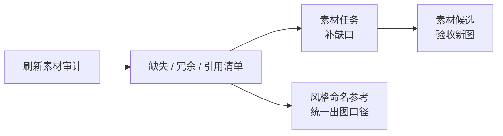

# 素材审计

雾津城里挂了多少灯笼、缺了几张门匾，不能靠记性。**素材审计** 扫一遍工程里素材的引用关系：谁在用、谁找不到、谁躺在文件夹里却没人引用——出图或重抽之前，先在这里摸清家底。

---

## 这块 Tab 管什么

- 刷新全工程素材引用审计
- 列出缺失、未引用、异常引用等情况
- 生成 **风格 / 命名参考**，给后续 AI 出图当统一口径

---

## 怎么操作

1. `./dev.sh workbench` → **素材审计**
2. 点 **刷新素材审计** —— 等扫描完成
3. 看列表里缺失项、冗余项、引用断链项
4. 需要给 AI 定风格口径时，点 **生成风格 / 命名参考**

---

## 典型用法

| 你遇到的情况 | 在这里做什么 |
|---|---|
| 预览里某 NPC 显示空白 | 刷新审计，找缺失条目，记下要补的素材 |
| 要批量重抽场景物件 | 先看审计里谁还在被引用，别误删仍在用的 |
| 给 Codex 下任务前 | 生成风格 / 命名参考，贴进素材任务的「具体要求」 |

审计结果指导 **[素材任务](./asset-task)** 填什么、 **[素材候选](./asset-candidate)** 验什么，不在这里直接改引用——引用仍回 **[主编辑器](../main-editor/overview)** 各面板改。

---

## 雾津例子

码头场景预览里铁环男孩立绘不显示：

1. **素材审计** → **刷新素材审计**。
2. 缺失列表里出现「铁环男孩站立」——确认主编辑器 **[角色登记](../panels/character)** 里引用的名字和磁盘上文件名对不上。
3. 点 **生成风格 / 命名参考**，复制雾津像素风 + 命名规则段落。
4. 去 **素材任务** 新建任务，把参考贴进具体要求，生成并执行。

---

## 相关

- [生产工作台总览](./overview)
- [素材任务](./asset-task)
- [素材候选](./asset-candidate)
