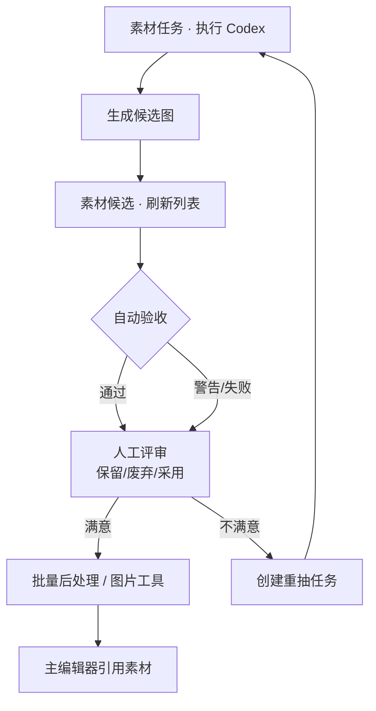

# 素材候选

AI 在雾津画坊里交出的一批稿纸，堆在 **素材候选** 这一格——每张候选的保存位置、自动验收结果、你给的评审意见都在这里过一眼。这里不只是"看一眼列表"，还能直接打分排序、批量退回重画、批量裁边缩放，决定留谁、退谁、直接送去精修的活儿基本都在这一页办完。

---

## 这是什么（30 秒看懂）

**素材候选是"验收窗口"，不是"画廊"。** 每次 **[素材任务](./asset-task)** 跑完 AI 出图，产出的文件都会被这里收进来登记——不光记路径，还自动核对了尺寸对不对、透明底对不对，你还可以在这里盖上自己的评审章："留下""废弃""采用"。

打个比方：雾津画坊交稿那天，掌柜不会一张张凭记忆去翻画案，而是有个专门的验收台——每张稿子往台上一摆，先看官府定的规格（尺寸、透明）对不对，再由掌柜亲自过目盖章。素材候选就是这张验收台：自动验收管"规格对不对"，你自己动手管"画得好不好"。两者都记在案，谁想重画、谁能直接入库，一眼就能分清。

生成任务的 prompt、执行日志、token 摘要都会自动存档；你在这里看到的是"交稿清单"，不是改 prompt 的地方——改 prompt 回 **[素材任务](./asset-task)** 或 **[AI 素材探针](./codex-probe)**。

---

## 入门：手把手做第一次

1. `./dev.sh workbench` → 顶部标签切到 **素材候选**。
2. 点 **刷新候选** —— 拉最新列表（刚在素材任务里执行完 Codex 之后尤其要刷一下）。
3. 表格里每一行是一张候选，列出：自动验收结果、你的评审状态、文件是否存在、尺寸、是否透明、所属任务、路径、运行目录。
4. 点一行看详情：下方会显示评审状态和备注输入框，选中的候选也能直接 **打开候选文件**、**打开运行目录**、**载入图片工具**。
5. 逐条看完，通过的送 **[图片工具](./image-tools)** 精修或 **[动画拼合](./anim-sheet)** 拼 sheet；不满意的写好备注、标记废弃，或者直接 **用备注创建重抽任务** 退回去重画。

### 雾津小例子

刚为铁环男孩跑了站立立绘任务：

1. **素材任务** 里 **执行 Codex 并记录** 完成。
2. **素材候选** → **刷新候选** → 出现两条：一条自动验收标"验收警告"（透明边偏大），一条标"验收通过"。
3. 警告那条：点进去看详情，备注框写"透明边偏大，边缘留白太多"，评审状态选 **保留**（不是废弃，因为图本身能用，只是需要修边）→ **保存评审**。
4. 拿这条去 **[图片工具](./image-tools)** 打开，自动裁透明边处理一遍。
5. 通过那条：评审状态选 **采用**，记下保存路径。
6. 回主编辑器 **[角色登记](../panels/character)** 把立绘引用指到处理好的文件 → 运行预览确认。

---

## 进阶：每一项都讲透

### 表格每一列怎么读

| 列 | 你怎么读 |
|---|---|
| **自动验收** | 机器按任务里填的尺寸、透明要求核对出来的结论：验收通过 / 验收警告 / 验收失败 / 未验收（还没跑过自动核对）。选中一行能在详情里看到具体是哪项不符 |
| **评审** | 你自己盖的章：未评审 / 保留 / 废弃 / 采用，默认都是未评审 |
| **文件** | 这张候选实际的文件存不存在——AI 有时候只报告了打算保存的路径但没真正落盘，这时会显示"缺失" |
| **尺寸 / 透明** | 从文件本身读出来的实际规格，不是任务里"要求"的规格——拿来跟自动验收的结论对照看 |
| **所属任务** | 这张候选出自哪次素材任务的执行记录 |
| **路径 / 运行目录** | 文件在工程里的相对路径，以及这次 AI 执行留下的运行记录所在目录 |

### 人工评审：怎么盖章

选中一行候选，下方"候选评审"区域可以：

- 点 **选择** 挑一个状态（未评审 / 保留 / 废弃 / 采用），填一段"修改/淘汰备注"，点 **保存评审**；
- 也可以直接用 **标记保留** / **标记废弃** / **标记采用** 三个快捷按钮，一键定状态。

四种状态各自的含义和后续影响：

- **未评审**：默认状态，还没人看过，或者看了但还没下决定；
- **保留**：能用，但你想留个记录、也许还要再打磨一版；批量重抽和批量后处理都会把"保留"当作可继续处理的候选；
- **废弃**：不要了，批量后处理和批量重抽都会跳过它；
- **采用**：这就是最终要用的那版，批量重抽默认不会再对它下手（避免你已经定稿的图被重复重画）。

### 批量评分/排序：让机器帮你排优先级

点 **批量评分/排序**，工具会给每张候选打一个 0–100 的规则分（不判断"画得好不好"，只根据文件是否存在、自动验收结果、你的人工评审、尺寸/透明信息是否可读来算），并给出五档结论：

| 分数区间 | 标签 | 建议 |
|---|---|---|
| 85 及以上 | 可交付 | 优先进入后处理或采用流程；仍需人工看一眼确认 |
| 70–84 | 可保留 | 建议人工快速过一遍，通过后可后处理 |
| 50–69 | 需确认 | 需要你自己判断，必要时创建重抽任务 |
| 25–49 | 建议重抽 | 优先写备注、创建重抽任务 |
| 24 及以下 | 阻塞 | 不建议继续使用，先查保存路径问题、重跑或重抽 |

候选一多的时候，先跑一次评分排序，能很快看出哪些不用你操心（分数已经很高）、哪些该优先处理（分数很低或者卡在中间档）。

### 批量创建重抽任务：一次退回一批

点 **批量创建重抽任务**，工具会自动扫一遍当前候选列表，挑出"符合重抽条件"的那些，逐一生成一条重抽任务单（写进 **[素材任务](./asset-task)** 的任务记录，不会立即执行）。什么算"符合条件"：

- 文件必须存在（缺失的候选没法当参考底图去重抽）；
- 已经标记"采用"的不会被批量退回（你已经定稿了，不该被顺手重画）；
- 明确标了"保留"或"废弃"的会被纳入；
- 没标"保留/废弃"但自动验收给了"失败"或"警告"的，也会被纳入；
- 剩下那些"没人评审过、自动验收也没问题"的会被跳过——机器判断这些大概率不需要重抽。

生成的重抽任务会带上候选原图作为参考、你写的备注作为修改要求，去 **素材任务** 里补充细节后照常执行就行。

### 批量后处理通过/保留：省一趟趟点

如果一批候选都合格了，只是都需要同样的裁边、缩放、格式转换，不用一张张进 **[图片工具](./image-tools)** 重复操作——点 **批量后处理通过/保留**，填好：

- **后处理输出目录**（留空则输出到原目录）；
- **后处理后缀**（默认 `_ready`，方便和原图区分）；
- **后处理格式**（按扩展名 / PNG 保透明 / JPEG 白底 / WebP）；
- **后处理缩放**（宽高，0 表示不改，可勾"保持比例"）；
- **自动裁透明空边**；
- **允许覆盖输出**（默认关闭，避免误覆盖已有文件）。

一键跑完，符合条件的候选会各自生成一份处理好的副本。符合条件的规则是：文件存在、没被标记废弃，并且（自动验收通过，或者你已经手动标了"保留/采用"）——不满足的会被跳过并在报告里说明原因。

单张想微调细节，还是回 **[图片工具](./image-tools)**；多帧动画整图去 **[动画拼合](./anim-sheet)**。

---

## 常见问题

**刷新候选后什么都没有？**
说明工程里还没有素材任务的执行记录。先去 **[素材任务](./asset-task)** 跑一次"执行 Codex 并记录"，再回来刷新。

**候选显示"缺失"是什么意思？**
AI 在执行报告里说了要保存到某个路径，但那个文件实际没有落盘——可能是生成失败，也可能是路径本身写错了。这种候选没法拿来当参考重抽，建议直接回 **素材任务** 重跑。

**自动验收"警告"和"失败"有什么区别？**
"失败"通常是硬性不符（比如尺寸完全对不上、该透明的没透明）；"警告"是可以接受但值得留意的问题（比如透明边留白偏多）。两者都不影响你手动标记"保留"或"采用"，是否继续用取决于你自己的判断。

**为什么"批量创建重抽任务"没有把某张候选包含进去？**
大概率是它已经被你标记"采用"（默认不会被批量退回），或者它压根还没人评审过、自动验收也没发现问题——机器认为它大概率不需要重画。想强制重抽，单条走"用备注创建重抽任务"就行。

**批量后处理为什么跳过了一部分候选？**
跳过的候选要么文件不存在，要么被标记了"废弃"，要么既没通过自动验收也没被你手动标"保留/采用"。报告里会逐条写清跳过原因。

**评审备注写了保存不了？**
先确认表格里有选中一行——评审操作是针对当前选中的候选生效的，没选中就点保存不会有效果。

---

## 相关

- [生产工作台总览](./overview)
- [素材任务](./asset-task)
- [图片工具](./image-tools)
- [动画拼合](./anim-sheet)
- [AI 素材探针](./codex-probe)
