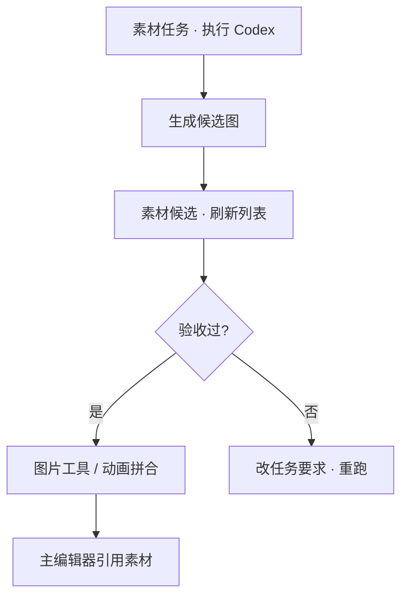

# 素材候选

AI 在雾津画坊里交出的一批稿纸，堆在 **素材候选** 这一格——每张候选的保存位置、自动验收结果、当前状态（待审、可用、驳回）都在这里过一眼，决定留谁、退谁、送 **[图片工具](./image-tools)** 精修。

---

## 这块 Tab 管什么

- 列出素材任务执行后产生的候选图
- 显示保存路径、验收结果摘要
- 管理候选状态，衔接后续入库或后处理

生成任务的 prompt、日志、token 摘要和验收结果会自动存档；你在这里看的是「交稿清单」，不是改 prompt 的地方（改 prompt 去 **[素材任务](./asset-task)** 或 **[AI 素材探针](./codex-probe)**）。

---

## 怎么操作

1. `./dev.sh workbench` → **素材候选**
2. 点 **刷新候选** —— 拉最新列表（刚在素材任务里 **执行 Codex 并记录** 后尤其要刷）
3. 逐条看：保存路径对不对、验收过没过、状态是否待你确认
4. 通过的送 **图片工具** 抠边缩放，或 **动画拼合** 拼 sheet；不过的退回 **素材任务** 改要求重跑

---

## 怎么看一行候选

| 列 / 信息 | 你怎么读 |
|---|---|
| **保存路径** | 文件落在哪，去资源浏览器或图片工具打开 |
| **验收结果** | 自动检查的尺寸、透明边、命名等是否达标 |
| **候选状态** | 还在等你看、已采纳、还是已标记废弃 |

单张微调别在这里硬改文件——去 **[图片工具](./image-tools)**；多帧动画去 **[动画拼合](./anim-sheet)**。

---

## 雾津例子

刚为铁环男孩跑了站立立绘任务：

1. **素材任务** 里 **执行 Codex 并记录** 完成。
2. **素材候选** → **刷新候选** → 出现两条：一条验收 warning「透明边偏大」，一条通过。
3. warning 那条点进 **图片工具** 自动裁透明边；通过那条记下保存路径。
4. 回主编辑器 **[角色登记](../panels/character)** 把立绘引用指到新文件 → 预览确认。

---

## 相关

- [生产工作台总览](./overview)
- [素材任务](./asset-task)
- [图片工具](./image-tools)
- [动画拼合](./anim-sheet)
