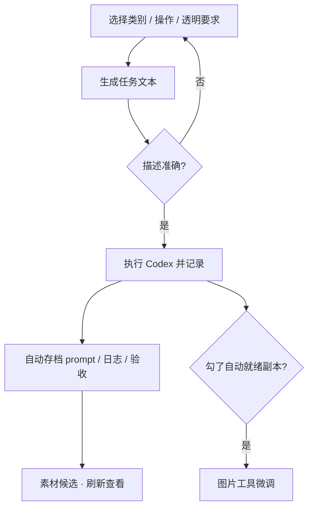

# 素材任务

缺一张门匾、缺一套走路帧，别在聊天窗口里零散描述——**素材任务** 把需求填成结构化任务：类别、操作、透明底、输出目录、宽高、帧数、参考素材、具体要求，生成任务文本确认无误后 **执行 Codex 并记录**，结果自动进 **[素材候选](./asset-candidate)**。

---

## 这块 Tab 管什么

- 按模板填写 AI 出图 / 出动画任务
- 预览生成的任务文本（prompt）是否准确
- 一键执行 Codex，自动保存 prompt、日志、保存路径、token 摘要和验收结果

---

## 怎么填（别手写枚举）

**类别**、**操作**、**透明要求** 都点 **选择**，不要手写选项名——和下拉盲翻一样容易填错。

其余按需求填：

- 输出目录
- 宽、高
- 帧数（动画时）
- 参考素材（从已有素材里搜）
- 具体要求（人话描述 + 可贴 **[素材审计](./asset-audit)** 生成的风格 / 命名参考）

需要自动缩放、裁透明边时，勾选 **执行后自动生成就绪后处理副本**——跑完会多一版可直接引用的文件，细节不满意再去 **[图片工具](./image-tools)**。

---

## 推荐流程

1. **[素材审计](./asset-audit)** 刷新，确认缺什么、拿风格参考
2. **素材任务** 新建，**选择** 填好类别 / 操作 / 透明要求
3. **生成任务文本** —— 读一遍，不对就改具体要求再生成
4. **执行 Codex 并记录** —— 等跑完
5. **[素材候选](./asset-candidate)** 刷新，看验收结果
6. 通过 → 主编辑器引用；warning → **图片工具** 或重跑

---

## 雾津例子

补铁环男孩站立立绘 128×192、透明底：

1. **素材审计** → **生成风格 / 命名参考**，复制雾津像素风段落。
2. **素材任务** → **选择** 类别「角色立绘」、操作「生成单张」、透明要求「全透明底」。
3. 宽高 128 / 192；参考素材 **选择** 已有「码头少年草稿」；具体要求贴上风格参考 +「抱铁环、粗布衣、8-bit 雾津色调」。
4. **生成任务文本** 确认 → 勾选 **执行后自动生成就绪后处理副本** → **执行 Codex 并记录**。
5. **素材候选** 刷新，验收通过 → **[角色登记](../panels/character)** 更新引用。

---

## 相关

- [生产工作台总览](./overview)
- [素材审计](./asset-audit)
- [素材候选](./asset-candidate)
- [AI 素材探针](./codex-probe)
