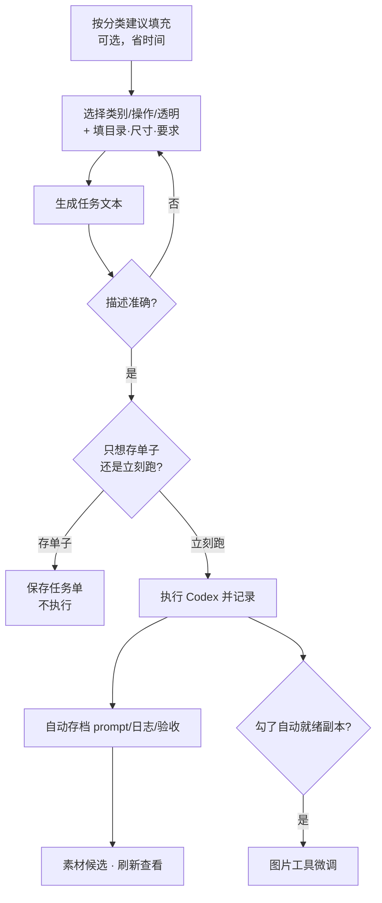

# 素材任务

缺一张门匾、缺一套走路帧，别在聊天窗口里零散描述——**素材任务** 把需求填成一张结构化任务单：类别、操作、目标文件、输出目录、宽高、帧数、参考素材、风格约束、具体要求、验收标准，一项项填清楚，生成任务文本确认无误后 **执行 Codex 并记录**，结果自动进 **[素材候选](./asset-candidate)** 等你验收。

---

## 这是什么（30 秒看懂）

**素材任务是"下单单据"，不是聊天框。** 你想让 AI 帮你出一张图、拼一套动画帧，与其在对话里现想现说、每次描述都不一样，不如把需求填进一张固定格式的单子——它逼你把该说清楚的都说清楚：要多大、要不要透明、参考谁、验收看什么。填完点一下按钮，AI 收到的是同一份完整、结构化的任务书，而不是一句临时拍脑袋的话。

打个比方：雾津画坊接私活，客人要是只说"画个灯笼"，画师十有八九猜不中要多大、要什么色调、挂哪儿用；但要是客人递上一张写着尺寸、色系、参考图、验收要求的订货单，画师照单画就是了。素材任务就是这张订货单，而且填完之后**自动存档**——单子内容、执行日志、AI 用了多少 token、跑出来的结果符不符合单子要求，全部留痕，不用你事后凭记忆回想"当时是怎么要求的"。

---

## 入门：手把手做第一次

1. `./dev.sh workbench` → 顶部标签切到 **素材任务**。
2. **标题** 随手填一个能认出来的名字，比如"铁环男孩站立立绘"。
3. **类别** 点 **选择**——不要手写，界面里列出的是"背景 / 场景 / 角色 / 道具 / 插画 / 小游戏 / 动画"这几类，选跟你要出的素材最贴的一个。
4. **操作** 点 **选择**——"新建"（从零生成）、"重抽"（在已有基础上再画一版）、"局部修改"、"改尺寸"、"出动画 sheet" 五选一。
5. 想省事，点 **按分类建议填充**——工具会照你选的类别，去看工程里这一类现有素材最常见的尺寸、透明习惯，自动帮你把输出目录、宽高、透明要求、参考素材都预填好，你在这基础上改就行。
6. 剩下手填：目标文件（要覆盖哪个具体文件时才填）、参考素材（从已有素材里搜，或者用"添加参考素材"按钮挑）、风格约束、**具体要求**（人话描述你想要什么）、验收标准。
7. 点 **生成任务文本**，读一遍右侧生成的任务文本，看它是不是准确表达了你的需求，不满意就回去改字段再生成。
8. 确认没问题，点 **执行 Codex 并记录**——等它跑完。
9. 跑完的结果、日志、token 用量、自动验收结论都会存档，去 **[素材候选](./asset-candidate)** 刷新查看。

### 雾津小例子

补铁环男孩站立立绘，128×192、要透明底：

1. **[素材审计](./asset-audit)** 先刷新一遍，顺手点 **生成风格/命名参考**，复制"角色"分类那段（常见尺寸、命名词、主色）。
2. **素材任务** 新建：标题"铁环男孩站立立绘"；**选择** 类别"角色"，**选择** 操作"新建"。
3. 点 **按分类建议填充**——工具照角色分类现有素材，自动把宽高填成 128×192、透明勾成"需要透明"，还塞进了几张参考素材路径。检查一遍，基本不用再改。
4. **具体要求** 里贴上第 1 步复制的风格参考，再补一句"抱铁环、粗布衣、8-bit 雾津色调"。
5. **验收标准** 留空也行——不填时任务文本会自动带上"尺寸/透明/目录符合任务、风格与参考一致、无穿帮脏边"这套默认验收语。
6. 勾选 **执行后自动生成就绪后处理副本**（跑完自动生成一版裁好透明边、缩放到位的可直接引用文件）。
7. **生成任务文本** 确认无误 → **执行 Codex 并记录**。
8. 跑完去 **[素材候选](./asset-candidate)** 刷新，验收通过 → **[角色登记](../panels/character)** 更新引用。

---

## 进阶：每一项都讲透

### 每个可填项是什么用途

| 字段 | 用途 | 填了会怎样 |
|---|---|---|
| **标题** | 给这条任务起个能认出来的名字 | 只影响任务单和存档记录里的显示名，不影响 AI 怎么画 |
| **类别** | 告诉 AI（也告诉工具自己）这是哪一类素材 | 决定默认输出目录、决定"按分类建议填充"去参考谁；界面上会看到"background / scene / character / prop / illustration / minigame / animation" 这几个英文类别名——分别对应背景、场景整体图、角色/NPC、道具、插画（兜底默认）、小游戏专用图、动画 frame/sheet |
| **操作** | 告诉 AI 这次是新建还是在旧图基础上动手 | 界面同样是英文名："new" 新建、"redraw" 重抽（沿用某张候选继续改）、"modify" 局部修改、"resize" 只改尺寸不改内容、"animation_sheet" 出动画 sheet（会额外触发帧数/网格自动验收） |
| **目标文件** | 要覆盖或参照的具体文件路径 | 重抽、局部修改、改尺寸这类操作通常要填；新建时可以留空，交给"输出目录"决定落在哪 |
| **输出目录** | AI 生成的文件要存进哪个目录 | 留空时用类别对应的默认目录；"按分类建议填充"会照现有同类素材习惯自动填 |
| **宽 / 高** | 目标尺寸 | 填了之后既写进任务文本要求 AI 照办，也会被自动验收拿来核对实际产出的尺寸是否一致；两个都填时，"自动就绪副本"那一步会强制缩放到这个尺寸（不保比例），只填一个则按比例缩放 |
| **透明** | 是否要求透明底 | "不指定 / 需要透明 / 不需要透明" 三选一；填了之后自动验收会核对产出图实际有没有 alpha 通道，对不上会被标记验收失败 |
| **帧数** | 动画素材的帧数 | 选了"出动画 sheet"操作或填了帧数，自动验收会额外按这个帧数去检查产出的图能不能被解释成一份合规的动画网格 |
| **参考素材** | 给 AI 看的参考图路径，可以从已有素材里搜或点按钮挑 | 会整段写进任务文本，AI 照这些参考去对风格；"重抽"类任务通常应该把上一版候选也加进来，让新版沿用而不是推倒重来 |
| **风格约束** | 一段专门讲风格基调的文字 | 单独成段写进任务文本，适合放 **素材审计** 生成的风格/命名参考，或者一句话的调性描述 |
| **具体要求** | 人话描述你到底想要什么 | 这是任务文本的核心内容，留空会被工具警告"AI 很可能不知道要做什么"，仍可以强行执行但不建议 |
| **验收标准** | 你希望怎么判断产出合格 | 填了就用你写的这套；不填会自动带上一套默认验收语（尺寸/透明/目录符合、风格与参考一致、无穿帮脏边） |
| **执行后自动生成就绪后处理副本** | 跑完 AI 之后，自动按任务的宽高/透明要求生成一版处理好的副本 | 勾选后省一趟去 **[图片工具](./image-tools)** 手动处理的功夫；副本文件名带就绪标记，细节还不满意再手动微调 |

### 按分类建议填充：它在帮你省什么

这个按钮背后调用的分析和 **[素材审计](./asset-audit)** 是同一套：它会去看你选的类别下，工程里现有素材最常出现的尺寸、透明比例，挑出几张体积较大（通常也更完整）的图当参考，自动帮你把输出目录、宽高、透明、参考素材都填好。好处是新图能天然贴合现有同类素材的规格，不用你凭印象猜"角色立绘一般多大"。

如果第一次点它工程里还没做过素材审计，它会自己在后台跑一次分析（稍等片刻），跑完之后自动套用。换了类别记得重新点一次，不同类别的建议值不一样。

### 保存任务单：不执行也能先占个位

**保存任务单** 和 **执行 Codex 并记录** 是两件独立的事——前者只是把当前填好的任务写进任务记录里，不会真的调用 AI 出图。适合你想先把一批需求都记下来、留到批量处理时再一次性执行，或者交接给别人时把任务单先定下来。

### 和其它 Tab 的配合顺序

- 出图前先去 **[素材审计](./asset-audit)** 摸清规格、拿风格参考；
- 需要先试一句 prompt、探探 AI 懂不懂某种风格描述，去 **[AI 素材探针](./codex-probe)**——但注意探针本身不是用来试 prompt 的，具体用法见该页；
- 跑完的产出去 **[素材候选](./asset-candidate)** 验收、评分、决定留谁退谁；
- 通过的候选如果是动画整图，去 **[动画拼合](./anim-sheet)** 拆帧或重新合成；单张微调去 **[图片工具](./image-tools)**。

### 效率窍门

- **重抽任务不必从头填**：在 **素材候选** 里对某张候选点"用备注创建重抽任务"，会自动带着这张候选的路径、尺寸、透明信息帮你预填好，你只需要补一句修改要求。
- **批量出一类素材时，先固定风格约束**：把 **素材审计** 生成的那段风格参考存成一份文本，每次新任务直接粘贴到"风格约束"里，保证一批素材气质统一。
- **验收标准别偷懒留空**：虽然留空有默认语兜底，但对形状/构图有硬性要求（比如"脚点对齐地面线""不能有对话气泡"）时，自己写清楚比指望默认语更靠谱。

---

## 常见问题

**任务文本生成后我又改了字段，需要重新点一次"生成任务文本"吗？**
需要。任务文本是根据你点按钮那一刻的字段内容渲染出来的，改了字段不会自动刷新文本，记得改完再生成一次确认。

**"执行 Codex 并记录"跑了很久没反应怎么办？**
出图任务本身可能需要几分钟，界面会显示"Codex 正在执行素材任务"。如果长时间没有任何进度提示，或者你怀疑本机的 AI 环境没配置好，先去 **[AI 素材探针](./codex-probe)** 跑一次能力检查，确认执行环境是否正常。

**具体要求留空能执行吗？**
可以强行执行，但工具会先弹出确认提示，因为 AI 大概率不知道要做什么。建议至少写一句话再跑。

**"按分类建议填充"填出来的尺寸不是我想要的怎么办？**
它只是"建议"，填完你可以照常手动改宽高、改透明要求，不受它约束。

**保存任务单和执行有什么区别，会不会执行两次？**
"保存任务单"只写记录不触发 AI；"执行 Codex 并记录"内部也会先保存一次任务单再执行，所以不用担心漏存——但两个按钮点了都各自算一次记录，不会因为你先保存过就跳过执行时的再次保存。

**任务执行完但看不到产出图？**
去 **[素材候选](./asset-candidate)** 点刷新——产出图不会直接显示在素材任务这个页面里，素材任务只管下单和执行日志，验收和查看候选是下一站的事。

---

## 相关

- [生产工作台总览](./overview)
- [素材审计](./asset-audit)
- [素材候选](./asset-candidate)
- [AI 素材探针](./codex-probe)
- [图片工具](./image-tools)
- [动画拼合](./anim-sheet)
