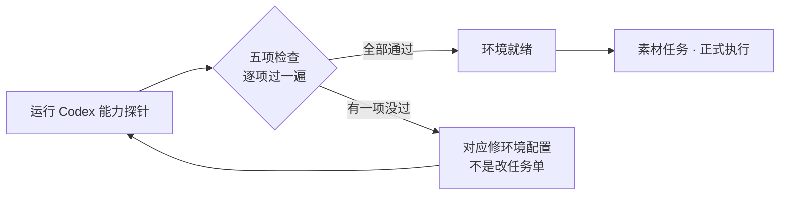

# AI 素材探针

**素材任务** 那边点了"执行 Codex 并记录"却迟迟没反应，或者跑完拿不到候选图、看不到 token 用量——先别急着怀疑 prompt 写得不对，很可能是本机的 AI 出图环境本身就没配好。**AI 素材探针** 就是干这个的：一键体检，告诉你 Codex 这套命令行工具在这台电脑上到底装没装、出图功能开没开、能不能正常报告"存到哪了""花了多少 token"。

---

## 这是什么（30 秒看懂）

**这不是一个用来"试写 prompt"的对话框，而是一台体检仪。** 界面上只有一个按钮："运行 Codex 能力探针"，点下去之后它不会问你想画什么、也不会返回任何图片或文字回应——它检查的是**环境本身**：

- 这台电脑上找不找得到 Codex 命令行工具；
- 这个工具的出图功能有没有打开；
- 它有没有提供一种"能一直挂着跑、随时对接"的服务模式；
- 通过这种模式跑出来的结果，格式里有没有包含"图存到哪了"这个信息；
- 有没有包含"这次花了多少 token"这个信息。

打个比方：雾津画坊要靠一台"自动研墨机"来配合画师干活，探针不是让你试着研一次墨看看颜色深浅，而是先检查这台研墨机插上电有没有反应、墨槽通不通、出墨口堵没堵——检查完确认整台机器能正常运转，画师才敢放心把正式的活儿交给它。真正"研出来的墨好不好用"，得等 **[素材任务](./asset-task)** 正式跑一次才知道。

批量出图、要存档、要自动验收，这些都走 **[素材任务](./asset-task)** → **[素材候选](./asset-candidate)** 那条正规流水线；探针只负责回答一句话："环境这边，能跑吗？"

---

## 入门：手把手做第一次

1. `./dev.sh workbench` → 最右侧标签切到 **AI 素材探针**（界面上可能标的是 Codex 或 GPT，指的是同一件事）。
2. 点 **运行 Codex 能力探针**——不用填任何东西，也不用等你想好要出什么图。
3. 稍等几秒到二十秒左右（它要实际调用命令行工具做几项检查），结果会显示"通过"或"未通过"，下面附一行一行的检查明细。
4. 如果显示"未通过"，逐行看是哪一项检查没过——这就是接下来要去修的地方（通常是找同事、找环境配置文档，而不是改任务单里的字）。
5. 需要留存或者发给别人对照时，点 **复制探针结果**。

### 雾津小例子

第一次在新电脑上装好这套工具，还没试过出图功能靠不靠谱：

1. 先别急着去 **素材任务** 填一堆字段就点执行，浪费一次真实的出图机会。
2. 切到 **AI 素材探针**，点 **运行 Codex 能力探针**。
3. 结果显示"未通过"，明细里有一行提示"image_generation: not enabled"——说明命令行工具本身能找到，但出图功能没打开。
4. 按明细提示去把这项能力打开（这一步是环境配置层面的事，超出这个页面能直接解决的范围），回来重新点一次探针。
5. 这次五项检查全部显示通过，探针整体结果变成"通过"——这时候再去 **[素材任务](./asset-task)** 正式下单出图，才不会白跑一趟。

---

## 进阶：功能讲透

### 探针到底检查了哪五件事

| 检查项 | 检查的是什么 | 显示"未通过"通常意味着什么 |
|---|---|---|
| **Codex 命令行工具** | 这台电脑上能不能找到这个工具本身 | 工具还没装，或者装了但系统找不到它的位置 |
| **出图能力（image_generation）** | 这个工具的"生成图片"功能开没开 | 工具装了，但出图这项具体能力没被启用——**素材任务**里执行 Codex 出图会没法真正产出图片 |
| **常驻服务模式（app-server）** | 这个工具有没有提供一种能一直挂着、随时接收指令的运行方式 | 缺了这个，工具就没法被稳定地反复调用来跑一批批素材任务 |
| **"存到哪了"这个信息** | 通过常驻服务模式跑出来的结果里，有没有明确带上"文件存到什么路径"这项信息 | 就算图能生成，如果这个信息缺失，**素材候选** 那边就没法自动收到候选图的路径，你得自己去问 AI 存哪了 |
| **"花了多少 token"这个信息（token 用量）** | 同样是这套结果里，有没有带上本次消耗的 token 数量 | 缺了这个，没法在界面上直接看到每次出图任务的成本，只能事后自己估算 |

五项全过，探针整体才会显示"通过"；只要有一项没过，就会显示"未通过"，并且额外提示一句：如果"存到哪了"或"token 用量"这两项缺失，界面没法稳定地实现命令行出图和实时看用量——也就是说 **素材任务** 那边"执行 Codex 并记录"这个功能会受影响，产出的候选可能拿不到路径或者看不到花费。

### 什么时候该跑一次探针

- **第一次在一台新电脑上用这套工作台**：先跑一次探针，确认能跑再动手填任务单，省得白等一次执行结果。
- **素材任务执行完之后拿不到候选图、或者候选一直显示"缺失"**：这大概率不是任务单填错了，而是环境这边"存到哪了"这项能力有问题，来探针这里确认一下。
- **升级了本机的 AI 工具版本之后**：版本一升级，某些能力开关可能被重置，跑一次探针确认没被动到。
- **别人报告"我这边跑不出来"、你要帮忙排查**：先让对方跑一次探针把结果发过来，比隔着屏幕猜任务单哪里写错了更快。

### 探针查不出来的事

探针只管"环境能不能跑"，它**不会**告诉你：

- AI 出的图画得好不好看、风格对不对——这是 **[素材候选](./asset-candidate)** 里人工评审的事；
- 某条具体任务的 prompt 写得清不清楚——那是 **[素材任务](./asset-task)** 生成任务文本那一步该检查的；
- 某次执行到底花了多少 token——探针只确认"这项功能存不存在"，具体某一次任务花了多少，看的是那次执行留下的记录，不是这里。

换句话说：探针通过了，只代表"这台机器具备正常出图、正常记录路径和用量的条件"，不代表接下来每一次素材任务都一定顺利——具体某次任务顺不顺利，还是要看 **素材候选** 里的自动验收和你自己的评审。

---

## 常见问题

**为什么点了"运行 Codex 能力探针"没有任何图片或文字回应？**
这本来就不是它的设计目的。它只做环境检查，不接受你输入 prompt，也不会返回创作内容——如果你想试一句风格描述让 AI 懂不懂，目前工作台里没有一个专门的"轻量试写"入口，直接去 **[素材任务](./asset-task)** 正式填一条任务执行，会是更直接的验证方式。

**探针跑一次要多久？**
通常在几秒到二十秒之间，因为它要实际调用命令行工具做几项检查，比单纯点一下按钮慢一点，属于正常现象。

**探针显示"未通过"，我该改任务单里的哪个字段吗？**
不用改任务单。探针查的是环境本身（工具装没装、能力开没开），不是任务单填得对不对——遇到"未通过"，该做的是去检查、修复本机的 AI 工具配置，而不是回 **素材任务** 调整字段。

**探针全部通过了，是不是就代表 AI 出的图一定合格？**
不是。探针只保证"能跑、能拿到路径和用量"这个底层能力，出图的实际质量、尺寸对不对、风格准不准，仍然要靠 **[素材候选](./asset-candidate)** 里的自动验收和人工评审来把关。

**探针结果要不要存档？**
点 **复制探针结果** 可以把当前结果拷到剪贴板；同时结果末尾会提示已经自动保存了一份记录，方便日后回溯"当时环境是不是就有问题"。

**多久跑一次比较合适？**
不需要每天跑。换新电脑、换新环境、升级过本机的 AI 工具版本、或者素材任务执行开始出现异常这几个时机跑一次就够了。

---

## 相关

- [生产工作台总览](./overview)
- [素材任务](./asset-task)
- [素材候选](./asset-candidate)
- [素材审计](./asset-audit)
