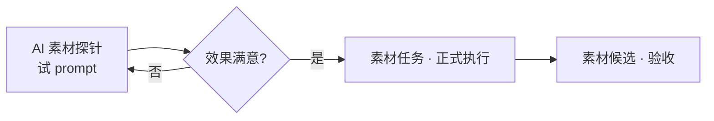

# AI 素材探针

正式下发 **[素材任务](./asset-task)** 之前，你想先试一句 prompt、看 token 烧多少、确认 AI 懂不懂「雾津像素灯笼」——开 **AI 素材探针** Tab。界面上标的是 **Codex** 或 **GPT**，和素材任务用的是同一套 AI 管线，这里更轻、更适合探路。

---

## 这块 Tab 管什么

- 快速试写 prompt，看 AI 回应或出图预览
- 查看 token 用量摘要，控制成本
- 验证风格描述是否被理解，再搬去素材任务正式跑

探针适合**试验**；批量、要存档、要自动验收的活儿仍走 **素材任务 → 素材候选** 正规流水线。

---

## 怎么操作

1. `./dev.sh workbench` → 最右侧 **AI 素材探针**（界面可能显示 Codex / GPT）
2. 输入试验 prompt（可先从素材审计的风格参考粘贴）
3. 发送，看返回结果和 token 摘要
4. prompt 满意 → 复制到 **素材任务** 的「具体要求」，走 **生成任务文本 → 执行 Codex 并记录**

---

## 和素材任务的分工

| | AI 素材探针 | 素材任务 |
|---|---|---|
| **目的** | 试词、探风格、估 token | 正式出图、自动存档、自动验收 |
| **结果存档** | 轻量，不一定进候选 | 完整 prompt / 日志 / 验收链 |
| **什么时候用** | 新风格第一次写描述 | 确认描述后批量出稿 |

---

## 雾津例子

第一次让 AI 画「雾津码头灯笼」，不确定它会不会画成现代 LED：

1. **AI 素材探针** 输入：「8-bit 像素风，雾津码头挂灯，暖黄光圈，无文字，透明底试验」。
2. 看返回图和 token——发现 AI 加了电线，改 prompt 加「古代木架、无现代元素」再试。
3. 第三版满意 → 把最终 prompt 段落贴进 **素材任务**，类别 **选择**「场景物件」，正式 **执行 Codex 并记录**。
4. **素材候选** 验收 → **图片工具** 裁边 → 主编辑器 **[场景](../panels/scene)** 引用。

---

## 相关

- [生产工作台总览](./overview)
- [素材任务](./asset-task)
- [素材候选](./asset-candidate)
- [素材审计](./asset-audit)
