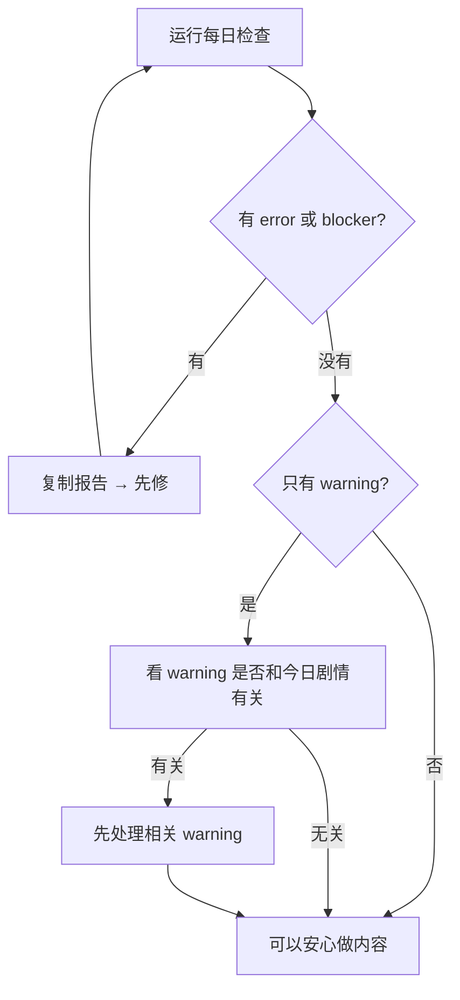

# 每日检查

雾津的书案上要开工了，先点一盏验灯的开关——**每日检查** 就是生产工作台的开工体检：一键跑编辑器 smoke、工作台 smoke、导入检查和叙事运行时保存检查，告诉你今天能不能安心做内容。

---

## 这块 Tab 管什么

- 跑全套例行检查，汇总 pass / warning / error / blocker
- 生成可复制报告，方便交给 AI 同事修
- 报告自动存档，日后可追溯

每日检查、剧情单元自检和验收相关报告都会自动保存，不用你手动导出。

---

## 怎么打开

1. `./dev.sh workbench`
2. 点顶部 **每日检查**
3. 点 **运行每日检查**
4. 等跑完——按钮显示「运行中 / 加载中」时别切换工程或关窗口

---

## 怎么看结果

正常通过时，报告里会看到类似这些项都绿了：

- Python 编辑器 / 叙事 smoke
- 生产工作台 smoke
- Python 导入 smoke
- 叙事 / 运行时保存 smoke 测试

| 级别 | 你怎么做 |
|---|---|
| **error / blocker** | 必须先修。点 **复制报告** 交给 AI 同事，修完再跑一遍 |
| **warning** | 可以继续做内容，但要看是否和今天要做的剧情有关——有关就先处理 |
| **全过** | 去主编辑器或剧情单元继续今天的活 |

:::tip[别和 error 搞混]
warning 不等于一定不能做内容；**error 和 blocker 一定要先清**。
:::

---

## 雾津例子

周二早上你要做「城隍庙关二狗」对白：

1. `./dev.sh workbench` → **每日检查** → **运行每日检查**。
2. 报告里 Narrative smoke 和保存 smoke 都过了，但有一条 warning 说某个旧场景缺背景引用——和今天无关，记下即可，继续做关二狗。
3. 若出现 blocker「叙事保存测试失败」，点 **复制报告**，修完保存链路后再跑每日检查，全过才开主编辑器。

---

## 相关

- [生产工作台总览](./overview)
- [剧情单元验收](./story-unit)
