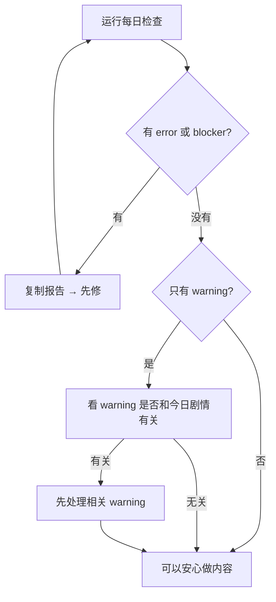

# 每日检查

雾津的书案上要开工了，先点一盏验灯的开关——**每日检查** 就是生产工作台的开工体检：一键跑叙事校验、对话结构检查、剧情单元追踪核对、素材引用和规格检查，再加一批工具链自测，告诉你今天能不能安心做内容。

---

## 这是什么（30 秒看懂）

每日检查像开工前给整本折子翻一遍——不是校对某一句话对不对，而是查「书页有没有装订错」「引用的名字都还在不在」「昨天留下的活有没有埋雷」。它一次跑六大类检查，每类都可能报出 `error`（必须先修）、`warning`（提醒你留意）或更严重的 `blocker`（彻底挡路），全部通过报告只花你点一下按钮的时间。

---

## 入门：手把手做第一次

1. `./dev.sh workbench`
2. 点顶部 **每日检查**
3. 点 **运行每日检查**
4. 等跑完——按钮会显示「检查运行中…」，这中间会跑一批工具链自测，通常需要几十秒到一分钟，别切换工程或关窗口
5. 报告出来后，先看有没有 `error` 或 `blocker`；有就先修，没有再看 `warning` 是否和你今天要做的活有关

### 雾津例子

周二早上你要做「城隍庙关二狗」对白：

1. `./dev.sh workbench` → **每日检查** → **运行每日检查**。
2. 报告里叙事校验和对话结构检查都过了，但有一条 `warning` 说某个旧场景缺背景引用——和今天无关，记下即可，继续做关二狗。
3. 若出现 `blocker`「叙事保存测试失败」，点 **复制报告**，修完保存链路后再跑一次每日检查，全过才开主编辑器。

---

## 进阶：每一项都讲透

每日检查一次会做六类检查，前五类只要工程数据在就能跑，第六类会真的跑一批自动化测试：

### 1. 叙事 Graph 校验

检查整个叙事编排（对话/信号/状态/任务/剧本的连接关系）内部是否自洽——有没有引用了不存在的图、状态或前置条件。这是最基础的一层，出问题往往意味着某处改动删掉了别处还在用的东西。

### 2. 对话图结构检查

逐个对话文件做结构核对，能发现的问题按严重程度分 `error`（结构坏了、跳转不到）和 `warning`（可以运行但值得留意，比如某条路线走不到底）。如果工程里一个对话文件都没有，会给一条 `warning` 提醒。

### 3. 剧情单元追踪检查

对每一个剧情单元核对「基本信息是否完整」——缺入口、缺出口、缺通过标准、有未解决的阻塞，都会列成 `warning`。**如果某个单元的制作状态已经是「待验收」或「通过」**，还会额外把它的验收脚本引用（旗标、任务、剧本、信号、场景、对话）核对一遍，等价于替你把 [剧情单元验收](./story-unit) 的「1. 检查脚本」在所有相关单元上都跑了一遍。

### 4. 素材引用检查

扫描工程里所有素材引用，找出指向不存在文件的引用——这类问题永远是 `error`，因为一旦出现，对应内容在游戏里大概率会显示不出来或直接报错。

### 5. 素材规格检查

抽查素材本身的文件规格：有图片读不出宽高会报 `warning`；文件扩展名和实际图片格式对不上（比如文件叫 `.png` 但其实是别的格式）也会报 `warning`。这类问题不一定马上出事，但迟早会在某个工具链或导出环节炸出来，早发现早处理。

### 6. 工具链自测

每日检查默认会顺带跑四组自动化测试：**Python 编辑器 / 叙事 smoke**、**生产工作台 smoke**、**Python 导入 smoke**、**TS 叙事 / 运行时保存 smoke 测试**。这几组测试各自覆盖不同层面（编辑器数据结构、工作台自身功能、Python 侧模块能正常导入、TypeScript 侧存读档与叙事运行时行为），任何一组失败都会记成 `error`，报告里会附一份该组测试的完整输出摘要；如果失败，工作台还会额外存一份**完整日志**，报告里给出保存路径，方便你或 AI 同事完整复现问题而不用重新跑一次。

### 报告怎么看、怎么用

正常通过时，报告里应该看到上面四组工具链测试都在「通过项」里列出来，问题区是空的或者只有零星 `warning`。

| 级别 | 你怎么做 |
|---|---|
| **error / blocker** | 必须先修。点 **复制报告** 交给 AI 同事，修完再跑一遍，直到干净 |
| **warning** | 可以继续做内容，但要看是否和今天要做的剧情有关——有关就先处理 |
| **全过** | 去主编辑器或剧情单元继续今天的活 |

:::tip[别和 error 搞混]
warning 不等于一定不能做内容；**error 和 blocker 一定要先清**。工具链测试失败一律算 error，因为它意味着某个基础能力已经不可信了。
:::

每日检查、剧情单元自检和验收相关报告都会**自动保存**存档，不用你手动导出；日后想追溯某一天的状态，可以回头翻这些存档报告。

---

## 危险区与边界

- 每日检查是**只读诊断**，不会改任何游戏内容或工程数据，放心随时跑。
- 工具链自测阶段会真的启动测试进程，跑的时间比前五类检查明显更长；如果工程很大或者机器负载高，耐心等，不要中途强行关闭工作台。
- 报告里的「完整日志」路径是本地文件路径，交给 AI 同事时记得带上，别只贴摘要——摘要只截了输出的最后几行，完整排查经常需要看更早的报错。

---

## 常见问题

**Q：每日检查和剧情单元验收有什么区别？**
每日检查是「今天能不能开工」的全局体检，跨越整个工程；剧情单元验收是「这一小块剧情具体过不过」，只针对某一个单元。每日检查里第 3 类顺带把「待验收/通过」状态的单元也扫了一遍，但不会替代你专门去 [剧情单元验收](./story-unit) 里跑三步验收。

**Q：为什么每日检查要跑这么久？**
因为它默认会带上四组工具链自测（真的启动测试进程），比纯粹的数据核对慢很多，属于正常现象。

**Q：warning 太多看不过来怎么办？**
优先看和今天要做的剧情/面板相关的那几条；不相关的历史遗留 warning 可以先记下来，找个专门的时间集中处理，不必每天都清零。

**Q：报告说素材规格 warning，但我压根没碰过那个素材，要修吗？**
不是今天引入的问题也建议记下来找时间处理——文件规格类问题往往是历史遗留，拖得越久越难追溯是谁引入的。

**Q：工具链测试失败，但我这次改动明明和它无关？**
先看失败测试属于哪一组（编辑器/工作台/Python 导入/TS 存读档），如果和你的改动完全不搭边，可能是环境或依赖问题，带上完整日志路径找 AI 同事一起排查，不要跳过不管。

---

## 相关

- [生产工作台总览](./overview)
- [剧情单元验收](./story-unit)
