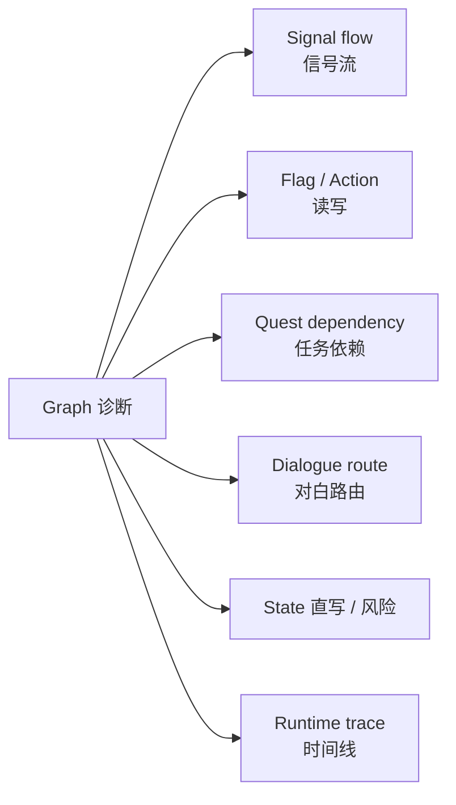

# Graph 诊断

主编辑器里对白、任务、信号像雾津城外的水路，牵一处动全身。**Graph 诊断** 把整张网摊开给你看：哪条信号没人收、哪个旗标被谁读写、任务依赖有没有环、对白路由能不能走到、状态有没有被偷偷直写。

---

## 这块 Tab 管什么

- 按范围扫描 Graph 问题（默认看全部，也可收窄到某个剧情单元）
- 分视图展示：信号流、旗标与动作读写、任务依赖、对白路由解释、状态直写风险、运行时 trace 时间线等
- 一键 **复制报告**，交给 AI 同事分析

这里**只读诊断**，不改游戏内容。

---

## 怎么打开

1. `./dev.sh workbench`
2. 点顶部 **Graph 诊断**
3. 默认范围是 **全部**；只看某块剧情时点 **选择范围**，用搜索选择器挑单元，不手写编号

---

## 重点看哪些视图

| 视图 | 什么时候盯它 |
|---|---|
| **Signal flow** | 发了信号没人接、或接错地方 |
| **Flag / Action read-write** | 旗标被谁设、被谁读，有没有漏设 |
| **Quest dependency** | 任务前置链断、环、或完不成的条件 |
| **Dialogue route explain** | 对白图某选项走不通、跳不过去 |
| **State 直写 / 风险** | 叙事状态被旁路写入，可能和状态机冲突 |
| **Runtime trace timeline** | 结合运行痕迹看实际发生了什么 |

看不懂或结果明显不对，点 **复制报告** 连同上下文一起交给 AI 同事。

---

## 典型用法

1. 剧情单元验收过了但玩家反馈「任务卡死」→ 来这里 **选择范围** 到对应单元 → 看 **Quest dependency** 和 **Signal flow**。
2. 对白某分支走不通 → 看 **Dialogue route explain**。
3. 旗标明明设了但条件不生效 → 看 **Flag / Action read-write** 谁在读、读的是不是同一个名。

---

## 雾津例子

「铁环男孩初遇」验收脚本跑完，任务 bridge_find_source 没进 Active：

1. **Graph 诊断** → **选择范围** → 搜「铁环男孩初遇」。
2. 打开 **Signal flow**，看 ringboy.met 有没有下游消费者。
3. 打开 **Quest dependency**，看 bridge_find_source 的接取条件是否依赖另一个没完成的旗标。
4. 发现问题：信号名和对白里发的不一致 → **复制报告** → 回主编辑器 **[图对话](../panels/dialogue-graph)** 改信号 → 再跑验收。

---

## 相关

- [生产工作台总览](./overview)
- [剧情单元验收](./story-unit)
- [运行时调试](./runtime-debug)
