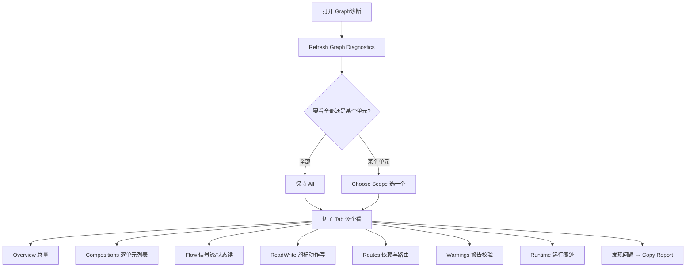
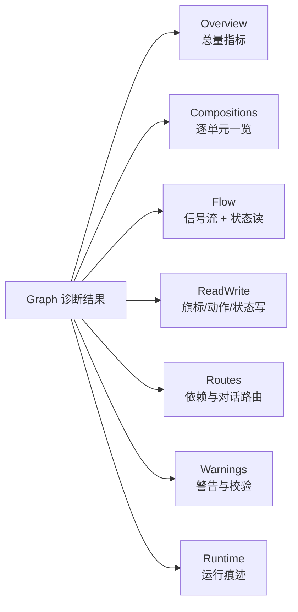

# Graph 诊断

主编辑器里对白、任务、信号像雾津城外的水路，牵一处动全身。**Graph 诊断** 把整张网摊开给你看：哪条信号没人收、哪个旗标被谁读写、任务和对话/剧本之间怎么牵连、状态有没有被绕过正常流程偷偷直写。这一页是**只读诊断**，不改任何游戏内容，看完发现问题再回主编辑器动手。

:::info[这个 Tab 的按钮是英文的]
「Graph 诊断」和下一页「运行时调试」两个 Tab 面向更专业的排障场景，按钮沿用了英文原名。本文照实标出按钮上写的英文，并在括号里给出中文含义，跟着走不会迷路。
:::

---

## 这是什么（30 秒看懂）

把一个剧情单元想成雾津城外交错的水路：信号是水流，旗标是闸门，任务和对话是沿岸的一个个渡口。水路图纸画得再整齐，也可能有闸门没人开、有渡口压根没水路能到。Graph 诊断做的事，就是把这张水路图摊在桌上，帮你一眼看出哪条水路断了、哪个闸门读写乱了套——而不是让你自己顺着对话图、状态机、任务表一条条肉眼去找。

---

## 入门：手把手做第一次

1. `./dev.sh workbench`
2. 点顶部 **Graph诊断**
3. 点 **Refresh Graph Diagnostics**（刷新 Graph 诊断）——第一次进这个 Tab 必须手动点一下才会加载数据
4. 顶部「Composition」输入框默认显示 **All**（全部）；只想看某一块剧情，点旁边的 **Choose Scope**（选择范围），用搜索选择器挑一个剧情单元；点 **All** 按钮能一键清空筛选、回到看全部
5. 下方是一排子 Tab：**Overview / Compositions / Flow / ReadWrite / Routes / Warnings / Runtime**，切换着看
6. 想跳回主编辑器确认某个具体对象，点 **Open Sources**（打开相关源）
7. 看完想留证据或者交给 AI 同事，点 **Copy Report**（复制报告）——这会复制下方日志区里的完整文字报告

### 雾津例子

「铁环男孩初遇」验收脚本跑完，任务 `bridge_find_source` 没进入「进行中」：

1. **Graph诊断** → 点 **Refresh Graph Diagnostics** → 点 **Choose Scope** → 搜「铁环男孩初遇」。
2. 切到 **Flow** 子 Tab，看信号流里 `ringboy.met` 有没有对应的下游触发边（有没有谁在监听这个信号）。
3. 切到 **Routes** 子 Tab，看这个单元关联的 quest 列表和 dialogue route 说明，确认 `bridge_find_source` 是否真的在这个单元范围内。
4. 发现问题：对话里发出的信号名和验收路线期望的信号名拼写不一致 → **Copy Report** → 回主编辑器 **[图对话](../panels/dialogue-graph)** 改信号 → 再回 [剧情单元验收](./story-unit) 重跑三步验收。

---

## 进阶：每一项都讲透

### 顶部工具行

| 按钮/控件 | 中文含义 | 说明 |
|---|---|---|
| **Refresh Graph Diagnostics** | 刷新 Graph 诊断 | 重新扫描工程数据，生成最新一份诊断；每次改完内容想重新看，都要点这个 |
| **Composition** 输入框 | 当前范围 | 只读展示，显示当前筛到哪个剧情单元，或者 **All** |
| **Choose Scope** | 选择范围 | 打开搜索选择器，挑一个剧情单元收窄范围，别手打编号 |
| **All** | 全部 | 一键清空筛选，回到看所有单元 |
| **Open Sources** | 打开相关源 | 列出当前范围对应剧情单元关联的原始数据，选一项直接打开 |
| **Copy Report** | 复制报告 | 把下方日志区当前显示的完整文字报告复制到剪贴板 |

### 七个子 Tab 逐个讲

| 子 Tab | 看什么 | 什么时候盯它 |
|---|---|---|
| **Overview** | 一组总量指标：剧情单元总数、当前筛了多少个、信号流条数、状态读条数、状态直写条数、动作读写条数、全局警告条数，以及最近一次运行时快照是否可用 | 想先有个全局印象，或者判断「这次改动是不是新增了很多风险边」 |
| **Compositions** | 逐个剧情单元列一行：ID、名称、制作状态、问题数、以及信号/读/直写/动作读写各自的条数。**点某一行会自动把上面的范围切到这个单元**，是最快的「按问题数排查」入口 | 不知道从哪个单元查起时，先按「问题数」这一列扫一遍，问题多的优先看 |
| **Flow** | 信号流（谁发出信号、被谁接住）和状态读（谁在读某个叙事状态）合并展示 | 「发了信号没人接」「接错了地方」「条件判断读错了状态」都在这里看 |
| **ReadWrite** | 旗标/动作层面的读写：谁设了某个旗标、谁读了它、谁发出了某个信号、谁改了任务状态、谁启动了某段对话；也包含「状态直写」——绕开正常状态机转换、直接写叙事状态的风险点 | 「旗标明明设了但条件不生效」，来这里看是不是设的和读的不是同一个名字；「状态被偷偷改」也在这里查 |
| **Routes** | 这个剧情单元涉及的任务、对话、剧本、信号清单，以及对话路由说明（某条对话线走到哪、能不能走通） | 「对白某分支走不通」「任务前置到底依赖哪个信号/状态」在这里对照 |
| **Warnings** | 跨 owner 直接写入的警告、结构推导过程中的警告、数据校验问题，以及不属于任何已知剧情单元的全局警告 | 结果「看不懂或明显不对」时，这里通常能给出具体原因；全局警告尤其要留意——它们往往是历史遗留、不挂在任何单元名下的坏引用 |
| **Runtime** | 最近一次运行时快照里的 trace 时间线（最多 80 条），列出每个事件的序号、类型、所在 Graph、触发的转换和摘要 | 想把「设计图上该怎么走」和「实际游戏里发生了什么」对照着看时，结合 [运行时调试](./runtime-debug) 一起看 |

### 用「Compositions」当排查入口的技巧

老手一般不会直接扎进某个具体子 Tab，而是先点 **Compositions**，按「问题数」列扫一眍，挑问题最多的几个单元点进去（点行自动收窄范围），再逐个切 Flow / ReadWrite / Routes / Warnings 细看。这样比一上来就精读某个你猜测有问题的单元更快找到真正的重灾区。

### 和运行时调试的分工

Graph 诊断看的是「设计图上该怎么连」——纯粹基于工程数据做静态推导，不需要游戏跑着。它的 **Runtime** 子 Tab 会顺带展示最近一次运行时快照的 trace，但那只是「捎带」，真正深入运行时排障要去 [运行时调试](./runtime-debug)。

| 情况 | 先看 | 再看 |
|---|---|---|
| 设计图上就连错了（信号名对不上、任务依赖了不存在的东西） | Graph 诊断 | — |
| 设计图看着没问题，但玩家反馈实际跑起来不对 | 运行时调试 | 回头用 Graph 诊断对照设计图 |
| 剧情单元验收某步失败 | 剧情单元报告 | Graph 诊断查静态问题 + 运行时调试抓失败瞬间快照 |

---

## 危险区与边界

- Graph 诊断**只读诊断，不改任何游戏内容**，随便点、随便刷新都不会弄丢东西。
- 它的判断基于当前保存在工程里的数据；主编辑器里还没保存的改动不会出现在诊断结果里——发现问题回去改完，记得先保存再回来点 **Refresh Graph Diagnostics**。
- **Runtime** 子 Tab 展示的是「最近一份」运行时快照，不是实时刷新；如果你在别的窗口继续操作游戏，这里的数据不会自动更新，需要重新点一次刷新。

---

## 常见问题

**Q：为什么这个 Tab 里全是英文按钮？**
Graph 诊断和运行时调试面向更专业的排障场景，界面延续了英文原名，其余提示文字仍是中文；跟着本文里给的中英对照操作即可。

**Q：刷新之后没看到我刚改的内容？**
先确认主编辑器里的改动已经保存；Graph 诊断只读工程里已保存的数据，没保存的改动看不到。

**Q：Compositions 里某个单元「问题数」很高，但我点开具体子 Tab 却看不出哪里错？**
问题数汇总了警告、校验问题、状态直写和跨 owner 写入四类，切到 **Warnings** 子 Tab 通常能看到最直接的文字说明；看不懂就 **Copy Report** 交给 AI 同事分析。

**Q：Overview 里「Global warnings」是什么，为什么它不挂在任何剧情单元下面？**
这是工作台没能把某条警告归到具体剧情单元名下的情况，一般是历史遗留或跨单元共享的引用出了问题；切到 **Warnings** 子 Tab 能看到具体内容。

**Q：我想看某个单元和别的单元有没有信号冲突，怎么办？**
先在 **All** 范围（不筛选）下切到 **Flow** 或 **ReadWrite**，同一个信号名/旗标名出现在多个剧情单元里，就是潜在冲突点。

---

## 相关

- [生产工作台总览](./overview)
- [剧情单元验收](./story-unit)
- [运行时调试](./runtime-debug)
