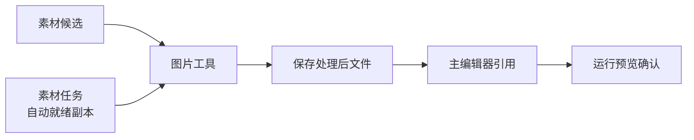

# 图片工具

AI 交来的稿纸往往还要修边、抠底、统一尺寸。**图片工具** 管单张图的后处理——从 **[素材候选](./asset-candidate)** 挑出来的 PNG，在这里裁透明边、缩放、对比前后，再回主编辑器引用。

---

## 这块 Tab 管什么

- 打开单张或少量图片做后处理
- 裁透明边、按目标宽高缩放
- 配合素材任务勾选「执行后自动生成就绪后处理副本」的流水线，也可在这里手动微调

多帧动画 sheet 不在这里拼——去 **[动画拼合](./anim-sheet)**。

---

## 怎么操作

1. `./dev.sh workbench` → **图片工具**
2. 打开要处理的图（常从素材候选里记下路径再来）
3. 按需：裁透明边、设目标宽高等
4. 保存后回主编辑器更新引用，**运行预览** 里看一眼

---

## 和素材任务的关系

在 **素材任务** 里勾选 **执行后自动生成就绪后处理副本**，Codex 跑完会自动出一版裁好边的副本，文件名带就绪标记。若自动版还不满意，再到 **图片工具** 手动修——别重复跑整次 AI 任务。

---

## 雾津例子

铁环男孩立绘候选验收 warning「透明边偏大」：

1. **素材候选** 复制该条保存路径。
2. **图片工具** 打开原图 → 一键裁透明边 → 预览轮廓是否贴边。
3. 另存为就绪副本，回 **[角色登记](../panels/character)** 改引用。
4. `./dev.sh editor` 运行预览，码头场景里男孩立绘不再浮空一圈白边。

---

## 相关

- [生产工作台总览](./overview)
- [素材候选](./asset-candidate)
- [动画拼合](./anim-sheet)
- [素材任务](./asset-task)
