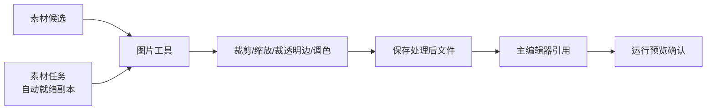

# 图片工具

AI 交来的稿纸往往还要修边、抠底、统一尺寸、甚至换个格式才能用。**图片工具** 管的是单张图的后处理：从 **[素材候选](./asset-candidate)** 挑出来的图，在这里精细裁剪、缩放、裁透明边、调亮度对比度，处理完再回主编辑器引用。

---

## 这是什么（30 秒看懂）

**图片工具是雾津画坊的修图案。** AI 画师交出来的稿子，边缘不一定干净，尺寸不一定刚好，有时候格式也不对——修图案就是干这个的地方：一张图摆上来，量尺寸、修边角、调深浅，改完看一眼再定稿。

它不做"从无到有"的创作，只做"已有图片的加工"：格式转换（PNG/JPEG/WebP 互转）、精细裁剪（拖框选或填数字都行）、按目标宽高缩放、自动裁掉多余的透明空边、调亮度/对比度/饱和度/锐化。多帧动画的整条 sheet 不在这里拼——那是 **[动画拼合](./anim-sheet)** 的活。

---

## 入门：手把手做第一次

1. `./dev.sh workbench` → 顶部标签切到 **图片工具**。
2. **源图片** 点 **选择...**，挑一张要处理的图（常见做法：先在 **[素材候选](./asset-candidate)** 里选中某张候选，点"载入图片工具"，会自动帮你把这张图带过来）。
3. 点 **读取/预览**，右侧会显示图片，同时报告区显示这张图的原始尺寸、格式、透明情况。
4. 按需要调整：
   - 要裁剪，直接在右侧预览图上**拖拽框选**要保留的区域，或者用左侧的 X/Y/W/H 四个数字精细微调；
   - 要缩放，填"缩放"里的宽或高（0 表示不改），勾不勾"保持比例"看你要不要强制拉伸；
   - 要去掉多余的透明留白，勾"自动裁掉透明空边"；
   - 要调色，拖亮度/对比度/饱和度/锐化四个滑块（默认都是 1.0，代表不改）。
5. 检查 **输出文件** 路径和 **输出格式**，不满意就改。
6. 点 **生成输出**——如果目标文件已经存在，会先弹窗确认要不要覆盖。
7. 处理完成后，报告区会列出应用了哪些操作、最终尺寸和透明情况；回主编辑器更新引用，去 **[运行预览](../main-editor/run-preview)** 里看一眼实际效果。

### 雾津小例子

铁环男孩立绘候选自动验收给了警告——透明边偏大：

1. 在 **[素材候选](./asset-candidate)** 里选中这条，点 **载入图片工具**。
2. 图片工具里点 **读取/预览**，看到男孩四周确实留了一圈明显的透明空白。
3. 勾上 **自动裁掉透明空边**，点 **生成输出** 预览一遍效果——报告显示裁掉了多少像素的空边。
4. 确认轮廓贴边合适之后，把输出文件名改成带"就绪"标记的另一个名字，避免覆盖原候选图。
5. 回 **[角色登记](../panels/character)** 把立绘引用指到新文件，`./dev.sh editor` 运行预览，码头场景里男孩立绘不再浮空一圈白边。

---

## 进阶：每一项都讲透

### 每个可填项是什么用途

| 字段 | 用途 | 填了会怎样 |
|---|---|---|
| **源图片** | 要处理的原图路径 | 选好之后点"读取/预览"才会真正加载并显示，仅仅填了路径不会自动刷新预览 |
| **输出文件** | 处理完保存到哪 | 必须落在当前工程目录内，工具会拒绝保存到工程外的路径，避免误覆盖无关文件；不手动改的话，默认会在源图同目录下生成一个带"_edited"后缀的新文件，不会覆盖原图 |
| **输出格式** | PNG（保透明）/ JPEG（白底）/ WebP / 按扩展名自动判断 | PNG 和 WebP 能保留透明通道；转成 JPEG 时，原本透明的部分会被铺成白色背景，因为 JPEG 本身不支持透明——角色、道具这类需要透明底的素材千万别转 JPEG |
| **缩放（宽/高）** | 目标宽高，0 表示不改这一项 | 只填宽或只填高时按比例缩放另一边；两个都填且勾了"保持比例"，会按能同时塞进这个宽高范围的最大比例缩放（不会变形）；两个都填但不勾"保持比例"，会直接拉伸到这个精确宽高 |
| **精细裁剪（像素）X/Y/W/H** | 手动指定裁剪框的左上角坐标和宽高 | 填了 W 和 H 才会真正生效；也可以不填数字，直接在预览图上拖拽画框，数字会跟着框自动更新，两种方式互通 |
| **清除裁剪** | 一键清空裁剪框 | 把 X/Y/W/H 都归零，取消刚才画的裁剪区域 |
| **自动裁掉透明空边** | 自动检测四周连续的透明像素并裁掉 | 只对本身带透明通道的图有效；如果图片本来就没有透明区域，这个选项不会有任何效果 |
| **亮度 / 对比度 / 饱和度 / 锐化** | 四个独立的调色滑块，默认值 1.0 表示不调整 | 数值大于 1 是增强、小于 1 是减弱；调整时会保留原图的透明通道不受影响，不会因为调色把透明的地方变得不透明 |
| **读取/预览** | 加载源图片并显示，同时刷新裁剪框的可拖拽范围 | 换了源图片之后一定要重新点一次，裁剪范围是按当前这张图的实际尺寸算的 |
| **重置参数** | 一键把缩放、裁剪、调色全部恢复默认 | 不会清空源图片和输出路径，只清参数 |
| **生成输出** | 真正执行处理并保存文件 | 如果输出文件已存在会先弹窗确认覆盖；处理顺序固定是：先裁剪、再自动裁透明边、再缩放、最后调色 |
| **复制报告** | 把当前报告区的文字复制到剪贴板 | 方便存档或者贴给别人对照 |

### 处理顺序会影响结果

工具内部固定按"手动裁剪 → 自动裁透明边 → 缩放 → 调色"的顺序执行。这意味着：如果你先手动裁掉了一部分图，自动裁透明边只会在裁剪之后的范围里找透明边界；缩放永远是在裁剪和裁边都做完之后才发生，所以填缩放尺寸时，脑子里想的应该是"裁完之后我要的最终尺寸"，而不是原图尺寸。

### 拖拽裁剪和填数字裁剪是同一件事

预览图上直接拖拽画框，最直观，适合凭眼睛判断"留多少边"；填 X/Y/W/H 四个数字，适合你已经知道精确像素值（比如美术给了具体裁切坐标）。两种方式是联动的——拖了框，数字会自动更新；改了数字，预览上的框也会跟着变。

### 和其它 Tab 的配合

- 从 **[素材候选](./asset-candidate)** 点"载入图片工具"能直接把选中的候选带过来，不用自己再去找路径；
- **[素材任务](./asset-task)** 里勾了"执行后自动生成就绪后处理副本"，跑完会自动按任务的宽高/透明要求做一遍类似的处理，这里更适合处理那批自动结果还不满意、需要再手动微调的图；
- 处理完的动画单帧（不是整条 sheet），下一步去 **[动画拼合](./anim-sheet)** 拼成动画条。

### 效率窍门

- 需要给同一批候选做一样的处理（比如统一裁边+统一缩放），别一张张进图片工具重复操作，去 **[素材候选](./asset-candidate)** 用"批量后处理"一次搞定；图片工具更适合处理单张、需要眼睛盯着微调的情况。
- 转格式时留意透明需求——角色、道具、UI 这类通常要透明底，只能选 PNG 或 WebP；场景背景这类不透明的大图，转 JPEG 能明显省体积。
- 输出文件名养成加后缀的习惯（比如 `_ready`、`_edited`），避免不小心覆盖掉还没确认好的原图。

---

## 常见问题

**为什么保存的时候提示"输出路径必须在工程目录内"？**
这是有意的限制，防止手滑把处理结果存到工程外部、之后找不到或者误覆盖了不相关的文件。把输出路径改到工程目录里面即可。

**转成 JPEG 之后透明的地方怎么变白色了？**
JPEG 格式本身不支持透明通道，工具会自动把透明区域铺成白色背景再保存。如果这张图需要保留透明，改选 PNG 或 WebP。

**裁剪框拖出来的范围和我想要的对不上？**
预览的缩放比例和实际像素之间有换算，如果差得比较多，直接在 X/Y/W/H 里填精确数字比拖拽更可靠。

**"自动裁掉透明空边"点了没反应？**
先确认这张图本身有透明通道——如果图是不透明的（比如背景图），这个选项不会做任何事，因为压根没有透明边界可裁。

**生成输出后想撤销怎么办？**
工具不提供撤销，处理是直接写文件。如果担心处理坏了，先把输出路径改成一个新文件名（而不是覆盖原图），确认满意后再决定要不要替换原文件。

**调了亮度对比度，结果图看起来发灰或者过曝？**
滑块是倍数关系，1.0 是原样，数值离 1.0 越远效果越强烈。建议每次只小幅调整、点一次生成输出看看效果，别一次性把几个滑块都调到极端值。

---

## 相关

- [生产工作台总览](./overview)
- [素材候选](./asset-candidate)
- [动画拼合](./anim-sheet)
- [素材任务](./asset-task)
- [运行预览](../main-editor/run-preview)
