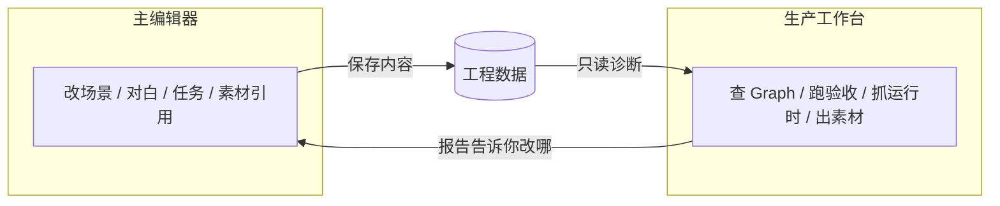
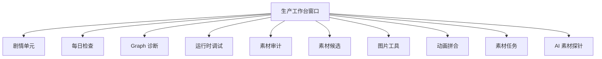

# 生产工作台总览

你在雾津编册子，**主编辑器**是执笔的书案；**生产工作台**是旁边的验货台——它不替你改对白、改场景、改任务，只帮你**查有没有漏、追做到哪了、跑一遍能不能过、素材齐不齐**。

启动：

```bash
./dev.sh workbench
```

---

## 能干什么

| 能力 | 说明 |
|---|---|
| **剧情单元追踪与验收** | 把一块剧情包成可追踪的工作包，自动生成验收路线、发到游戏里跑、记录过没过 |
| **每日检查** | 开工前一键跑例行体检，error 和 blocker 必须先修 |
| **Graph 诊断** | 看信号流、旗标读写、任务依赖、对白路由、状态风险 |
| **运行时调试** | 游戏跑着时抓快照、看 trace、复现事故 |
| **素材生产链** | 审计引用、下发 AI 任务、收候选、抠图拼动画 |

你日常改内容仍在 **[主编辑器](../main-editor/overview)**；到这里来，是为了**检查、验收、Debug 和出素材**。

---

## 与主编辑器的分工



| 谁 | 干什么 | 什么时候开 |
|---|---|---|
| **主编辑器** | 编纂游戏内容 | 要写、要改、要预览 |
| **生产工作台** | 检查、追踪、验收、Debug、素材任务 | 开工体检、一块剧情要过验收、查 Graph 问题、跑素材管线 |

:::tip[记住这句]
**改东西去主编辑器；查过没过、齐不齐来工作台。**
:::

后台任务还在跑时（按钮显示「运行中 / 加载中」），工作台会拦住你切换工程或关窗口——先等它结束。

---

## 界面怎么逛

窗口顶部是一排 **10 个 Tab**，从左到右依次是剧情单元、每日检查、Graph 诊断、运行时调试、素材审计、素材候选、图片工具、动画拼合、素材任务、AI 素材探针。每个 Tab 下方还有独立的日志区，方便你看本次操作输出了什么。



---

## 10 个 Tab 一览

| # | Tab | 一句话 | 详情 |
|---|---|---|---|
| 1 | **剧情单元** | 把一块剧情包成可验收的工作包 | [剧情单元验收](./story-unit) |
| 2 | **每日检查** | 每天开工先跑一遍体检 | [每日检查](./daily-check) |
| 3 | **Graph 诊断** | 查信号、旗标、任务、对白路由有没有断 | [Graph 诊断](./graph-diag) |
| 4 | **运行时调试** | 游戏跑着时抓状态、看 trace | [运行时调试](./runtime-debug) |
| 5 | **素材审计** | 哪些素材被引用、哪些缺、哪些多余 | [素材审计](./asset-audit) |
| 6 | **素材候选** | 看 AI 生成出来的候选图过没过 | [素材候选](./asset-candidate) |
| 7 | **图片工具** | 单张抠图、缩放、裁边 | [图片工具](./image-tools) |
| 8 | **动画拼合** | 把多帧拼成动画条 | [动画拼合](./anim-sheet) |
| 9 | **素材任务** | 填需求、生成 prompt、交给 AI 执行 | [素材任务](./asset-task) |
| 10 | **AI 素材探针** | 界面上叫 Codex / GPT，试 prompt、看 token | [AI 素材探针](./codex-probe) |

---

## 典型一天

1. 打开工作台 → **每日检查** → 点「运行每日检查」，有 error 先修。
2. 去主编辑器改今天要做的剧情。
3. 回到 **剧情单元**，选对应单元，补齐验收路线，跑三步验收。
4. 验收不过 → **Graph 诊断** 或 **运行时调试** 查原因，**复制报告** 交给 AI 同事修。
5. 缺素材 → **素材审计** 看缺口 → **素材任务** 下发 → **素材候选** 验收 → **图片工具** / **动画拼合** 收尾。

---

## 雾津例子

你要验收「码头铁环男孩」这一段：

1. 主编辑器里把对白和任务改完，保存。
2. `./dev.sh game start` 打开游戏页面。
3. `./dev.sh workbench` → **剧情单元** → 左侧选「铁环男孩初遇」。
4. 点「操作向导」看下一步该填什么；验收路线里用「选场景」「NPC」「对话」搭好路线，不手写任何编号。
5. 点「检查脚本」→「发送到游戏运行」→「完成并记录结果」。
6. 过了就把制作状态改成「通过」；不过就「复制当前单元报告」去修。

---

## 相关

- [主编辑器总览](../main-editor/overview)
- [工具速查表](../tool-matrix)
- [启动架构](../launch-architecture)
