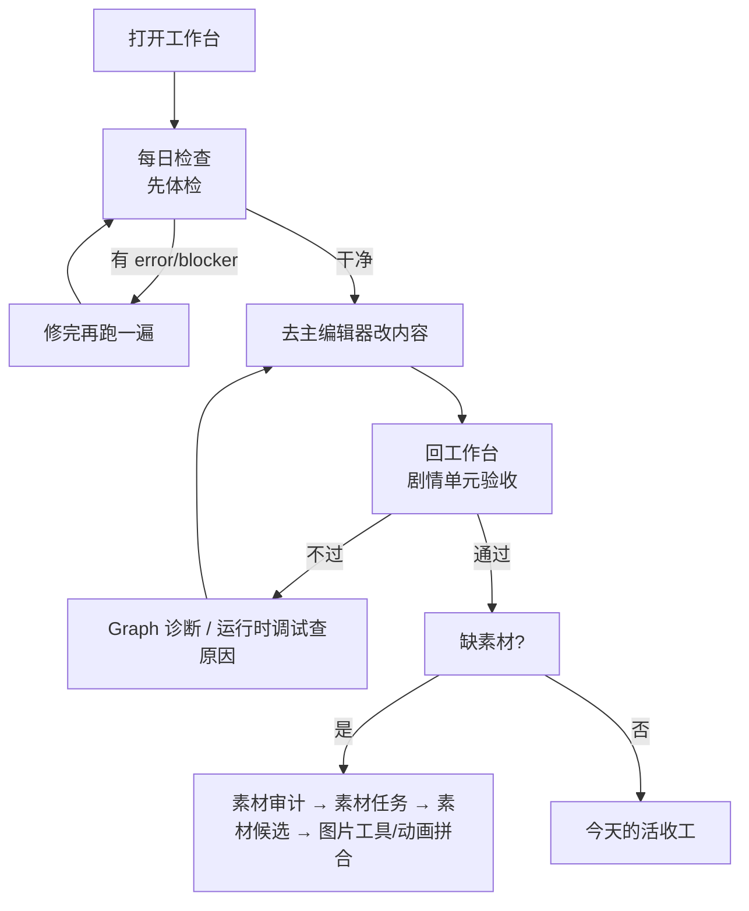
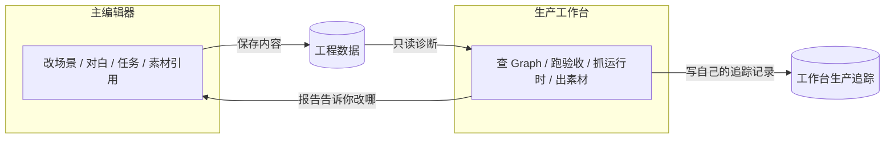
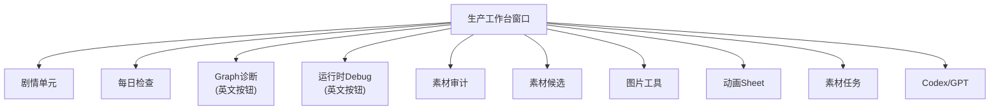

# 生产工作台总览

你在雾津编册子，**主编辑器**是执笔的书案；**生产工作台**是旁边的验货台——它不替你改对白、改场景、改任务，只帮你**查有没有漏、追做到哪了、跑一遍能不能过、素材齐不齐**。读完这页你能分清「这活该去主编辑器还是工作台」，也能认出工作台顶部那 10 个 Tab 分别是干什么的。

---

## 这是什么（30 秒看懂）

把雾津寻狗记想象成一本正在编的折子。**主编辑器**是你摊开的书案，笔、墨、稿纸都在那儿——写对白、摆场景、连任务都在这。但一本折子编到一半，光埋头写不够，你还需要一张**验货台**：

- 开工前先看看昨天有没有留坑（每日检查）；
- 写完一段要找人验一遍是不是真通了（剧情单元验收）；
- 验不过要查是哪根线断了（Graph 诊断）；
- 查不出来就直接盯着正在跑的游戏看实况（运行时调试）；
- 缺插画缺立绘，得走一条从审计到出图的素材流水线（素材审计/候选/图片工具/动画拼合/素材任务/AI 素材探针）。

这张验货台就是生产工作台。它**只读工程数据、只写自己的生产追踪记录**（比如剧情单元的验收状态、每日检查的报告存档），从不直接改场景、对白、任务这些游戏正文——那些永远是主编辑器的地盘。

---

## 入门：手把手做第一次

拿雾津城隍庙「关二狗」的日常来走一遍——这是最典型的一天：开工体检、动手改内容、回来验收。

1. 打开工作台：

   ```bash
   ./dev.sh workbench
   ```

2. 窗口顶部一排 Tab，默认停在第一个「剧情单元」；点第二个 **每日检查**。
3. 点 **运行每日检查**，等它跑完（这一步会顺带跑一批工具链自检，稍等半分钟到一分钟很正常）。
4. 报告里如果有 `error` 或 `blocker`：先别做别的，点 **复制报告** 交给 AI 同事修，修完重新跑一遍每日检查，直到干净。
5. 只有 `warning`：扫一眼是不是和你今天要做的活（关二狗对白）有关，无关就继续。
6. 体检过了，切到**另一个窗口/程序**打开 **[主编辑器](../main-editor/overview)**，把关二狗今天要改的对白改完、保存。
7. 回到工作台，切到 **剧情单元** Tab，选中关二狗对应的单元，补一遍验收路线，跑三步验收（细节见 [剧情单元验收](./story-unit)）。
8. 验收没过：切到 **Graph 诊断** 或 **运行时调试** 去查是哪里断的；复制报告给 AI 同事定位。
9. 缺插画：切到 **素材审计** 看缺口，去 **素材任务** 下发需求，图出来了在 **素材候选** 里验收，最后用 **图片工具**／**动画拼合** 收尾。



---

## 进阶：每一项都讲透

### 与主编辑器的分工



| 谁 | 干什么 | 什么时候开 | 会不会改游戏正文 |
|---|---|---|---|
| **主编辑器** | 编纂游戏内容 | 要写、要改、要预览 | 会 |
| **生产工作台** | 检查、追踪、验收、Debug、素材任务 | 开工体检、一块剧情要过验收、查 Graph 问题、跑素材管线 | 不会——只写自己的验收记录和报告存档 |

:::tip[记住这句]
**改东西去主编辑器；查过没过、齐不齐、断没断来工作台。**
:::

工作台里能编辑的字段（比如剧情单元的显示名、入口、出口、备注），说的都是「给人看的生产追踪信息」，不是游戏运行时数据——改了不会同步进游戏，也不会因为改游戏正文就自动更新，需要你自己保持两边一致。

后台任务还在跑时（按钮显示「运行中 / 加载中」「Refreshing…」之类），工作台会拦住你切换工程或关窗口——先等它结束，强行退出可能让当次报告没保存全。

### 界面怎么逛

窗口顶部是一排 **10 个 Tab**。工作台是双语混排的：多数 Tab 标题、按钮是中文，但「Graph 诊断」「运行时 Debug」这两个 Tab 内部的具体按钮沿用了英文（比如 Graph 诊断里的「Refresh Graph Diagnostics」「Copy Report」），这不是没翻译完，而是这两块面向的是更技术向的排障场景。每个 Tab 下方通常还有独立的日志区，方便你看本次操作的完整输出，报告也大多会自动存档在本地，方便回溯。



### 10 个 Tab 一览

| # | Tab（窗口里显示的文字） | 一句话 | 详情 |
|---|---|---|---|
| 1 | **剧情单元** | 把一块剧情包成可验收的工作包，三步跑验收 | [剧情单元验收](./story-unit) |
| 2 | **每日检查** | 每天开工先跑一遍体检，error/blocker 必须先修 | [每日检查](./daily-check) |
| 3 | **Graph诊断** | 查信号、旗标、任务、对白路由有没有断 | [Graph 诊断](./graph-diag) |
| 4 | **运行时Debug** | 游戏跑着时抓状态、看 trace，还能手动发调试命令 | [运行时调试](./runtime-debug) |
| 5 | **素材审计** | 哪些素材被引用、哪些缺、哪些多余 | [素材审计](./asset-audit) |
| 6 | **素材候选** | 看 AI 生成出来的候选图过没过 | [素材候选](./asset-candidate) |
| 7 | **图片工具** | 单张抠图、缩放、裁边 | [图片工具](./image-tools) |
| 8 | **动画Sheet** | 把多帧拼成动画条 | [动画拼合](./anim-sheet) |
| 9 | **素材任务** | 填需求、生成 prompt、交给 AI 执行 | [素材任务](./asset-task) |
| 10 | **Codex/GPT** | 界面上叫 Codex / GPT，试 prompt、看 token | [AI 素材探针](./codex-probe) |

### 两条常跑的链路

**验收链**：每日检查（开工体检）→ 主编辑器改内容 → 剧情单元（补路线、跑三步验收）→ 卡住时去 Graph 诊断（设计图层面对不对）或运行时调试（实际跑起来对不对）。

**素材链**：素材审计（发现缺口）→ 素材任务（下需求、生成 prompt）→ Codex/GPT 或外部 AI 出图 → 素材候选（人工验收候选图）→ 图片工具/动画拼合（抠图、裁边、拼帧）收尾。

这两条链路会互相交叉：剧情单元里发现「阻塞：缺某张立绘」，直接可以用剧情单元自带的选择器把这条阻塞挂到素材需求上，再去素材审计/素材任务那头处理。

---

## 危险区与边界

- 工作台**不写游戏正文数据**，所以理论上你在这里随便点不会弄丢场景、对白、任务——但它会写**自己的生产追踪文件**（剧情单元状态、验收记录、历史报告），这些是给团队协作用的，删错了也麻烦，别手滑清空。
- **运行时调试** Tab 里能手动拼出任意一条调试命令直接发给正在跑的游戏（包括直接改旗标、直接把任务状态设成已完成）——这能救急排障，但如果拿它去"让验收通过"，等于绕开了真实玩法，验收结果就失真了。详情见 [运行时调试](./runtime-debug) 的危险区一节。
- 后台任务运行中（体检、Graph 诊断刷新、剧情单元发送到游戏运行等）不要强行关闭工作台或切换工程，可能导致报告没写完整、命令队列状态不一致。
- 更细的「哪里能改、哪里会丢、哪里编辑器够不到」，看 [危险区参考页](/docs/reference/danger-zone)。

---

## 常见问题

**Q：工作台里改了剧情单元的入口/出口/备注，游戏里会变吗？**
不会。这些字段是给人看的生产追踪信息，不是运行时数据；游戏正文永远只认主编辑器保存的内容。

**Q：每日检查和剧情单元验收有什么区别，要不要都跑？**
每日检查是"今天能不能开工"的全局体检，覆盖叙事校验、对话图结构、剧情单元完整性、素材引用/规格、以及一批工具链自测；剧情单元验收是"这一小块剧情具体过不过"，两者都要跑，但每日检查在前、剧情单元验收在具体做完一块内容之后。

**Q：为什么 Graph 诊断和运行时 Debug 的按钮是英文的，是不是没做完？**
不是没做完，这两块面向更专业的排障场景，按钮沿用了英文原名（如「Copy Report」「Refresh Snapshot」），页面上其余提示文字仍是中文，跟着本文档的中文说明操作即可。

**Q：工作台卡在"运行中"不动怎么办？**
先耐心等——每日检查、Graph 诊断刷新这类操作可能需要几十秒。如果确认卡死了，也不要强行杀掉工作台窗口，优先看输出日志区有没有报错，再决定要不要重启工作台。

**Q：我该先开工作台还是先开主编辑器？**
一天的活通常按"工作台体检 → 主编辑器改内容 → 工作台验收"的顺序来回切换，两者可以同时开着，谁在做谁的事。

---

## 相关

- [主编辑器总览](../main-editor/overview)
- [工具速查表](../tool-matrix)
- [启动架构](../launch-architecture)
