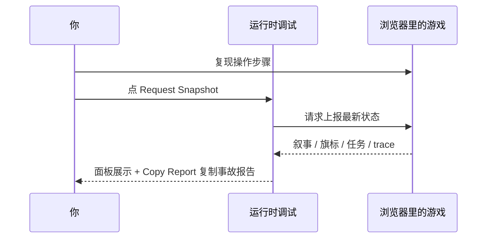

# 运行时调试

Graph 诊断看的是「设计图上该怎么连」；**运行时调试** 看的是「玩家刚才在游戏里实际发生了什么」。验收脚本说过了但画面不对、旗标 mysteriously 变了、trace 里缺一步——来这里对着正在跑的游戏抓快照。它还带了一个更硬核的能力：手动拼一条调试命令直接发给游戏，不用等剧情单元帮你生成。

:::info[这个 Tab 的按钮是英文的]
和 [Graph 诊断](./graph-diag) 一样，运行时调试的按钮沿用了英文原名，本文照实标出并给出中文含义。
:::

---

## 这是什么（30 秒看懂）

如果说 Graph 诊断是看水路图纸，运行时调试就是站在真实的雾津河边，看水这一刻到底流到哪了。它读的是游戏正在运行时上报的一份「快照」——当前场景、旗标、任务、剧本、叙事状态、最近发生的事件轨迹（trace）——并且能反过来往游戏里发一条命令，比如「把某个旗标设成什么」「让玩家走到某个点」，立刻看游戏怎么反应。

---

## 入门：手把手做第一次

### 前置条件

游戏必须先跑起来：

```bash
./dev.sh game start
```

在浏览器里打开游戏页面，并保持页面在前台（后台运行会导致命令响应变慢，见下方常见问题），再回工作台。

### 基本操作

1. `./dev.sh workbench` → **运行时Debug**
2. 点 **Refresh Snapshot**（刷新快照）——把游戏最新上报的状态拉到面板里
3. 需要干净复现前，点 **Clear Trace**（清运行痕迹）——清掉旧痕迹再去游戏里重现一遍你要排查的操作
4. 需要立刻抓一帧当前状态，点 **Request Snapshot**（请求快照）——这会让游戏主动上报一次最新状态
5. 出问题时点 **Copy Report**（复制报告）——把下方日志区的完整文字报告复制到剪贴板



面板下方是四个可视化子 Tab：**Overview（总览）**、**State（状态）**、**Trace（痕迹）**、**Commands（命令）**——按需切换，不用一次全看完。

### 雾津例子

铁环男孩验收第三步说「任务状态不符」，但 Graph 诊断里依赖链看起来没问题：

1. 游戏里重新走一遍：进码头 → 对话 → 看完选项。
2. 对话刚结束，立刻回 **运行时Debug** → 点 **Request Snapshot**。
3. 切到 **State** 子 Tab 的 **Quests** 页，看 `bridge_find_source` 仍是「未接取」——说明接取动作根本没触发。
4. 点 **Copy Report** → 回主编辑器检查对白图「跑动作」里有没有「给予任务」这个动作 → 补上后再回 [剧情单元验收](./story-unit) 重跑。

---

## 进阶：每一项都讲透

### 顶部工具行

| 按钮 | 中文含义 | 说明 |
|---|---|---|
| **Refresh Snapshot** | 刷新快照 | 把本地已有的最新一份快照重新加载进面板；不会让游戏重新上报 |
| **Request Snapshot** | 请求快照 | 给游戏发一条命令，让它**主动**立刻上报一次最新状态，然后自动刷新面板 |
| **Clear Trace** | 清运行痕迹 | 给游戏发一条命令，清空 trace 记录，方便你干净地重新复现一次操作 |
| **Clear Snapshot** | 清快照 | 清掉本地保存的快照文件本身（和「清运行痕迹」不同，这个是清你本地看到的记录，不是清游戏里的状态） |
| **Copy Report** | 复制报告 | 复制下方日志区当前显示的完整文字报告 |
| **Show Queue** | 显示队列 | 看当前还有哪些命令排在队列里、尚未被游戏取走执行 |
| **Clear Queue** | 清空队列 | 把还没被游戏取走的命令队列整个清空——命令发太多、堆积了，或者发错了，可以用这个止损 |

### 四个可视化子 Tab

| 子 Tab | 里面有什么 |
|---|---|
| **Overview** | 快照的关键字段一览（当前场景、GameState、上报时间、触发原因、来源等），以及一段「对话/条件摘要」文字，简述当前对话/条件求值的大致情况 |
| **State** | 四个小页：**Narrative**（各叙事 Graph 当前所在的状态）、**Flags**（旗标当前值）、**Quests**（任务当前状态）、**Scenarios**（剧本各阶段进度） |
| **Trace** | 三个小页：**Trace**（最近事件流水账）、**Transitions**（状态转换记录：从哪个状态、经过哪次转换、走到哪个状态、由什么触发）、**Issues**（游戏运行时自己报出来的问题） |
| **Commands** | 手动发送调试命令的操作台，见下一节 |

### 手动发送调试命令（Commands 子 Tab）

这是运行时调试里最硬核的一块：你可以不通过 [剧情单元验收](./story-unit) 的自动生成，直接手工拼一条调试命令发给正在运行的游戏。操作台长这样：

1. **命令类型选择框**（显示「Choose command」）+ 旁边的 **Choose** 按钮——点开会列出游戏支持的全部调试命令，按用途大致分这几类：
   - **场景与交互**：切场景（可带出生点）、触发某个热点、和某个 NPC 互动
   - **对话**：开始某段对话（带入口和显示的 NPC 名）、把对话推进若干步、选某个对话选项
   - **状态与经济**：设一个旗标的值、设某个任务的状态、设某个剧本某个阶段的状态、重置某个剧本的进度、发出一个叙事信号、直接把某个叙事状态设成指定值
   - **玩家模拟**：点击场景上某个坐标、从一点拖拽到另一点、把玩家瞬移到某个坐标、让玩家朝某个坐标走过去
   - **存档**：保存到某个槽位、读某个槽位的存档、重新载入当前场景
   - **辅助**：清空叙事运行痕迹、立刻抓一次快照、等待一段时间
2. **原因** 输入框：默认写着一句标记文字，说明这条命令是从工作台手动发的，方便日后在 trace 里认出它的来源，一般不用改。
3. 选好命令类型后，下面会自动展开这条命令需要的参数表单，每个参数都带一个示例默认值方便你照着改：
   - 场景 ID、出生点这类参数旁边有专门的 **Pick**（选择）按钮，打开搜索选择器挑选，不用手打编号；
   - 坐标、时长、槽位号、选项下标这类参数是可以直接编辑的输入框，改成你要的数值即可；
   - 有布尔类参数（比如旗标的值），会显示成一个勾选框。
4. **Reset Params**（重置参数）——不想要自己手改的乱七八糟内容了，一键恢复成示例默认值。
5. **Send**（发送）——把这条命令连同参数一起发进命令队列，等游戏轮询取走执行。

发送之后，回到 **Trace** 或 **Commands** 页面能看到「Pending Commands（待执行）」和「Recent Results（最近结果）」两张表，确认命令有没有被游戏取走、执行成功还是失败。

### 和 Graph 诊断怎么配合

| 情况 | 先看 | 再看 |
|---|---|---|
| 设计图上就连错了 | Graph 诊断 | — |
| 设计图对但跑起来不对 | 运行时调试 | 必要时 Graph 诊断对照 |
| 验收脚本某步失败 | 剧情单元报告 | 运行时调试抓失败瞬间快照 |
| 想快速复现某个特定状态来看 UI 表现 | 运行时调试手动发命令 | — |

---

## 危险区与边界

- **手动发送调试命令能直接改游戏状态**——设旗标、改任务状态、瞬移玩家位置这类命令是「直接把结果怼进去」，不经过玩家真实操作路径。这在快速复现 bug、检查某个特殊状态下 UI 表现时非常好用，但**不能拿它来让验收「看起来通过」**：如果你是在验证一条真实玩法路径能不能走通，应该用「玩家模拟」类命令（点击、拖拽、移动、走对话、选选项）或者干脆自己在游戏里操作，而不是直接用状态类命令把结果摆好——那样测出来的「通过」没有意义。
- **Clear Queue（清空队列）会把还没被游戏取走的命令全部作废**，包括你自己刚发的、还有 [剧情单元验收](./story-unit) 第 2 步「发送到游戏运行」自动排进去的命令——两边共用同一条队列，清空前确认没有别的验收正在等待执行。
- **Clear Snapshot（清快照）** 清的是本地保存的快照文件，不影响游戏里的实际状态；如果你想让游戏「忘掉」某个状态，应该用命令去改状态，而不是清快照——清快照只是让工作台这边暂时看不到旧记录。
- 命令队列是**跨会话共享**的：如果同时有别的开发服务器实例也在跑同一个工程并轮询这条队列，你发的命令可能被那边先取走消费掉，表现为「发了但没反应」。

---

## 常见问题

**Q：点了 Request Snapshot 却没反应，或者报告显示「不可用」？**
先确认游戏是不是用 `./dev.sh game start` 以开发模式跑起来的，并且浏览器里的游戏页面开着。如果从来没抓到过快照，报告会提示「还没有运行时快照」，先让游戏跑起来再试。

**Q：命令发了半天，Recent Results 里一直没有结果？**
最常见的原因是浏览器页面被切到后台太久——页面长期不在前台时，游戏内部的命令轮询会被浏览器自动节流，可能几十秒才检查一次队列；命令又有大约 30 秒的有效期，很容易在被取走之前就被服务端当作过期命令清掉了。把游戏页面切回前台，或者整页刷新一下再重新发送，通常就好了。

**Q：Clear Trace 和 Clear Snapshot 有什么区别？**
Clear Trace 是让游戏清空「最近发生了什么」的运行记录，方便你干净地重现一次操作；Clear Snapshot 是清掉工作台本地保存的那份快照文件，两者操作的对象不一样，别搞混。

**Q：我发的命令和 [剧情单元验收](./story-unit) 第 2 步发的命令会不会打架？**
会。两者共用同一条命令队列。如果你正在手动调试的同时又跑了一次剧情单元的「发送到游戏运行」，两批命令会混在一起按顺序执行，容易互相干扰。建议一次只做一件事，需要的话先用 **Show Queue** 看看队列里还有没有别人的命令没处理完。

**Q：Overview 里看到的时间和我实际操作的时间对不上？**
快照是「最后写入者赢」——如果同时有多个游戏页面/多个实例在运行并写同一份快照，你看到的可能是另一个实例最后写入的结果。确认只有一个游戏页面在跑，或者重新走一遍操作再抓一次快照。

**Q：能不能靠这个 Tab 里发的命令，把一条流程测试直接跑「通过」？**
技术上能做到，但不建议。参见上面危险区一节——这样跑出来的结果不代表真实玩法路径能走通，只是状态被直接摆好了。

---

## 相关

- [生产工作台总览](./overview)
- [Graph 诊断](./graph-diag)
- [剧情单元验收](./story-unit)
- [主编辑器运行预览](../main-editor/run-preview)
