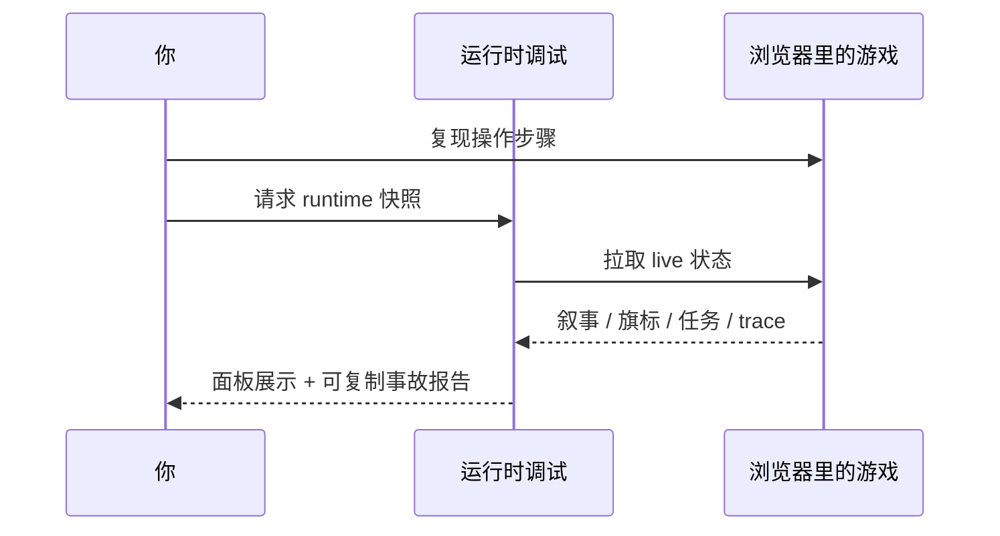

# 运行时调试

Graph 诊断看的是「设计图上该怎么连」；**运行时调试** 看的是「玩家刚才游戏里实际发生了什么」。验收脚本说过了但画面不对、旗标 mysteriously 变了、trace 里缺一步——来这里对着 live 游戏抓快照。

---

## 这块 Tab 管什么

- 刷新并浏览当前运行时快照：叙事状态、旗标、任务、剧本等
- 查看 trace、过渡、问题列表
- 清 trace、主动请求快照
- **复制事故报告**，打包上下文交给 AI 同事

---

## 前置条件

游戏必须先跑起来：

```bash
./dev.sh game start
```

浏览器里打开游戏页面，再回工作台。

---

## 怎么操作

1. `./dev.sh workbench` → **运行时调试**
2. 点 **刷新运行时快照** —— 拉最新状态到面板
3. 需要干净复现前，点 **清 runtime trace** —— 清掉旧痕迹再重现步骤
4. 需要立刻抓一帧状态，点 **请求 runtime 快照**
5. 出问题时点 **复制事故报告**



子区域大致分：**概览**、**状态**（叙事 / 旗标 / 任务 / 剧本）、**Trace**（痕迹 / 过渡 / 问题）、**命令**相关视图——按需切换，不用一次全看完。

---

## 和 Graph 诊断怎么配合

| 情况 | 先看 | 再看 |
|---|---|---|
| 设计图上就连错了 | Graph 诊断 | — |
| 设计图对但跑起来不对 | 运行时调试 | 必要时 Graph 诊断对照 |
| 验收脚本某步失败 | 剧情单元报告 | 运行时调试抓失败瞬间快照 |

---

## 雾津例子

铁环男孩验收第三步说「任务状态不符」，但 Graph 诊断里依赖链看起来没问题：

1. 游戏里重新走一遍：进码头 → 对话 → 看完选项。
2. 对话刚结束立刻回 **运行时调试** → **请求 runtime 快照**。
3. 在 **任务** 视图看 bridge_find_source 仍是「未接取」——说明接取动作根本没触发。
4. **复制事故报告** → 回主编辑器检查对白图「跑动作」里有没有「给予任务」→ 补上后再验收。

---

## 相关

- [生产工作台总览](./overview)
- [Graph 诊断](./graph-diag)
- [剧情单元验收](./story-unit)
- [主编辑器运行预览](../main-editor/run-preview)
