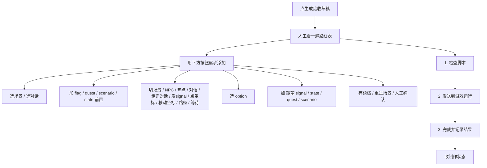

# 剧情单元验收

「剧情单元」不是新的剧情编辑器。它只做三件事：先把你在主编辑器里做的一块剧情登记清楚，再搭一条能重复执行的验收路线，最后把这条路线发给正在运行的游戏并自动对比结果——像给雾津寻狗记某一环贴一张验货单。这页会把「三步验收」从头到尾拆开讲，保证你照着做不会卡壳。

---

## 这是什么（30 秒看懂）

主编辑器里，每一段完整的剧情（叙事编排）一旦存在，工作台就会**自动**在剧情单元列表里给它开一行——不用你手动新建。这一行分三层，各管各的：

| 层 | 管什么 | 会不会影响游戏 |
|---|---|---|
| **① 这个剧情单元是什么** | 给人看的定义：类型、进度、入口、出口、通过标准 | 不会，纯生产追踪信息 |
| **② 自动验收怎么跑** | 会被翻译成一条条运行时调试命令，发给正在运行的游戏走一遍 | 只在你点「发送到游戏运行」时才会真的操控游戏状态 |
| **③ 结果、阻塞和素材需求** | 记录这块现在能不能过、卡在哪、还缺什么素材 | 不会，纯记录 |

改对白、改任务、改状态机——仍去 **[主编辑器](../main-editor/overview)**。这里只**定义怎么验、跑验收、记结果**。

---

## 入门：手把手做第一次

### 打开与认路

1. `./dev.sh workbench`
2. 点顶部 **剧情单元**
3. 左侧是一张列表：ID、名称、类型、状态、问题。**问题** 一列会自动提示这个单元还缺什么（比如「缺入口」「阻塞 1 项」），一眼就能看出哪些单元还没填全。
4. 选中一行，右侧上半是三层表单，右下是「自动聚合摘要」——自动汇总这个单元涉及的 Graph、对话、任务、剧本、区域、小游戏、信号，帮你确认「我是不是漏看了什么」。
5. 不确定下一步该做什么？点顶部 **操作向导**，它会告诉你接下来该点哪个按钮。

### 雾津例子：铁环男孩初遇

1. 左侧选「铁环男孩初遇」，**制作状态** 点旁边的 **选择**，选 **制作中**。
2. **类型** 同样点 **选择**，五种类型里选「支线」（其余四种是主线、小情景、结局、系统验证）。
3. **剧情入口** 填「进入码头后和铁环男孩对话」；**剧情出口** 填「铁环男孩线标记为已见面」；**通过标准** 填「发出 ringboy.met 信号，任务 bridge_find_source 进入进行中」。
4. 点 **生成验收草稿**，工作台会从这个单元本身涉及的对话/信号/状态/任务里推一条起步路线；人工确认后，用下方按钮补齐：
   - **添加起点** 区点 **选场景** → 码头
   - **添加步骤** 区点 **对话** → 初遇对白，再点 **走完对话**
   - **添加期望** 区点 **加 signal** → ringboy.met，点 **加 quest** → bridge_find_source（选目标状态「进行中」）
   - **添加复查** 区点 **人工确认**（或按需要选 **存读档**）
5. 先点 **1. 检查脚本**——不用开着游戏，纯核对文字引用；无 error 再继续。
6. `./dev.sh game start` 打开游戏页面，回到工作台点 **2. 发送到游戏运行**；等浏览器里执行完。
7. 点 **3. 完成并记录结果**——工作台会自动把建议结果（通过/失败/阻塞）填进「最近验收结果」。
8. 显示「通过」→ 把 **制作状态** 改成「通过」（如果暂时不想再改这块，就选「冻结」）。

---

## 进阶：每一项都讲透

### 第一层：这个剧情单元是什么

| 字段 | 说明 |
|---|---|
| 运行时 ID | 只读，工作台自动从主编辑器数据里认出来的编号 |
| 显示名 | 给策划看的名字，不影响运行时任何数据 |
| 类型 | 点 **选择**：主线（必经）、支线（可选但要完整验收）、小情景（短互动/局部事件）、结局（结算/收束段落）、系统验证（专门用来验证某个系统能力） |
| 制作状态 | 六态，见下表 |
| 预计小时 | 可选，纯排期参考 |
| 剧情入口 | 玩家怎样开始，例如「进入码头后和铁环男孩对话」；也可以写成 `scene:测试场景 spawn:门边` 这类更明确的短句，供验收脚本入口留空时复用 |
| 剧情出口 | 做完后应到什么状态 |
| 通过标准 | 一句话说清楚怎样算过 |

**制作状态六态**：

| 状态 | 什么时候选 | 保存时会不会拦 |
|---|---|---|
| **未做** | 还没开始动这块 | 不拦 |
| **制作中** | 正在做，验收路线可以先不补齐，可以有 warning | 不拦 |
| **可玩** | 已经能走一遍，但还没正式验收 | 不拦 |
| **待验收** | 内容基本做完，准备走三步验收 | 必须补齐入口、出口、通过标准和验收路线，否则保存过不去 |
| **通过** | 三步验收已经跑过且结果是「通过」 | 最近一次验收结果不是「通过」就不能选 |
| **冻结** | 验收通过后锁起来，默认不再改 | 同「通过」的门槛 |

:::info[保存会拦的情况]
选「待验收」却没填齐入口、出口、通过标准或验收路线，保存过不去；选「通过」或「冻结」但最近一次验收结果不是「通过」，同样过不去。想返工，先把制作状态退回「制作中」或「可玩」再改验收路线。
:::

### 第二层：搭验收路线（重点）

**不要手写编号，不要手填占位数字。** 所有会变多的引用——场景、对话、旗标、NPC、热点、选项、信号、状态、任务、剧本——都走**搜索选择器**，工作台会自动拼成既能核对、又能执行的脚本文本。验收路线表格显示三列：**阶段、内容、底层命令**——第三列是给你核对机器最终会怎么执行，仍然不用你手改。

各组按钮逐一说明：

**路线操作行**：**生成验收草稿**（见下文说明）、**删除选中**（先在表里选中一行）、**上移**/**下移**（调整步骤顺序）、**复制验收路线**（只复制路线，不带其余上下文）、**刷新列表**。

**添加起点**：**选场景**（连同出生点一起选）、**选对话**（直接从某段对话开始）。这是「入口」，只能有一条，加错了先清空再选。

**添加前置**：在跑验收之前，先把游戏状态摆到起跑线上。**加 flag**（选好旗标后还会问你设成 true 还是 false）、**加 quest**（选任务并选一个初始状态）、**加 scenario**（选剧本并选一个初始状态）、**加 state**（选叙事状态）。

**添加步骤**：验收过程中要做的事，会按顺序执行。**切场景**（含出生点）、**NPC**（交互某个 NPC）、**热点**（触发某个热点）、**对话**（打开某段对话）、**走完对话**（固定步骤，把当前对话推进到底）、**发 signal**（主动发出一个信号）、**点坐标**（在场景背景图上点一个位置）、**移动坐标**（让玩家走到场景上的某一点）、**路径**（按顺序点多个点，串成一条移动路径）、**等待**（250ms / 500ms / 1 秒 / 2 秒可选）。

**添加选项**：**选 option**——对话里要选哪一个分支。

**添加期望**：验收跑完之后，**应该看到什么**。**加 signal**、**加 state**、**加 quest**、**加 scenario**——注意这组按钮名字和「添加前置」很像，但目标完全不同：前置写的是「跑之前把状态摆成什么」，期望写的是「跑完之后应该变成什么」，两组数据分别存在不同字段里，别搞混。

**添加复查**：**存读档**（选存档槽位）、**重进场景**（选一个场景，验证重进后状态还在）、**人工确认**（工作台判断不了画面对不对时，明确标成靠人眼看）。

**结果区的选择器**：**加 zone 到备注**（从场景区域里搜，写进「备注」字段）、**选已有素材需求**（从现有素材里搜，写进「素材需求」字段，方便和素材审计对上号）。

#### 「生成验收草稿」到底做了什么

只有验收路线**完全是空的**时候才能点——已经有路线了，工作台不会覆盖，而是弹窗提醒你先手动清空。它会从这个剧情单元本身涉及的对话、信号、状态、任务里，挑最直接的一条拼出一条**起步草稿**：本质是「抛砖引玉」，不是完整路线，生成后必须人工确认是否符合真实玩法，再继续用选择器补全。如果这个单元还没关联任何对话/信号/状态，草稿会提示「无法生成」，只能手动搭。

### 第三层：结果、阻塞和素材需求

| 字段 | 说明 |
|---|---|
| 最近验收结果 | 未跑 / 通过 / 失败 / 阻塞。三步验收跑完会**自动**帮你填好，也可以自己用选择器改 |
| 验收备注 | 给自己或 AI 同事的补充说明 |
| 阻塞 | 每行一个真正挡住制作/验收的问题；每日检查会把还没解决的阻塞一起扫出来提醒你 |
| 素材需求 | 每行一个素材需求，比如「戒指男孩站立 sprite」；可以用选择器引用已有素材做参考 |
| 备注 | 更自由的补充说明，「加 zone 到备注」写在这里 |

---

## 三步验收：从点第一下到写结果，逐步拆开讲

准备工作：主编辑器里的对白/任务已经改完并保存；验收路线搭好、经过人工确认。

### 第 1 步：检查脚本

这是纯**静态核对**——工作台把验收路线里每一条引用（场景、对话、旗标、任务、剧本、信号、状态）拿到当前工程数据里核对一遍，看这些名字是否真实存在、格式是否能识别。**不会给游戏发送任何东西，游戏可以还没打开也能点这步**，随时点、零成本。

- 结果分两级：**error**（必须先修，通常是引用了不存在的东西）、**warning**（工作台看不太懂这条写法，但不一定是错）。
- 如果这个单元的制作状态已经是「待验收」或「通过」，还会一并检查「入口/出口/通过标准是否填全」「验收路线是否够完整」这类完整性问题。
- 结果会**自动复制到剪贴板**并显示在右侧自动聚合摘要区，不需要你再点一次复制。

建议：每次改完验收路线，先点一次这一步，把明显的引用错误挡在门外，再去开游戏。

### 第 2 步：发送到游戏运行

前提：游戏必须已经用 `./dev.sh game start` 跑起来，且浏览器里的游戏页面开着、在前台。

这一步按顺序做了这些事：

1. **清空旧的运行时快照**，避免看到上一次遗留的结果；
2. 把「前置」里加的旗标/任务/剧本/叙事状态，按顺序发给游戏，先把起跑线摆好；
3. **清空一次叙事运行痕迹**（trace），让接下来记录的都是这一次跑的；
4. 把「起点」对应的命令发过去（比如切场景、开对话）；
5. 抓一次快照占位；
6. 依次发送「步骤」和「选项」里的每一条——切场景、NPC、热点、对话、走完对话、发信号、点坐标、移动坐标、路径、等待，以及你选的对话选项；
7. 如果填了「存读档复查」，也会把对应的存档/读档/重进场景命令一并发出去。

这一步是**半自动**的：能识别成一条合法调试命令的步骤会自动发送执行；如果某一步工作台没法把它解析成命令（比如写得太口语化），会在结果里给出「command warning」提醒你，这一步需要你自己在游戏里手动完成。发送完之后，去浏览器里看游戏画面走一遍是否符合预期——工作台发的是调试指令，不是替你点鼠标。结果同样会自动复制到剪贴板。

发送前也会顺带做一次和「检查脚本」类似的静态核对，发现问题会附在报告后面。

### 第 3 步：完成并记录结果

读取游戏跑完之后**最新一份运行时快照**，拿「期望」区里填的每一条（期望 signal / 期望 state / 期望 quest 变化 / 期望 scenario 变化 / 存读档复查）去和快照实际内容逐条对比。

每条对比结果分四种：

| 结果 | 含义 |
|---|---|
| **通过** | 命中了 |
| **未通过** | 没命中，报告里会附上「最新实际是什么」方便你判断差在哪 |
| **警告** | 这条写法工作台没法百分百识别，需要人工确认 |
| **需要人工复查** | 你自己标了「人工确认」（比如存读档复查这种画面对不对工作台判断不了的场景） |

综合所有子结果，工作台会给一个**建议结果**：

- 有「未通过」的 → **失败**
- 没有「未通过」但有「警告」的 → **阻塞**（意思是「自动判断不了，需要你亲自看一眼再定」）
- 都命中但还有「需要人工复查」的 → **通过**，但备注会提醒你人工确认那部分还没确认
- 全部命中 → **通过**

这个建议结果会**自动写进「最近验收结果」**，连带一句备注一起填好，不需要你手动选——你要做的只是看一眼建议对不对，不认可就自己用「最近验收结果」旁的选择器改。结果不对，直接 **复制当前单元报告** 交给 AI 同事修，改完从第 1 步重新走。

### 补充按钮：只对比当前快照

如果你已经在游戏里手动走了一遍，不想让工作台重新清空、重新发送前置命令，可以跳过第 2 步，直接点这个——只做和第 3 步一样的「期望 vs 最新快照」对比，不清空、不重发任何命令。适合「我已经手动摸了一遍，只想看这次结果对不对」的场景。

---

## 操作向导 与 当前单元自检

这两个按钮都在帮你判断「现在该干什么」，但侧重不同：

- **操作向导**：看当前这个单元缺什么、验收路线通没通过静态检查、最近一次验收状态，给出下一步该点哪个按钮的具体建议；会单独弹一个小窗口，方便你边看边操作，内容也会自动复制到剪贴板。
- **当前单元自检**：更像一份体检报告，分「基本信息」「验收路线」「脚本检查」「建议下一步」四块，一次性把这个单元当前所处的位置说清楚，适合交接给别人看或者定期扫一遍进度。

不确定现在该干嘛，先点 **操作向导**；想要一份完整现状快照，点 **当前单元自检**。

## 打开相关源

点 **打开相关源**，会列出和这个单元相关的原始数据（叙事 Graph 数据、涉及的对话、场景、任务、剧本等），选一项用系统默认方式直接打开，不用你自己在好几个面板里翻着对照。

---

## 和别的面板/工具怎么配合

| 情况 | 去哪 |
|---|---|
| 具体对白、任务、状态机要改 | 回 [主编辑器](../main-editor/overview) |
| 验收路线检查报错，但看不懂设计图为啥不通 | [Graph 诊断](./graph-diag) |
| 验收脚本报「未通过」，想看实际游戏跑起来发生了什么 | [运行时调试](./runtime-debug) |
| 阻塞/素材需求里缺一张图 | 挂上「素材需求」，转 [素材审计](./asset-audit) / [素材任务](./asset-task) |

---

## 危险区与边界

- 剧情单元的所有字段（显示名、入口、出口、备注等）都是**生产追踪信息**，不是运行时数据，游戏永远不会读到它们；改了不会影响游戏本身，也不会因为你改了游戏正文就自动同步，需要你自己保持两边一致。
- 「制作状态」在「通过/冻结」有强制校验；真要返工，先把状态退回「制作中」或「可玩」再改验收路线，冻结状态下不建议随手重新点三步验收。
- **第 2 步会真的操控正在运行的游戏状态**（设旗标、切场景、改任务状态等）。如果游戏里还有你手动摆的重要进度但还没存档，发送前置命令可能会把它覆盖掉——操作前留意一下。
- 「存读档复查」如果标成「人工确认」，工作台不会替你验证画面对不对，别把「结果显示通过」误当成「存读档已经完全验证过」。

---

## 常见问题

**Q：为什么「1. 检查脚本」游戏都没开着也能跑？**
因为这一步只核对文字引用是否存在，不需要连游戏；「2. 发送到游戏运行」才需要游戏真的跑起来。

**Q：点了「2. 发送到游戏运行」，游戏里却没反应？**
先确认游戏是不是用 `./dev.sh game start` 以开发模式跑起来的，浏览器页面开着且在前台。工作台发的是后台调试指令，不是模拟点击；如果浏览器页面长时间在后台，指令轮询可能被节流，命令还没被消费就过期了——把页面切回前台再试一次。

**Q：制作状态选不了「待验收」？**
先把入口、出口、通过标准填完，验收路线至少要有起点、执行步骤和期望结果这几块内容。

**Q：「最近验收结果」和我自己看到的不一样怎么办？**
它是工作台按对比结果自动给的建议，不是绝对真理；你有更准确的判断时，可以直接用「最近验收结果」旁的选择器自己改。

**Q：点「生成验收草稿」没反应或提示缺信息？**
说明这个单元本身还没有关联任何对话/信号/状态/任务，工作台推不出内容，只能用下方选择器手动搭路线。

**Q：阻塞和素材需求是不是随便写写就行？**
不建议。每日检查会把还没解决的阻塞和缺口一并扫出来提醒你，写清楚能省下以后回头翻的功夫。

---

## 相关

- [生产工作台总览](./overview)
- [Graph 诊断](./graph-diag)
- [运行时调试](./runtime-debug)
- [主编辑器总览](../main-editor/overview)
