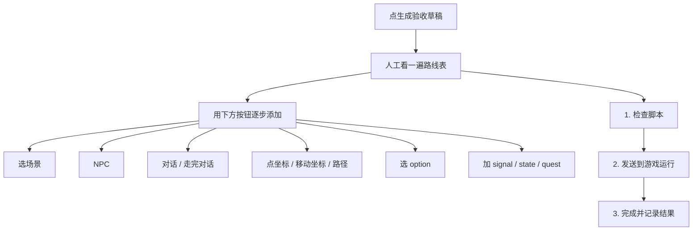

# 剧情单元验收

「剧情单元」不是新的剧情编辑器。它只是把你在主编辑器里做的那一块剧情，包成**能追踪、能验收、能复制报告**的工作包——像给雾津寻狗记某一环贴一张验货单。

---

## 这块 Tab 管什么

剧情单元分三层，各管各的：

| 层 | 管什么 |
|---|---|
| **这个剧情单元是什么** | 给人看的定义：类型、进度、入口、出口、通过标准——不直接驱动游戏 |
| **自动验收怎么跑** | 会被转成运行时命令，发给正在运行的游戏去走一遍 |
| **结果、阻塞和素材需求** | 记录这块现在能不能过、卡在哪、还缺什么图 |

改对白、改任务、改状态机——仍去 **[主编辑器](../main-editor/overview)**。这里只**定义怎么验、跑验收、记结果**。

---

## 怎么打开

1. `./dev.sh workbench`
2. 点顶部 **剧情单元**
3. 左侧列表选要做的单元；不确定下一步时点顶部 **操作向导**

---

## 制作状态怎么选

点 **制作状态** 旁的 **选择**，按真实进度选，别凑数：

| 状态 | 什么时候选 |
|---|---|
| **未做** | 还没开始动这块 |
| **制作中** | 正在做，验收路线可以先不补齐 |
| **可玩** | 已经能走一遍，但还没正式验收 |
| **待验收** | 必须补齐入口、出口、通过标准和验收路线，否则保存会拦住你 |
| **通过** | 必须最近一次验收结果是「通过」才能选 |
| **冻结** | 验收通过后锁起来，别轻易再改 |

:::info[保存会拦的情况]
选「待验收」却没填齐入口、出口、通过标准或验收路线，保存过不去。选「通过」但最近一次验收没过，也过不去。
:::

**类型** 同样点 **选择**，别在下拉框里盲翻。

---

## 填「这个剧情单元是什么」

可以自由写人话的字段：

- 显示名
- **剧情入口** —— 玩家怎样开始，例如「进入码头后和铁环男孩对话」；想让自动验收复用，也可写「进入测试场景、在门边出生」这类机器能懂的短句
- **剧情出口** —— 做完后应到什么状态，例如「铁环男孩线标记为已见面」
- **通过标准** —— 一句话怎样算过，例如「发出见面信号，寻源任务进入进行中」
- 阻塞、素材需求、备注

**素材需求** 和 **备注** 旁有选择器：**选已有素材需求** 从现有素材里搜作参考；**加 zone 到备注** 从场景区域里搜，不手写区域编号。

---

## 搭验收路线（重点）

**不要手写编号，不要手填占位数字。** 所有会变多的引用——场景、对话、旗标、NPC、热点、选项、信号、状态、任务——都走 **搜索选择器**。



上方 **验收路线** 表会显示起点、前置、执行步骤、选项、期望结果和复查项。不知道怎么开始时：

1. 点 **生成验收草稿** —— 从当前单元涉及的对话、信号、状态、任务推一条起步路线
2. 草稿**不会覆盖**已有路线；生成后必须人工看一遍
3. 用下方按钮添加：**选场景**、**选对话**、**加 flag**、**NPC**、**热点**、**点坐标**、**移动坐标**、**路径**、**选 option**、**加 signal** 等
4. 坐标类步骤先选场景，再在场景背景图上点位置；**路径** 按顺序点多个点
5. 加错了：在表里选中那一行 → **删除选中**；顺序错了 → **上移** / **下移**
6. 只复制路线点 **复制验收路线**；要全部上下文点顶部 **复制当前单元报告**

**自动验收脚本显示区** 是机器生成的，正常情况不要手写。

检查没问题后，回主编辑器改具体对白和任务，再回来跑验收。

---

## 三步验收

先让游戏跑起来：

```bash
./dev.sh game start
```

浏览器里打开游戏页面，然后回到工作台 **剧情单元**：

1. **1. 检查脚本** —— 有 error 先修，再去主编辑器改内容
2. **2. 发送到游戏运行** —— 等浏览器里执行完
3. **3. 完成并记录结果** —— 看过没过

结果不对就 **复制报告** 交给 AI 同事修。过了以后把制作状态改成 **通过** 或 **冻结**。

需要更细的问题明细时，点 **当前单元自检**。

---

## 雾津例子：铁环男孩初遇

1. 左侧选「铁环男孩初遇」，制作状态选 **制作中**。
2. 剧情入口填「进入码头后和铁环男孩对话」；出口填「铁环男孩线.done」；通过标准填「发出 ringboy.met，任务 bridge_find_source 进入 Active」。
3. 点 **生成验收草稿**，人工确认后补全：
   - **选场景** → 码头
   - **NPC** → 铁环男孩
   - **对话** → 初遇对白
   - **走完对话**
   - **加 signal** → ringboy.met
   - **加 quest** → bridge_find_source，目标状态 Active
4. **检查脚本** 无 error → 游戏里已开着 → **发送到游戏运行** → **完成并记录结果**。
5. 显示通过 → 制作状态改 **通过**。

---

## 相关

- [生产工作台总览](./overview)
- [Graph 诊断](./graph-diag)
- [运行时调试](./runtime-debug)
- [主编辑器总览](../main-editor/overview)
