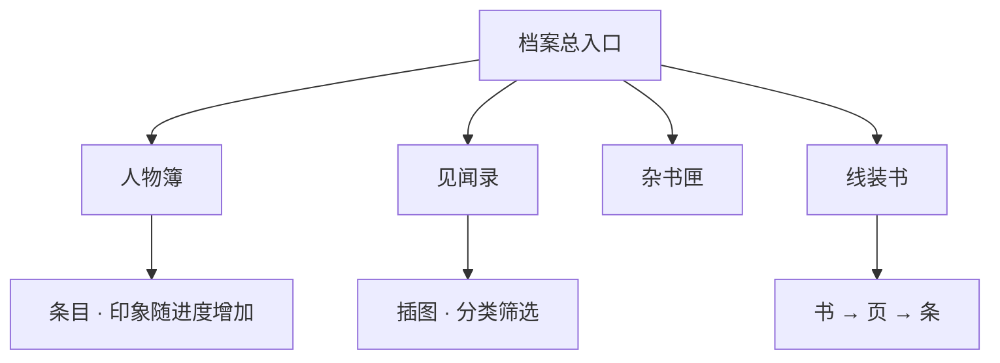

# 档案 · 见闻录

雾津的故事散在街头巷尾。除了当下对话，你还可以翻**档案**——把见过的人、听过的怪谈、捡到的文档攒成一本志怪簿。进度推进、调查、完成任务都会解锁新条目。

---

## 档案分哪几类

| 分类 | 内容 | 例子 |
|---|---|---|
| **人物簿** | 你见过的人：外貌、脾气、印象 | 关二狗、李天狗、庙祝、糖画王 |
| **见闻录** | 怪谈、风俗、渡口闲话 | 捞尸人规矩、阎王岭传闻 |
| **杂书匣 / 文档** | 纸条、告示、抄本 | 义庄告示、袍哥口信 |
| **线装书籍** | 分册分页的长文 | 多页逐条读，像翻旧书 |

在探索状态打开**档案**入口（与背包、规矩本并列，以当前界面为准），再选子分类浏览。

---

## 怎么解锁

条目不是一开始全开放：

| 方式 | 说明 |
|---|---|
| 跟某人首次深聊 | 人物簿出现或更新 |
| 调查特定热区 | 见闻录多一篇 |
| 完成任务步骤 | 文档、书籍新页 |
| 持有物品或旗标 | 条件满足才看得见 |

列表里灰掉或没有的，代表**还没轮到**——回去探索、对话、做任务。

---

## 怎么阅读

1. 选中一条，正文区显示标题与内容。
2. **首次阅读**有时有翻页声、短动画，并记下「已读」进度。
3. 见闻里可能有**插图**（水彩雾津图、城隍庙线图等），点开放大或内嵌显示。
4. 人物簿除固定介绍外，**印象**会随你行为追加——对关二狗嘴硬，印象里可能多一句「不好惹」。

富文本里出现的名字、物品名会和游戏里实际登记一致；你背包里改了显示名，档案引用也会跟着变。

---

## 和别的系统怎么配合

| 系统 | 关系 |
|---|---|
| **任务** | 任务目标常写「去档案查某某」——查完已知信息再出门 |
| **规矩本** | 见闻讲风俗，规矩本讲能用的法则，对照看更清楚 |
| **气味 / 环境** | 档案写「焚香」，进庙闻到对上会更沉浸 |
| **地图探索** | 见闻里提的地名，回场景对照找调查点 |

---

## 雾津阅读建议（不剧透）

| 建议 | 原因 |
|---|---|
| 新认识 NPC 后翻人物簿 | 印象条会补，避免漏关系线 |
| 进城隍庙、义庄前扫一眼见闻 | 规矩相关伏笔常藏在这里 |
| 线装书按页读 | 跳页可能漏条件触发用的细节 |
| 二狗线索断档时查文档匣 | 任务道具说明和档案互引 |

档案是慢节奏享受；急着推主线可以晚点再补，但阎王岭、叫魂前补一遍见闻更稳。

下一页：[提示与技巧](./tips)。
