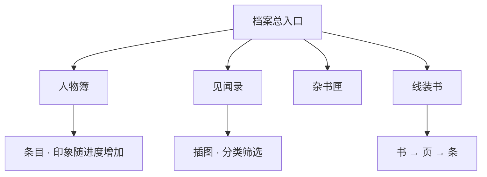

# 档案 · 见闻录

雾津的故事散在街头巷尾。除了当下对话，你还可以翻**档案**——把见过的人、听过的怪谈、捡到的文档攒成一本志怪簿。进度推进、调查、完成任务都会解锁新条目。这页讲清档案分几类、怎么解锁、怎么读、和别的系统怎么对照着用。

---

## 这是什么（30 秒看懂）

把档案想成关二狗随身揣的一本**杂记**：谁跟他说过什么话、哪条街有什么怪谈、捡到过什么纸条，都被他顺手记下来了。它不推进剧情，也不是必须翻的——但翻了往往能提前看懂一条规矩为什么这么定、一个人为什么这么说话，属于「慢半拍也值」的内容。

---

## 入门：手把手做第一次

以「第一次认识李天狗后去翻档案」为例：

1. 跟李天狗第一次深聊完，回到探索状态。
2. 打开**档案**入口（与背包、规矩本并列，以当前界面为准）。
3. 进**人物簿**分类，找到「李天狗」这一条，查看已解锁的外貌、脾气、初始印象。
4. 顺手翻一眼**见闻录**，看看有没有和他相关的传闻新条目一起解锁。
5. 之后每次跟他产生新互动（选了嘴硬的话、帮了他一次），回来翻翻印象文字有没有更新——这是低成本了解剧情走向的好习惯。

---

## 进阶：每一项都讲透

### 档案分哪几类

| 分类 | 内容 | 例子 |
|---|---|---|
| **人物簿** | 你见过的人：外貌、脾气、印象 | 关二狗、李天狗、庙祝、糖画王 |
| **见闻录** | 怪谈、风俗、渡口闲话 | 捞尸人规矩、阎王岭传闻 |
| **杂书匣 / 文档** | 纸条、告示、抄本 | 义庄告示、袍哥口信 |
| **线装书籍** | 分册分页的长文 | 多页逐条读，像翻旧书 |

四类各有节奏：人物簿随你和角色的互动慢慢长厚；见闻录偏一次性收集，读完基本就定型；杂书匣常是任务链的旁证；线装书是分册长文,适合闲时慢慢读完。

### 怎么解锁，逐条讲

条目不是一开始全开放：

| 方式 | 说明 |
|---|---|
| 跟某人首次深聊 | 人物簿出现或更新 |
| 调查特定热区 | 见闻录多一篇 |
| 完成任务步骤 | 文档、书籍新页解锁 |
| 持有物品或旗标 | 条件满足才看得见 |

列表里灰掉或没有的，代表**还没轮到**——回去探索、对话、做任务，通常都能补上。有些条目还会分阶段更新：同一个人物簿条目，可能随剧情推进换几次表述，不是一次性写死的。

### 怎么阅读

1. 选中一条，正文区显示标题与内容。
2. **首次阅读**有时有翻页声、短动画，并记下「已读」进度，方便你知道自己漏没漏。
3. 见闻里可能有**插图**（水彩雾津图、城隍庙线图等），点开放大或内嵌显示。
4. 人物簿除固定介绍外，**印象**会随你行为追加——对关二狗嘴硬，印象里可能多一句「不好惹」；帮过忙，印象可能软化。

富文本里出现的名字、物品名会和游戏里实际登记一致；你背包里改了显示名，档案引用也会跟着变。

### 和别的系统怎么配合

| 系统 | 关系 |
|---|---|
| **任务** | 任务目标常写「去档案查某某」——查完已知信息再出门，能省不少空转 |
| **规矩本** | 见闻讲风俗，规矩本讲能用的法则，对照看更清楚为什么这么规定 |
| **物品与买卖** | 物品说明里出现的人名地名，会和档案条目联动，互为参照 |
| **地图探索** | 见闻里提的地名，回场景对照找调查点，常能发现之前漏掉的热区 |

### 老手读法（不剧透）

| 建议 | 原因 |
|---|---|
| 新认识 NPC 后翻人物簿 | 印象条会补，避免漏关系线 |
| 进城隍庙、义庄前扫一眼见闻 | 规矩相关伏笔常藏在这里，提前读能少踩坑 |
| 线装书按页读 | 跳页可能漏掉后续触发条件用的细节 |
| 二狗线索断档时查文档匣 | 任务道具说明和档案互引，常能找到下一步线索 |
| 定期回翻已读条目 | 部分条目会随剧情悄悄更新表述，不是一劳永逸 |

档案是慢节奏享受；急着推主线可以晚点再补，但阎王岭、叫魂前补一遍见闻更稳。

---

## 常见问题

**档案条目一直是灰的，是不是漏内容了？**
不一定，多数灰条只是「还没轮到」——继续探索、做任务、跟人对话，条件满足会自动解锁，不需要特意去找。

**同一个人的人物簿会不会一直不变？**
不会，印象文字会随你的选择和互动追加或更新，值得隔一阵回翻确认有没有变化。

**见闻录和规矩本内容重复吗？**
不完全重复，见闻讲风俗为什么这样、规矩本讲能实际操作的法则，两者对照着看更容易理解一条规矩的来龙去脉。

**线装书要一次读完吗？**
不用，可以分次读，但建议按页顺序读，跳页可能漏掉之后触发某些内容用到的细节。

**档案能不能影响剧情走向？**
档案本身是记录型内容，不会反过来改变剧情，但读没读、读没读全，会影响你判断规矩、选对话选项时的信息量。

**读档会不会清空已解锁的档案？**
会，读档回到存档点状态，之后新解锁的条目也会一并回滚，见 [存档与设置](./save)。

---

## 相关

- [规矩系统](./rules)——见闻风俗和规矩条文互相印证。
- [对话与选择](./dialogue-choice)——深聊解锁人物簿的具体入口。
- [物品与买卖](./items-shop)——物品说明和档案条目的联动。

下一页：[提示与技巧](./tips)。
