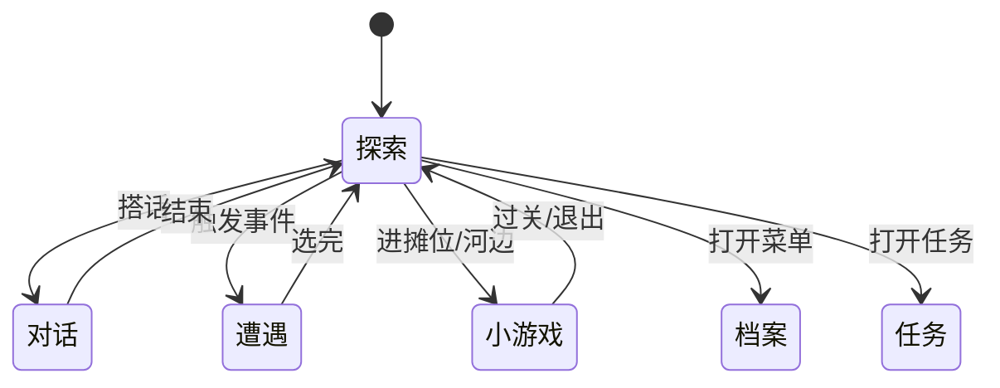

# 操作与界面

雾津城里大部分时候你在**场景探索**——走路、看人、调查、搭话。进入对话、遭遇、小游戏或菜单时，界面会切换，但底层操作习惯不变。

---

## 键盘操作

| 按键 | 作用 |
|---|---|
| `W` `A` `S` `D` 或方向键 | 移动 |
| `Shift`（按住） | 奔跑 |
| `E` 或 `空格` | 互动——对话、调查、拾取、开门等 |
| `F5` | 快速存档 |
| `F6` | 快速读档 |

:::tip[互动提示]
走近可互动的对象时，画面通常会有提示。没看到提示就按互动键，多半是没站对位置，或者这件事还没满足触发条件。
:::

---

## 游戏状态一览

游戏在几种**状态**之间切换；每种状态能做的事不同：

| 状态 | 你在干什么 |
|---|---|
| **场景探索** | 默认状态。自由走动，找热区、找 NPC。 |
| **对话** | 跟 NPC 说话，读台词，有时要选选项。 |
| **遭遇** | 一页多个选项的紧要关头——常和规矩、物品有关。 |
| **任务** | 查看主线、支线进度与目标说明。 |
| **背包 / 规矩本** | 管物品，翻已学会的规矩与碎片。 |
| **小游戏** | 糖画转盘、扎纸、水域等独立玩法。 |
| **档案** | 人物簿、见闻录、杂书匣、线装书。 |

---

## 界面区域（探索时）

不同版本皮肤略有差异，但逻辑相近：

| 区域 | 作用 |
|---|---|
| **主画面** | 当前场景；角色在里头走动。 |
| **互动提示** | 靠近可调查处、NPC、门洞时出现。 |
| **任务追踪** | 当前目标摘要，迷路时先看一眼。 |
| **快捷入口** | 背包、规矩本、档案、任务等——以你当前版本显示的为准。 |

对话、遭遇、小游戏会占满或大半屏幕，用选项、按钮或专用控件操作；结束后回到探索。

---

## 位面与画面变化

推进剧情后，雾津有时会进入**另一位面**——同一地点，能见到的人、能调查的东西可能完全不同。例如鬼打墙激活后，巷口多出人影、少路灯。

这不是设置里的选项，而是故事推进的结果。若突然发现「刚才还能对话的人不见了」，先回想最近是否触发了险境或完成了某段任务。

---

## 常见问题

| 现象 | 多半原因 |
|---|---|
| 按互动没反应 | 站太远；或该互动尚未解锁 |
| 跑不动 | 对话/遭遇/小游戏进行中，先结束当前状态 |
| 找不到菜单 | 在探索状态打开；部分剧情会暂时禁菜单 |

更多存档与设置见 [存档与设置](./save)；探索细节见 [探索与交互](./exploration)。
