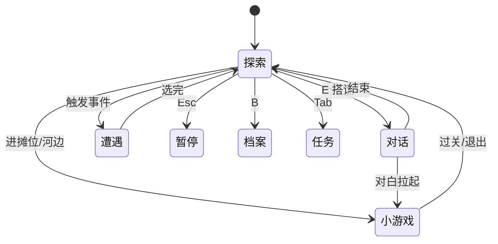

# 操作与界面

这页讲清楚：你按哪几个键、屏幕上各块区域是干嘛的、以及游戏在不同「状态」之间切换时你该怎么应对。读完你能不慌不忙地在雾津走路、互动、开菜单，遇到界面突然变了也知道是怎么回事。

---

## 这是什么（30 秒看懂）

雾津城里大部分时候你在**场景探索**——走路、看人、调查、搭话，这时候操作很简单：移动键 + 互动键 `E`。进入对话、遭遇、小游戏或菜单时，界面会切换成对应的样子；`空格` / `Enter` 多半用来**推进对白、确认选项、按住蓄力**，不再当作「街上随便互动」的键。

打个比方：探索状态像你在雾津的街上溜达，`E` 像随时能伸手敲门；进了对话或遭遇，就像敲开了门走进屋里，屋里用确认键往下翻页。

---

## 入门：新手怎么玩

### 键盘操作

| 按键 | 作用 |
|---|---|
| `W` `A` `S` `D` 或方向键 | 移动 |
| `Shift`（按住） | 奔跑 |
| `E` | **探索互动**——对话、调查、拾取、开门、转场等 |
| `空格` / `Enter` | 对话 / 遭遇 / 过场推进；选项确认；压力长按与水域拉拽时按住 |
| `数字键 1–9` | 对话或遭遇里快速选第 N 个选项 |
| `Q` | **主动闻一下**当前气味提示 |
| `Tab` | 任务面板 |
| `I` | 背包 |
| `R` | 规矩本 |
| `L` | 对话记录 |
| `B` | 书架 / 档案 |
| `M` | 世界地图 |
| `F` | 使用规矩（在可判定场合） |
| `Esc` | 暂停菜单（存读档、设置） |

:::tip[互动提示]
走近可互动的对象时，画面通常会有提示。没看到提示就按 `E`，多半是没站对位置，或者这件事还没满足触发条件。
:::

### 第一次上手，照这几步试

1. 用 `W/A/S/D` 或方向键在场景里走两步，感受一下移动手感。
2. 按住 `Shift` 跑一段，确认松开后恢复步行。
3. 走到一个 NPC（比如茶馆里的说书人或土地庙外的李天狗）身边，看屏幕出没出互动提示；出现了就按 `E` 搭话。
4. 对话里用 `空格` / `Enter` 往下翻句；有选项时用数字键或鼠标点选。
5. 对话结束回到探索后，按 `Esc` 打开暂停菜单，熟悉三个存档槽；再按 `I` / `R` / `B` / `M` / `Tab` 混个脸熟。
6. 路过气味异常的地方，按 `Q` 主动闻一下，看提示有没有变化。

### 游戏状态一览

| 状态 | 你在干什么 |
|---|---|
| **场景探索** | 默认状态。自由走动，找热区、找 NPC。 |
| **对话** | 跟 NPC 说话，读台词，有时要选选项。 |
| **遭遇** | 一页多个选项的紧要关头——常和规矩、物品有关。 |
| **任务** | 查看主线、支线、活计进度与目标说明。 |
| **背包 / 规矩本** | 管物品，翻已学会的规矩与碎片。 |
| **小游戏** | 糖画转盘、扎纸、水域等独立玩法。 |
| **档案** | 人物簿、见闻录、杂书匣、线装书。 |
| **暂停** | 存读档、设置；不安全状态（对话/遭遇/过场/小游戏中）通常不能存。 |

---

## 进阶：玩深的技巧

### 界面区域（探索时）逐块讲

| 区域 | 作用 | 用法要点 |
|---|---|---|
| **主画面** | 当前场景；角色在里头走动 | 场景背景、NPC、热区都画在这一层；互动提示也出现在这里 |
| **互动提示** | 靠近可调查处、NPC、门洞时出现 | 提示形状/图标可能暗示互动类型（调查 / 拾取 / 对话 / 转场） |
| **任务追踪** | 当前目标摘要 | 迷路时先看这里；活计激活时目标会变 |
| **气味提示** | 当前环境气味的视觉/文字提示 | 主动按 `Q` 可再确认一次 |
| **快捷入口** | 背包、规矩本、档案、任务、地图等 | 一般探索状态下才能打开 |

记住：**只有探索状态才能自由开菜单**；其它状态先把手头这件事做完。

### 状态之间怎么串联

- **对话中途直接拉进小游戏**：比如糖画摊搭讪后选「讨个彩头」，会从对话直接跳进糖画转盘。
- **遭遇里选项直接触发长按险境**：某些遭遇选项按下去不是结束对话，而是立刻进入 [压力与险境](./pressure)。
- **探索中被剧情强制锁菜单**：部分演出或紧张段落会暂时关闭背包/任务入口。

### 位面与画面变化

推进剧情后，雾津有时会进入**另一位面**——同一地点，能见到的人、能调查的东西可能完全不同。若突然发现「刚才还能对话的人不见了」，先回想最近是否触发了险境或完成了某段任务。

### 不同版本的差异

| 版本 | 差异点 |
|---|---|
| 浏览器版 | 窗口大小随浏览器；部分快捷键可能与浏览器自身快捷键冲突 |
| 独立导出包 | 一般支持窗口/全屏切换（见 [存档与设置](./save)）；键位与浏览器版基本一致 |

---

## 常见问题

| 现象 | 多半原因 |
|---|---|
| 按 `E` 没反应 | 站太远；或该互动尚未解锁（任务/规矩条件未满足） |
| 按空格没互动 | 探索态只认 `E`；空格留给对话推进和长按 |
| 跑不动 | 对话/遭遇/小游戏进行中，先结束当前状态 |
| 找不到菜单 | 需在探索状态打开；部分剧情会暂时禁菜单 |
| 互动提示忽然消失 | 热区可能已经调查/拾取过；或位面变了 |
| 全屏后按键失灵 | 多是浏览器版窗口失焦，点一下游戏画面重新获取焦点 |
| 按 `Q` 没感觉 | 当前区域没有气味配置，或提示本身很淡 |

更多存档与设置见 [存档与设置](./save)；探索细节见 [探索与交互](./exploration)。

---

## 相关

- [走进雾津](./intro)——先认识世界观和主角
- [存档与设置](./save)——三槽存读档与设置项
- [探索与交互](./exploration)——热区、调查、拾取、转场
- [任务与活计](./quests)——主线、支线、可重复活计
- [世界地图](./map)——节点解锁与回访
- [对话与选择](./dialogue-choice)——对话界面怎么用、选项怎么选
