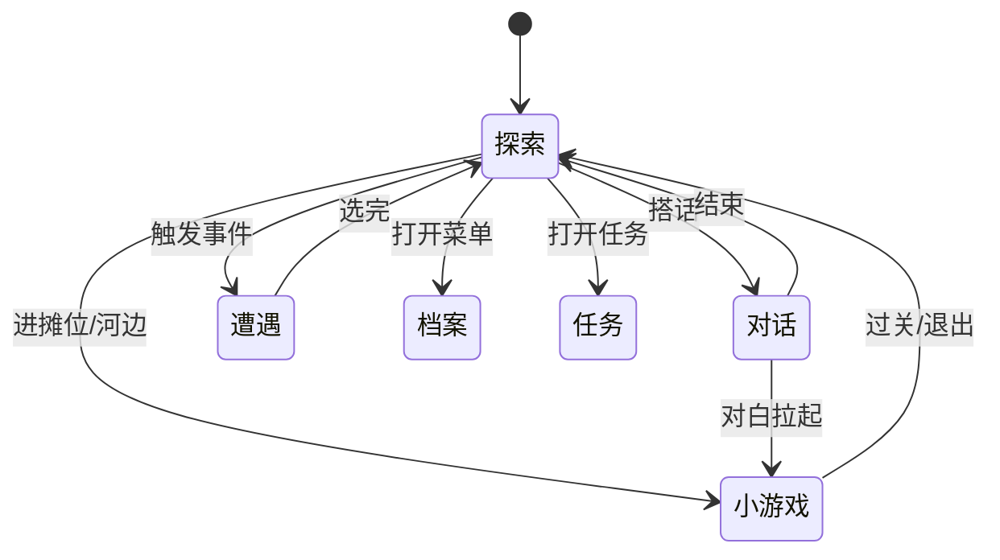

# 操作与界面

这页讲清楚：你按哪几个键、屏幕上各块区域是干嘛的、以及游戏在不同「状态」之间切换时你该怎么应对。读完你能不慌不忙地在雾津走路、互动、开菜单，遇到界面突然变了也知道是怎么回事。

---

## 这是什么（30 秒看懂）

雾津城里大部分时候你在**场景探索**——走路、看人、调查、搭话，这时候操作很简单：移动键 + 一个万能互动键。进入对话、遭遇、小游戏或菜单时，界面会切换成对应的样子，但「按互动键推进」「用方向键选选项」这套底层习惯基本不变。

打个比方：探索状态像你在雾津的街上溜达，互动键像你随时能伸手敲门；进了对话或遭遇，就像敲开了门走进屋里，屋里的规矩（选选项、看剧情）跟街上不一样，但「敲门」这个动作你已经会了。

---

## 入门：新手怎么玩

### 键盘操作

| 按键 | 作用 |
|---|---|
| `W` `A` `S` `D` 或方向键 | 移动 |
| `Shift`（按住） | 奔跑 |
| `E` 或 `空格` | 互动——对话、调查、拾取、开门等 |
| `F5` | 快速存档 |
| `F6` | 快速读档 |

:::tip[互动提示]
走近可互动的对象时，画面通常会有提示。没看到提示就按互动键，多半是没站对位置，或者这件事还没满足触发条件。
:::

### 第一次上手，照这几步试

1. 用 `W/A/S/D` 或方向键在场景里走两步，感受一下移动手感。
2. 按住 `Shift` 跑一段，确认松开后恢复步行。
3. 走到一个 NPC（比如土地庙外的李天狗）身边，看屏幕出没出互动提示；出现了就按 `E` 或空格试着搭话。
4. 对话结束回到探索后，打开背包/规矩本/档案随便看一眼，感受一下菜单类界面长什么样。
5. 找个安全的时机按一下 `F5`，再按 `F6` 试试读档，确认自己会用快速存读——这个动作以后每进一次险境前都要做。

### 游戏状态一览

游戏在几种**状态**之间切换；每种状态能做的事不同：

| 状态 | 你在干什么 |
|---|---|
| **场景探索** | 默认状态。自由走动，找热区、找 NPC。 |
| **对话** | 跟 NPC 说话，读台词，有时要选选项。 |
| **遭遇** | 一页多个选项的紧要关头——常和规矩、物品有关。 |
| **任务** | 查看主线、支线进度与目标说明。 |
| **背包 / 规矩本** | 管物品，翻已学会的规矩与碎片。 |
| **小游戏** | 糖画转盘、扎纸、水域等独立玩法。 |
| **档案** | 人物簿、见闻录、杂书匣、线装书。 |

---

## 进阶：玩深的技巧

### 界面区域（探索时）逐块讲

不同版本皮肤略有差异，但逻辑相近：

| 区域 | 作用 | 用法要点 |
|---|---|---|
| **主画面** | 当前场景；角色在里头走动 | 场景背景、NPC、热区都画在这一层；互动提示也出现在这里 |
| **互动提示** | 靠近可调查处、NPC、门洞时出现 | 提示形状/图标可能暗示互动类型（调查 / 拾取 / 对话 / 转场），留意区分 |
| **任务追踪** | 当前目标摘要 | 迷路时先看这里，比满地图瞎找效率高 |
| **快捷入口** | 背包、规矩本、档案、任务等 | 具体按键或图标以你当前版本显示的为准，一般探索状态下才能打开 |

对话、遭遇、小游戏会占满或大半屏幕，用选项、按钮或专用控件操作；结束后回到探索。记住这个规律：**只有探索状态才能自由开菜单**，其它状态先把手头这件事做完（对完话、选完项、过完小游戏）才能回去翻背包。

### 状态之间怎么串联

几个容易让新手愣住的连锁情况：

- **对话中途直接拉进小游戏**：比如糖画摊搭讪后选「讨个彩头」，会从对话直接跳进糖画转盘，退出后一般回到对话或直接回探索——不是操作出错。
- **遭遇里选项直接触发长按险境**：某些遭遇选项按下去不是结束对话，而是立刻进入 [压力与险境](./pressure) 的长按环节，提前有个心理准备。
- **探索中被剧情强制锁菜单**：部分演出或紧张段落会暂时关闭背包/任务入口，这是设计好的节奏控制，不是卡死。

### 位面与画面变化

推进剧情后，雾津有时会进入**另一位面**——同一地点，能见到的人、能调查的东西可能完全不同。例如某些险境激活后，巷口多出人影、少路灯，原本能对话的 NPC 也可能暂时不在。

这不是设置里的选项，而是故事推进的结果。若突然发现「刚才还能对话的人不见了」，先回想最近是否触发了险境或完成了某段任务，再回去看看这地方是不是换了位面。

### 不同版本的差异

游戏可能有浏览器版和独立导出包两种形态：

| 版本 | 差异点 |
|---|---|
| 浏览器版 | 窗口大小随浏览器；部分快捷键可能与浏览器自身快捷键冲突，注意别按到浏览器的刷新/后退 |
| 独立导出包 | 一般支持窗口/全屏切换（见 [存档与设置](./save)）；键位与浏览器版基本一致 |

具体按键提示以你实际运行的版本内显示为准，本页表格是通用基准。

---

## 常见问题

| 现象 | 多半原因 |
|---|---|
| 按互动没反应 | 站太远；或该互动尚未解锁（任务/规矩条件未满足） |
| 跑不动 | 对话/遭遇/小游戏进行中，先结束当前状态 |
| 找不到菜单 | 需在探索状态打开；部分剧情会暂时禁菜单 |
| 互动提示忽然消失 | 这处热区可能已经调查/拾取过，变成「一次性」用完；或位面变了 |
| 全屏后按键失灵 | 多是浏览器版窗口失焦，点一下游戏画面重新获取焦点 |
| 浏览器版 `F5` 没反应或刷新了页面 | 少数浏览器把 `F5` 优先当刷新页面处理，确认游戏窗口已获得焦点后再按 |

更多存档与设置见 [存档与设置](./save)；探索细节见 [探索与交互](./exploration)。

---

## 相关

- [走进雾津](./intro)——先认识世界观和主角
- [存档与设置](./save)——快速存读档与设置项
- [探索与交互](./exploration)——热区、调查、拾取、转场
- [对话与选择](./dialogue-choice)——对话界面怎么用、选项怎么选
