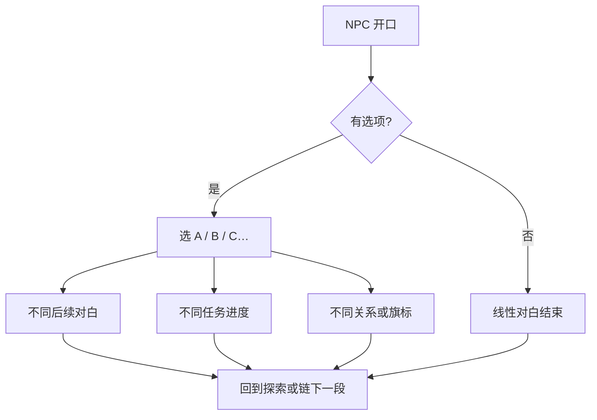

# 对话与选择

雾津的人嘴碎、心眼多。跟 NPC 搭话是对话的主要形式；有些关头则是一页多选的**遭遇**（见 [规矩系统](./rules)）。本节先说**图对话**——边走边聊、选项分支那种。

---

## 怎么进入对话

在探索状态走近 NPC 或剧情触发点，按 `E` 或 `空格`。屏幕切到对话界面：立绘或半身像、说话人名字、台词逐句或整段显示。

对白是**重庆话口味**的市井腔，偶尔带字谜、俗语。读不懂先往下点，上下文会补。

---

## 对话界面怎么用

| 操作 | 作用 |
|---|---|
| 点击 / 空格 / 确认键 | 跳下一句 |
| 选选项 | 鼠标或方向键选中，确认 |

没有选项时，一路确认到底即结束，回到探索。

---

## 选项与分支

出现**选项**时，每个按钮是一句你能说的话或能做的事。选不同项，后面台词、任务、甚至谁能见到都会变。

### 选项上常见提示

| 提示 | 意思 |
|---|---|
| 灰色、点不了 | 条件不满足——缺物品、规矩未学、任务未到 |
| 规矩相关暗示 | 这项和某条规矩有关；没学全可能选不了或选了吃亏 |
| 花费说明 | 选这项要扣铜钱或物品 |

关二狗贫嘴、李天狗绕弯的选项，有时**嘴硬路线**和**守规矩路线**回报不同——不是善恶滑条，是雾津处世。

---

## 对话和别的系统怎么接

| 系统 | 关系 |
|---|---|
| **任务** | 对话可接任务、交任务、更新目标 |
| **规矩** | 选项可能要求已学某层规矩；或给你规矩提示 |
| **物品** | 对话里交物品、买东西、触发使用 |
| **遭遇** | 激烈冲突常用遭遇页；对话偏铺陈与日常 |
| **小游戏** | 对白结束可能直接拉你进糖画、扎纸、水域 |
| **档案** | 首次跟某人深聊，可能解锁人物簿条目 |

---

## 雾津例子（不剧透主线）

**土地庙外，李天狗问路：**

- 选「道士你也穷？」——关二狗嘴贱，可能多听几句闲话，档案里多一条印象。
- 选「二狗丢哪儿了？」——直奔主题，任务目标更清楚。

**城隍庙庙会，糖画王搭讪：**

- 选「讨个彩头」——进 [小游戏 · 糖画转盘](./minigames#糖画转盘)。
- 选「没闲钱」——跳过小游戏，剧情另走。

---

## 读档与对话

重大选项前建议 `F5` 快速存档（见 [存档与设置](./save)）。雾津不少分支**不能事后合并**，读档是正当玩法。

下一页：[规矩系统](./rules)——象、理、术与遭遇选项。
