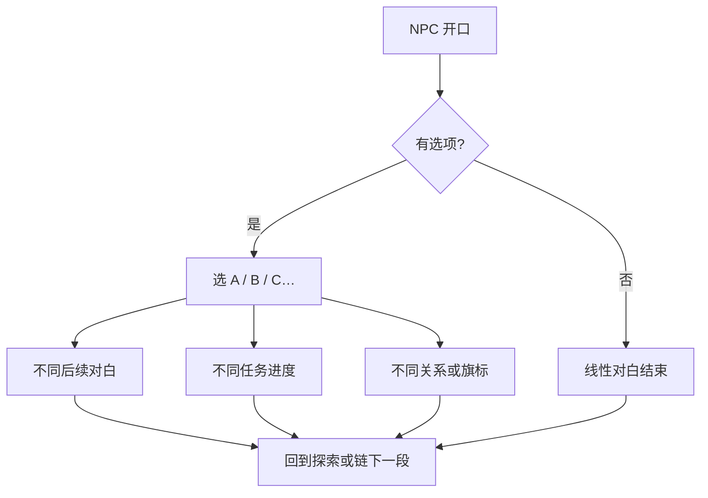

# 对话与选择

这页讲清楚：怎么跟 NPC 搭话、对话界面怎么操作、选项怎么影响后面的剧情。读完你就知道雾津里「说什么话」这件事有多大分量，不会把选项当成随手一点的过场。

---

## 这是什么（30 秒看懂）

雾津的人嘴碎、心眼多。跟 NPC 搭话是对话的主要形式——边走边聊、选项分支那种，我们叫它**图对话**。有些关头则是一页多选的**遭遇**（更紧张、更常和规矩挂钩，见 [规矩系统](./rules)）。这两者的区别可以这么记：**对话偏日常铺陈**，**遭遇偏紧急抉择**。本页专讲对话。

打个比方：对话像你在茶馆坐下跟人拉家常，气氛松弛，但对方说的每句话、你答的每个选项，都可能悄悄改变他往后愿不愿意帮你、跟你说不说实话。

---

## 入门：新手怎么玩

### 怎么进入对话

在探索状态走近 NPC 或剧情触发点，按 `E` 或 `空格`。屏幕切到对话界面：立绘或半身像、说话人名字、台词逐句或整段显示。

对白是**重庆话口味**的市井腔，偶尔带字谜、俗语。读不懂先往下点，上下文会补。

### 对话界面怎么用

| 操作 | 作用 |
|---|---|
| 点击 / 空格 / 确认键 | 跳下一句 |
| 选选项 | 鼠标或方向键选中，确认 |

没有选项时，一路确认到底即结束，回到探索。

### 第一次进对话，照这几步走

1. 走近一个 NPC（比如土地庙外的李天狗），看互动提示出现，按 `E`/空格进入对话。
2. 把每一句台词读完，别急着连续点跳过——对白里常藏着任务线索。
3. 遇到选项时，先停一下想想「关二狗会怎么答」，再选。
4. 选完看对方的反应有没有变化——语气、后续台词、给不给你新信息。
5. 对话结束回到探索后，翻一下**任务面板**，确认这段对话有没有更新目标。

---

## 进阶：玩深的技巧

### 选项与分支

出现**选项**时，每个按钮是一句你能说的话或能做的事。选不同项，后面台词、任务、甚至谁能见到都会变。

### 选项上常见提示，逐条讲清楚

| 提示 | 意思 | 你该怎么做 |
|---|---|---|
| 灰色、点不了 | 条件不满足——缺物品、规矩未学、任务未到 | 先去补条件（学规矩、拿物品、推进任务），不是这选项永远没用 |
| 规矩相关暗示 | 这项和某条规矩有关；没学全可能选不了或选了吃亏 | 选前翻一眼规矩本，看自己学到哪一层 |
| 花费说明 | 选这项要扣铜钱或物品 | 确认背包够不够，选完不可反悔（除非读档） |

关二狗贫嘴、李天狗绕弯的选项，有时**嘴硬路线**和**守规矩路线**回报不同——不是善恶滑条，是雾津处世：嘴硬可能多套出点闲话或占点便宜，守规矩可能更稳妥但少点乐子，两条路都不是「正确答案」。

### 对话和别的系统怎么接

| 系统 | 关系 |
|---|---|
| **任务** | 对话可接任务、交任务、更新目标 |
| **规矩** | 选项可能要求已学某层规矩；或给你规矩提示 |
| **物品** | 对话里交物品、买东西、触发使用 |
| **遭遇** | 激烈冲突常用遭遇页；对话偏铺陈与日常 |
| **小游戏** | 对白结束可能直接拉你进糖画、扎纸、水域 |
| **档案** | 首次跟某人深聊，可能解锁人物簿条目 |

这张表的读法是：**对话是枢纽**——它几乎能触发所有其它系统。养成「每次对话都留意选项旁的小图标/提示」的习惯，能提前判断这段对话会不会牵出任务、规矩或小游戏。

### 怎么读懂话里有话

雾津的对白很少直给：

- 关二狗嘴上贫，很多时候是在遮掩正经想法，选项里带调侃味的那句不一定就是「不认真」的选择。
- 李天狗绕弯子，往往是在试探或留后手，选「追问」类选项常能多挖出一层信息。
- 同一句台词，配合规矩本上不同层（象/理/术）的解锁进度，可能读出不一样的弦外之音——这也是为什么规矩本值得随身翻看。

### 对话能不能反悔

选项一旦选定，游戏内没有「悔棋」按钮——但你可以在关键对话前 `F5` 存档，选完看看效果不满意，再 `F6` 读档换一条路线试试（见 [存档与设置](./save)）。这在雾津是正当玩法，别有心理负担。

---

## 常见问题

**选项都是灰的，是不是卡关了？**
先看灰色选项旁有没有提示——大概率是缺某条规矩、某件物品，或任务进度没到。回去补条件，回来再选。

**同一个 NPC 能反复对话吗？每次内容一样吗？**
能反复对话；内容常随任务进度、已知信息变化，不是每次都一模一样，值得时不时回去搭话。

**选错了会不会直接导致坏结局？**
雾津的选择不设「唯一正确答案」，大多数分支是走向不同、体验不同，而不是判定输赢。真正在意某个具体选择的后果，可以先存档再试。

**为什么有的对话没有选项，点到底就结束了？**
线性铺陈类对话本来就没有分支，作用是交代信息、推进见闻或任务，正常现象。

**对话和遭遇选不出来的东西有区别吗？**
对话的选项一般改变台词、关系、任务；遭遇的选项更常直接触发结果（给物品/掉血/切场景/进入长按险境），紧张程度更高，具体见 [规矩系统](./rules) 里的遭遇部分。

下一页：[规矩系统](./rules)——象、理、术与遭遇选项。

---

## 相关

- [操作与界面](./controls)——对话界面属于哪个游戏状态
- [规矩系统](./rules)——选项旁的规矩提示到底怎么判定
- [存档与设置](./save)——重大选择前怎么存档试探
