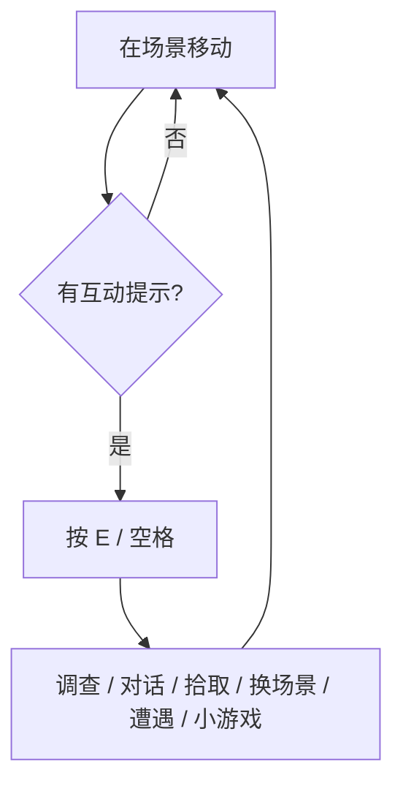

# 探索与交互

雾津由许多**场景**拼成：渡口、老街、义庄、城隍庙、土地庙、阎王岭外径……场景之间用门洞、台阶、渡口缆绳等连接。默认你在**探索状态**，用移动和互动键把地图摸透。

---

## 场景里有什么可互动

走近某些位置，会出现互动提示。常见几类：

| 类型 | 你感受到的 | 例子（雾津） |
|---|---|---|
| **调查** | 查看物件、读说明、找线索 | 义庄棺盖上的纸封、渡口沉箱痕迹 |
| **拾取** | 捡起地上的东西进背包 | 湿了的鞋、掉落的符纸 |
| **对话** | 跟 NPC 开口 | 关二狗蹲处、李天狗在土地庙台阶 |
| **转场** | 切到另一张地图 | 进城隍庙山门、出城往阎王岭 |
| **遭遇** | 弹出选项页，紧要抉择 | 纸人巷对峙、庙前规矩判定 |
| **小游戏** | 进入糖画、扎纸、水域 | 庙会糖画摊、江边捞物 |

统一操作：站进提示范围，按 `E` 或 `空格`。

---

## 调查与观察

调查点往往给**见闻线索**，不是每次都有物品。雾津里：

- 码头听捞尸人闲话，可能解锁档案里的见闻。
- 城隍庙看香炉裂纹，后面规矩或遭遇会对上。
- 义庄纸人姿态不对，别手快——先调查再决定动不动。

有些调查点**要任务或规矩到了才出现**；第一次路过没有提示，过阵子再来可能有。

---

## 拾取与背包

拾取后物品进**背包**。任务道具、消耗品、铜钱等类型不同，能不能用、在哪儿用，看物品说明和当前剧情。

- 李天狗让你找的引魂灯材料，通常得先捡到齐，才能在扎纸或对话里交差。
- 香烛、符纸之类，遭遇或险境里可能消耗；缺了记得去渡口货郎或城隍庙香烛铺看看 [物品与买卖](./items-shop)。

---

## 场景切换

**转场**热区多在门、渡口、巷子口。走过去互动即可切换地图。

注意：

| 情况 | 说明 |
|---|---|
| 门打不开 | 剧情未到时锁着；或要先跟某人对话、拿钥匙 |
| 同地名不同内容 | 可能进了**另一位面**——见 [操作与界面 · 位面](./controls#位面与画面变化) |
| 阎王岭 | 城外险地，建议存档后再进 |

---

## NPC 与走动

NPC 站在场景里，有的会动（巡逻、作揖），有的蹲着不动。互动距离不必贴脸，但离太远不会出对话。

关二狗、李天狗、庙祝、货郎、纸扎匠都会在固定或条件满足后出现。某人突然不在老位置，多半是剧情推走了，或当前位面看不见他。

---

## 任务与探索配合

打开**任务面板**看当前目标——写清要去哪、找谁、拿什么。任务说明和 [档案 · 见闻录](./archive) 可以对照着看，避免在老街空转。

---

## 小例子：从土地庙到渡口

1. 在**土地庙**外跟李天狗搭话，接到寻狗线索。
2. 调查庙旁供桌，拾取若有提示的符纸碎角。
3. 走转场到**渡口**，调查缆绳桩听闲话。
4. 若任务指向河边，找水域互动点尝试捞物（见 [小游戏玩法](./minigames)）。

探索是主线骨架；对话与规矩会在你走动时层层挂上。下一页：[对话与选择](./dialogue-choice)。
