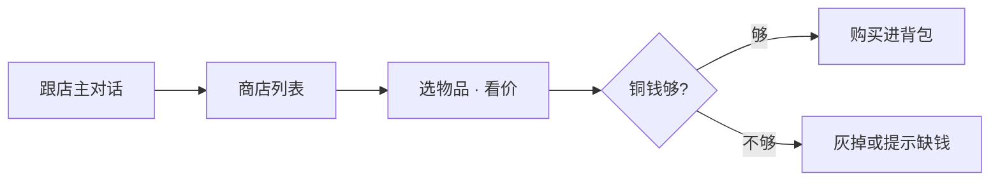

# 物品与买卖

雾津街上要花钱的地方不少：香烛、符纸、灯油、引路物……关二狗不是大户，**铜钱**得掂量着花。物品分任务道具、消耗品、可堆叠杂货；商店则是货郎、纸扎铺、香烛铺那一套价目表。

---

## 背包

探索时打开**背包**查看持有物：

| 信息 | 说明 |
|---|---|
| 名称与图标 | 这件是什么 |
| 数量 | 可堆叠物品显示个数 |
| 说明 | 用途、来历；随剧情可能追加描述 |

背包有堆叠上限；同类物品占一格叠满为止。任务关键物丢了往往得回场景捡或剧情重给——读档前想清楚。

---

## 物品从哪来

| 来源 | 例子 |
|---|---|
| 地上拾取 | 渡口湿鞋、碎符 |
| 对话 / 任务奖励 | 李天狗给的引魂材料 |
| 商店购买 | 城隍庙平安香 |
| 小游戏 | 糖画吉兆、水域捞上的沉箱钥匙 |
| 遭遇结果 | 选某选项后塞给你的 |

---

## 怎么用物品

不是所有东西都能从背包里「使用」：

| 类型 | 典型用法 |
|---|---|
| **消耗品** | 在背包或剧情里使用，回血、驱邪、交任务 |
| **任务道具** | 在指定 NPC 或调查点自动消耗 / 交付 |
| **装备 / 持物** | 改变互动或遭遇可用选项 |
| **货币** | 铜钱等，商店扣减，一般不单独「使用」 |

点不了使用时，多半是要去特定地点或跟特定人对话，而不是在菜单里硬点。

---

## 商店怎么逛

跟货郎、铺子老板对话，选「看看货」「买点香烛」等，打开**商店界面**：

| 界面元素 | 说明 |
|---|---|
| 商品列表 | 这家卖什么、标价多少文 |
| 你的铜钱 | 当前余额 |
| 购买 / 确认 | 扣钱、物品入背包 |

雾津常见铺子：

| 铺子 | 可能卖什么 |
|---|---|
| **渡口货郎** | 灯油、粗符、日常杂货 |
| **城隍庙香烛铺** | 平安香、纸钱、拜神用品 |
| **纸扎铺** | 扎纸材料、与丧仪相关物 |

价是**这家店**的价，不同铺子对同一物品可能不同。特价就是便宜，标价 0 就是白送——少见，见到了别愣着。

---

## 买卖策略（不剧透）

| 建议 | 原因 |
|---|---|
| 进险境前买香烛、符纸 | 遭遇可能消耗 |
| 留一点铜钱给糖画讨彩头 | 庙会转盘可能要钱才转 |
| 任务道具别随手卖掉 | 商店一般不收任务关键物，但别乱丢 |
| 大笔采购前 `F5` | 见 [存档与设置](./save) |

---

## 和规矩、遭遇的关系

- 遭遇选项可能要求**持有并消耗**某物品（如符纸一张）。
- 规矩**术**层有时指定要用哪件物（狗哨、引魂灯等）。
- 物品说明里出现的人名、地名，会和 [档案](./archive) 条目联动。

下一页：[压力与险境](./pressure)——叫魂、长按、鬼打墙。
