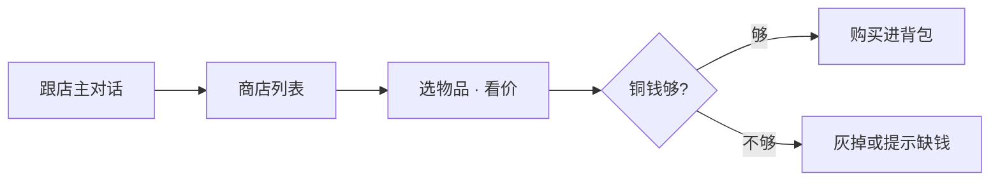

# 物品与买卖

雾津街上要花钱的地方不少：香烛、符纸、灯油、引路物……关二狗不是大户，**铜钱**得掂量着花。物品分任务道具、消耗品、可堆叠杂货；商店则是货郎、纸扎铺、香烛铺那一套价目表。这页讲清背包怎么看、东西怎么用、店怎么逛、钱怎么花才不亏。

---

## 这是什么（30 秒看懂）

把背包想成关二狗随身的褡裢，商店想成雾津老街上一家家开着门的铺子。你在外面捡的、别人给的、花钱买的东西都进褡裢；褡裢里的东西不是摆设，遭遇、规矩、险境常常直接问你「有没有带这个」。花钱前多想一步——铜钱够不够撑到下一次险境，比省下来买糖画更要紧。

---

## 入门：手把手做第一次

跟着「进城隍庙前先补一趟货」这件事走一遍：

1. **打开背包**看现存的香烛、符纸够不够——数量不够或压根没有，说明该去补了。
2. **找一家铺子**：城隍庙门口常驻着香烛铺,跟老板对话,选类似「看看货」「买点香烛」的选项。
3. **进入商店界面**，浏览商品列表、看标价，对照自己的铜钱余额。
4. **选中要买的物品**，确认购买——扣钱、物品进背包。
5. **退出商店**，回背包确认到货，再往城隍庙里走。

---

## 进阶：每一项都讲透

### 背包能看到什么

| 信息 | 说明 |
|---|---|
| 名称与图标 | 这件是什么 |
| 数量 | 可堆叠物品显示个数 |
| 说明 | 用途、来历；随剧情可能追加描述 |

背包有堆叠上限；同类物品占一格叠满为止。任务关键物一旦弄丢，往往得回场景重新捡或靠剧情重给——**读档前想清楚**这一点，别为了省一次读档把关键物品用错地方。

### 物品四种类型，逐条讲用法

| 类型 | 典型用法 | 你会碰到的情况 |
|---|---|---|
| **消耗品** | 在背包或剧情里使用，回血、驱邪、交任务 | 符纸用一张少一张，别攒着舍不得 |
| **任务道具** | 在指定 NPC 或调查点自动消耗 / 交付 | 背包里点不了「使用」，得走到对的人或地方 |
| **装备 / 持物** | 改变互动或遭遇里可选的选项 | 带没带某件东西，会决定某个选项亮不亮 |
| **货币** | 铜钱等，商店扣减，一般不单独「使用」 | 数值型，看余额即可，不用手动操作 |

点不了「使用」时，多半不是 bug，而是该去特定地点或跟特定人对话，而不是在菜单里硬点。

### 物品从哪来，全部列清

| 来源 | 例子 |
|---|---|
| 地上拾取 | 渡口湿鞋、碎符 |
| 对话 / 任务奖励 | 李天狗给的引魂材料 |
| 商店购买 | 城隍庙平安香 |
| 小游戏 | 糖画吉兆、水域捞上的沉箱钥匙 |
| 遭遇结果 | 选某选项后塞给你的 |

### 商店细节：价目、铺子、特殊标价

跟货郎、铺子老板对话，选「看看货」「买点香烛」等，打开**商店界面**：

| 界面元素 | 说明 |
|---|---|
| 商品列表 | 这家卖什么、标价多少文 |
| 你的铜钱 | 当前余额 |
| 购买 / 确认 | 扣钱、物品入背包 |

雾津常见铺子，各家性格不同：

| 铺子 | 可能卖什么 |
|---|---|
| **渡口货郎** | 灯油、粗符、日常杂货 |
| **城隍庙香烛铺** | 平安香、纸钱、拜神用品 |
| **纸扎铺** | 扎纸材料、与丧仪相关物 |

价是**这家店**的价，不同铺子对同一物品可能不同——货郎的粗符未必比庙里的便宜，多逛一家不吃亏。特价就是便宜，标价 0 就是白送，少见，见到了别愣着，先收了再说。

### 老手买卖策略（不剧透）

| 建议 | 原因 |
|---|---|
| 进险境前买香烛、符纸 | 遭遇和长按险境可能直接消耗，临时没得补更被动 |
| 留一点铜钱给糖画讨彩头 | 庙会转盘可能要钱才转，别把钱花得一干二净 |
| 任务道具别随手卖掉 | 商店一般不收任务关键物，但也别乱丢在场景里 |
| 大笔采购前先存档 | 见 [存档与设置](./save)，读档能反悔一次花销决定 |
| 铜钱来源要留心 | 拾取、任务奖励、小游戏吉兆都可能给钱，别只想着省 |

---

## 常见问题

**东西点不了使用是不是卡关了？**
不是。任务道具、部分持物需要走到指定 NPC 或调查点才会触发效果，背包菜单里硬点通常没反应，先看物品说明写没写「交给谁」。

**任务道具能不能卖掉换钱？**
一般不能，商店不收任务关键物；就算能卖也别卖，很多道具后面还要用。

**堆叠满了拾取会怎样？**
同类物品叠满一格后，多余的可能拿不进背包或有额外提示，视具体物品而定；建议关键采集前先清点背包空位。

**不同铺子价格差这么多，正常吗？**
正常，标价是各家自己的价目表，渡口货郎和城隍庙铺子对同一件东西开价可能不同，多逛一圈能省钱。

**铜钱不够怎么办？**
留意拾取、任务奖励、小游戏（尤其糖画转盘吉兆）的额外收益；没必要为攒钱刻意跳过对话或探索。

**读档会不会影响已经买的东西？**
会。读档回到存档点状态，之后的购买、消耗都会被撤销，见 [存档与设置](./save)。

---

## 相关

- [规矩系统](./rules)——遭遇选项常要求持有并消耗某件物品。
- [压力与险境](./pressure)——叫魂、长按里符纸、香烛常是硬需求。
- [小游戏玩法](./minigames)——糖画、水域是物品的重要来源。
- [存档与设置](./save)——大笔采购或险境前的存档习惯。

下一页：[压力与险境](./pressure)——叫魂、长按、鬼打墙。
