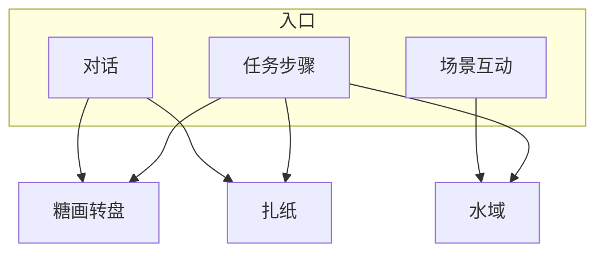

# 小游戏玩法

雾津不只有走路说话。庙会**糖画转盘**、义庄**扎纸**、江边**水域打捞**，各有一段要你亲手操作的戏。它们由剧情、摊位或河边互动拉起，过关后往往给物品、旗标或任务进度。这页把三类小游戏的入门操作和进阶手感都讲透，让你第一次上手不慌，多玩几次能摸出门道。

---

## 这是什么（30 秒看懂）

三个小游戏对应雾津三种老手艺：糖画王的转盘讨的是**彩头**，纸扎铺的扎纸拼的是**丧仪的规矩**，江边的下钩捞的是**水下的东西**。它们不是可有可无的支线彩蛋——过关常直接换来任务需要的物品、规矩碎片，甚至是能不能过某段剧情的门槛。第一次玩不用紧张，多数能重来；真正要小心的是限时、限次那几种。

---

## 入门：手把手做第一次

以最常见的入口——**跟糖画王对话讨个彩头**——走一遍完整流程：

1. 走近庙会糖画摊，跟摊主对话，选类似「讨个彩头」的选项。
2. 若要花钱，界面会先扣铜钱，没钱转不动，先去看看 [物品与买卖](./items-shop)。
3. 按提示**蓄力**（按住或点按，以界面为准），松手后指针旋转。
4. 指针减速，停在某一**扇区**——龙、吉、凶、空等文案之一。
5. 根据落点得到对应结果：吉兆给物品，平运给台词，凶兆可能触发关二狗贫嘴或一小段遭遇。
6. 结束后回到探索状态，去找纸扎铺或江边试试另外两类。

三类小游戏的基本操作节奏是一致的：**进入界面 → 一段手上操作（蓄力/拼装/收线）→ 系统判定 → 给出结果并回到探索**，记住这个骨架，遇到新变体也不会慌。

---

## 进阶：每一项都讲透

### 糖画转盘

糖画王摊位上一盘转轮，指针乱转后停在一格——**讨彩头、判吉凶**。

| 要点 | 说明 |
|---|---|
| 可能要花钱 | 转之前扣铜钱，没钱转不动 |
| 扇区文案 | 龙、吉、凶、空等——停哪算哪，概率感强，别指望靠手速控制落点 |
| 剧情衔接 | 吉兆可能给平安符；凶兆可能触发关二狗贫嘴或小遭遇 |
| 老手做法 | 留着一点闲钱专门讨彩头，凶格不伤大雅，读档也能重讨 |

庙会线常先转盘讨彩头，再扎纸或捞河灯——各玩一遍不亏，彩头结果有时会和后面的对话呼应。

### 扎纸

纸扎铺、义庄丧仪里，按**订单**用彩纸拼出纸人、纸马、**引魂灯**等。

1. 看订单：要什么成品、哪些部件必选。
2. 从部件库选**纸色、零件**（黄裱纸、马鞍、灯架等）。
3. 拖到画布**槽位**，对齐图纸。
4. 提交判定：拼对过关，拼错提示或扣分，通常允许重试。
5. 有的订单有**收尾一问**（如「点睛吗？」）——这一步和规矩学没学全直接相关，乱点可能触发惊吓演出。

| 要点 | 说明 |
|---|---|
| 纸色要对 | 红白纸、金边选错可能提示警告但不硬锁流程 |
| 槽位对齐 | 马头、灯架浮空说明没对准，留意画布上的对齐提示 |
| 收尾一问是关键 | 回答前最好先翻一眼 [规矩系统](./rules)，看这类收尾和哪条规矩相关 |
| 奖励 | 过关常给任务道具或规矩碎片，是碎片的重要来源之一 |

李天狗让关二狗扎引魂灯，是扎纸课的典型订单——按提示一件一件凑，别想着抄近路跳过部件。

### 水域

雾津多水。渡口、河湾可**下钩打捞**——鱼、罐子、钥匙影等都在水底。

1. 进入水域界面，看到一片水面与下钩点（码头白天教程关、雨夜码头、墓边夜捞等各有实例）。
2. **抛线 / 下钩**，观察目标深度与晃动。
3. **收线 / 拉拽**：按住 `空格` 参与拉力，把目标拉上来（节奏以界面提示为准）。
4. 可能有**时间限制**或**次数限制**；脱钩、空竿会给出音效与动画反馈，不算严重失败。

| 要点 | 说明 |
|---|---|
| 实体不同手感不同 | 漂箱、河灯、沉物各不一样，第一次多试几次节奏 |
| `空格` 拉拽 | 拉力阶段按住空格出力，别和探索态的 `E` 互动搞混 |
| 限时关先存档 | 码头夜捞一类，失手成本高，读档比硬扛划算 |
| 捞到后 | 常直接给物品或切场景，注意是不是任务下一步的钩子 |

### 三类小游戏怎么串起来

它们各自独立又互相呼应：糖画的彩头有时暗示后面剧情的走向，扎纸的成品是任务或仪式的必需物，水域捞上来的东西又可能是扎纸订单缺的部件。留意任务面板和对话里的提示，别把三个小游戏当成孤立的收集玩法。

---

## 常见问题

**小游戏能不能跳过？**
多数情况下能靠对话选择跳过（比如「没闲钱」），不影响主线继续，但会少拿相应的物品、旗标或台词，长远看不如玩一遍划算。

**糖画转盘的落点能不能靠手法控制？**
不能，扇区结果概率感强，别纠结按住时长的微操，运气成分是设计好的。

**扎纸拼错了会不会直接失败？**
一般会给提示或扣分，允许重试；真正要小心的是订单最后的「收尾一问」，答错可能触发惊吓演出。

**水域捞鱼/捞物有时间限制吗？**
部分场次有限时或限次，界面会提示；没提示的通常可以慢慢试节奏。

**小游戏失败了要读档吗？**
一般不需要，多数能原地重来；只有限时水域这类失手成本高的场次，建议提前存档更稳妥。

**过关奖励为什么每次不一样？**
奖励和当前剧情进度、你选的分支有关，同一个小游戏在不同任务阶段掉落的东西可能不同，不是固定表。

---

## 相关

- [物品与买卖](./items-shop)——糖画转盘、水域是物品和铜钱的重要来源。
- [规矩系统](./rules)——扎纸「点睛」一类收尾问答和规矩直接相关。
- [存档与设置](./save)——限时水域关卡前的存档建议。

下一页：[档案 · 见闻录](./archive)。
