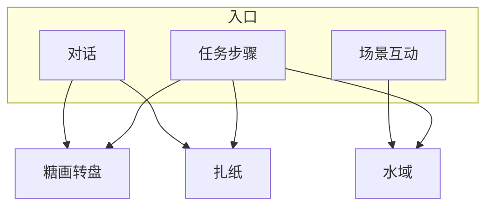

# 小游戏玩法

雾津不只有走路说话。庙会**糖画转盘**、义庄**扎纸**、江边**水域打捞**，各有一段要你亲手操作的戏。它们由剧情、摊位或河边互动拉起，过关后往往给物品、旗标或任务进度。

---

## 三类一览

| 小游戏 | 在哪遇见 | 你在干啥 |
|---|---|---|
| **糖画转盘** | 城隍庙庙会、街角摊 | 蓄力转指针，停在哪格算哪格 |
| **扎纸** | 义庄、纸扎铺 | 按订单选纸、拼部件、凑成品 |
| **水域** | 渡口、河湾 | 下钩打捞，限时或限次捞指定物 |

---

## 糖画转盘

糖画王摊位上一盘转轮，指针乱转后停在一格——**讨彩头、判吉凶**。

### 怎么玩

1. 按提示**蓄力**（按住或点按，以界面为准），松手后指针旋转。
2. 指针减速，停在某一**扇区**。
3. 扇区决定结果：吉兆物品、平运台词、凶兆小惩罚等。

### 要点

| 要点 | 说明 |
|---|---|
| 可能要花钱 | 转之前扣铜钱，没钱转不动 |
| 扇区文案 | 龙、吉、凶、空等——停哪算哪，概率感强 |
| 剧情衔接 | 吉兆可能给平安符；凶兆可能触发关二狗贫嘴或小遭遇 |

庙会线常先转盘讨彩头，再扎纸或捞河灯——各玩一遍不亏。

---

## 扎纸

纸扎铺、义庄丧仪里，按**订单**用彩纸拼出纸人、纸马、**引魂灯**等。

### 怎么玩

1. 看订单：要什么成品、哪些部件必选。
2. 从部件库选**纸色、零件**（黄裱纸、马鞍、灯架等）。
3. 拖到画布**槽位**，对齐图纸。
4. 提交判定：拼对过关，拼错提示或扣分。
5. 有的订单有**收尾一问**（如「点睛吗？」）——和规矩学没学全有关，乱点可能惊吓。

### 要点

| 要点 | 说明 |
|---|---|
| 纸色要对 | 红白纸、金边选错可能 warn 但不硬锁 |
| 槽位对齐 | 马头、灯架浮空说明没对准 |
| 奖励 | 过关常给任务道具或规矩碎片 |

李天狗让关二狗扎引魂灯，是扎纸课的典型订单——按提示一件一件凑。

---

## 水域

雾津多水。渡口、河湾可**下钩打捞**——鱼、尸块、罐子、钥匙影等都在水底。

### 怎么玩

1. 进入水域界面，看到一片水面与下钩点。
2. **抛线 / 下钩**，观察目标深度与晃动。
3. **收线**（拉杆、按住等，以界面为准）把目标拉上来。
4. 可能有**时间限制**或**次数限制**；脱钩、空竿会反馈音效与动画。

### 要点

| 要点 | 说明 |
|---|---|
| 实体不同手感不同 | 钥匙影、河灯、沉箱各不一样，多试节奏 |
| 限时关先存档 | 码头夜捞钥匙类，失手成本高 |
| 捞到后 | 常直接给物品或切场景 |

---

## 通用提示

| 提示 | 说明 |
|---|---|
| 退出 | 多数小游戏结束自动回探索；少数要过关才能走 |
| 和主线 | 不跳过也能推进，但奖励、台词可能少一截 |
| 读档 | 转盘凶兆、扎纸点睛失败、水域超时都可 `F5`/`F6` 重来 |

下一页：[档案 · 见闻录](./archive)。
