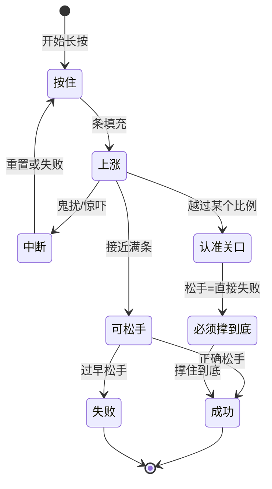

# 压力与险境

雾津不只有走路聊天。城隍庙**叫魂**、过瘴气**屏息**、贴符**念咒**——这些时刻不能光靠点选项，要**长按**蓄满一条气，在正确时机松手。松早了失败；鬼摸头还可能**打断**进度，甚至过了某个节点就**不许再松手**，只能硬撑到底。阎王岭**鬼打墙**、义庄夜路，则整段地图变成险境，规矩、物品、脚下的路都可能是你能不能走出去的关键。

---

## 这是什么（30 秒看懂）

把这类时刻想成雾津的「屏气一刻」：平时靠嘴皮子、靠选项过关的关二狗,这时候不能耍嘴,得**手上真沉住气**。屏幕上一条蓄力条、一句提示,你按住、扛住、看准时机松手——像极了老一辈说的"这口气得憋到位,憋不住就前功尽弃"。规矩学得越透（尤其是**术**层），这些时刻越容易扛过去；规矩没学好，硬扛也可能扛得很难看。

---

## 入门：手把手做第一次

以一次典型的临场长按为例，走一遍完整流程：

1. **触发时机**：走到特定地点或选了特定选项，屏幕突然出现**蓄力条**和提示文案（如「按住念咒」「松手唤名」）。
2. **按下不放**：条开始上涨,期间移动键通常不响应,专心盯条和提示,别乱按其他键。
3. **维持接近满**：条涨到提示的区间时,准备松手,注意——有些场合过了某个点后**不允许中途松手**，松开等于直接判定失败，只能撑到底。
4. **在提示时机松手**：正确时机松开成功；松太早条不够,直接失败。
5. **应对打断**：期间若被"鬼扰"打断,条会回退或直接失败,别慌,按提示重来或看后续演出。

手感和秒数因场景而异——城隍庙河边叫魂与李天狗贴符，难度节奏可能不同。多试几次找节奏，或先 `F5` 存档再挑战。

---

## 进阶：每一项都讲透

### 雾津典型险境，逐个拆

| 场景 | 你在扛什么 | 提示 |
|---|---|---|
| **城隍庙叫魂** | 河边按规矩念名唤魂,呼声由远及近层层逼近 | 读清「松手」提示；鬼扰时条会跳,越靠近声音越紧 |
| **屏息过瘴** | 阎王岭或瘴气带憋气 | 衰减快,别习惯性早松,瘴气浓度不等人 |
| **贴符念咒** | 李天狗在场时配合术式 | 失败可能触发遭遇或位面变化,不是单纯扣血 |
| **鬼打墙** | 位面切换后的迷巷,不一定靠长按,有时靠你自己走位 | 绕回原地一两次是常态,规矩、物品、长按可能都是出口条件 |

### 「认准关口」是这套系统的核心手感

不是所有长按都能随时反悔：有的时刻在条涨到某个比例之前松手，只是回落、可以重来；但一旦越过那个**认准的关口**，游戏就认定你"already committed"——这时候松手不是失败重来，而是**直接判定失败**，只能死死按住撑到底。这是雾津险境故意做出来的紧张感：让你没法在最后一刻反悔，得提前判断自己撑不撑得住。留意提示文案的措辞变化（比如从「按住」变成「别放手」），往往就是关口临近的信号。

### 叫魂类险境的层次感

河边或庙前的叫魂,声音往往不是一次性砸过来的,而是**由远及近、由单一到多方位**逐步逼近——先是模糊的一声,接着可能变成好几个方向同时喊,最后贴近确认。层次越靠后,留给你反应的空间越小,越考验你是不是已经稳住了节奏,而不是临时手忙脚乱。

### 鬼打墙：不是长按，是你自己走出去

有的鬼打墙场景不给蓄力条,而是让你**真的在场景里走**——你以为往前走了,结果又回到起点,绕一两次是设计好的常态,不是操作失误。别慌,别乱点交互键：

- 冷静按规矩本提示的方向或做法走。
- 身上带没带对的物品,有时是能不能走出去的关键。
- 反复绕回不代表卡死,通常在你撑过几次之后,剧情会给出转折,不是无限循环。

### 中断与失败后果，具体到类型

失败不是统一「Game Over」，而是具体后果：

| 后果类型 | 你可能遇到 |
|---|---|
| 重来本段长按 | 再按一次，台词略变 |
| 惊吓演出 | 音效、画面闪、短遭遇 |
| 旗标变化 | 如「鬼扰」「失魂」类状态，影响后面选项 |
| 位面惩罚 | 生命流失、地图变样 |
| 任务分支 | 走补救线或硬闯线 |

鬼打墙激活时，长按类互动可能在条长到一半被**强制打断**——这是剧情在施压。先稳规矩、备香烛，或读档再来。

### 和规矩、位面的关系

- 叫魂、念咒成功往往算掌握规矩**术**层（见 [规矩系统](./rules)）；术层学得越透，提示读起来越顺，越容易判断"关口"在哪。
- **位面**变化时，同一地点规则不同：探索时看不见的人、不能用的门，险境里可能全反过来。
- 遭遇里选「强行叫魂」之类，可能直接进入长按，比对话选项更狠——选之前先想清楚自己规矩学到位没有。

---

## 常见问题

**长按到一半突然不能松手了，是不是卡住了？**
不是卡住，是越过了「认准关口」——这类设计故意不给你临时反悔的机会，只能撑到底，松手会直接判定失败。

**鬼打墙一直绕回原地，是 bug 吗？**
不是。有些鬼打墙就是设计成"先让你绕一两次"，冷静按提示或规矩本线索走，通常撑过几次后会有转折，不会无限循环。

**失败了要重开游戏吗？**
不用。多数失败只是重来当前段落或触发一小段惊吓演出，严重的会走位面惩罚或补救任务线，但都能继续玩下去。

**为什么我总是卡在同一个长按过不去？**
先检查对应规矩的**术**层学没学到位，再检查有没有该带的符纸香烛；纯手速问题的话，多试几次找蓄力条的节奏也有帮助。

**险境里探索的移动键怎么不管用了？**
长按期间游戏通常锁定移动，只认蓄力键，这是正常设计，别和探索奔跑混淆。

**进险境前有什么准备建议？**
存档、备够符纸香烛、把相关规矩学到术层，戴耳机听清按住音和惊吓音提示的节奏，都能明显降低失败率。

---

## 相关

- [规矩系统](./rules)——叫魂、念咒本质是术层规矩的实操。
- [物品与买卖](./items-shop)——进险境前的符纸、香烛准备。
- [存档与设置](./save)——进庙、进岭前的存档习惯。

下一页：[小游戏玩法](./minigames)——糖画、扎纸、水域。
