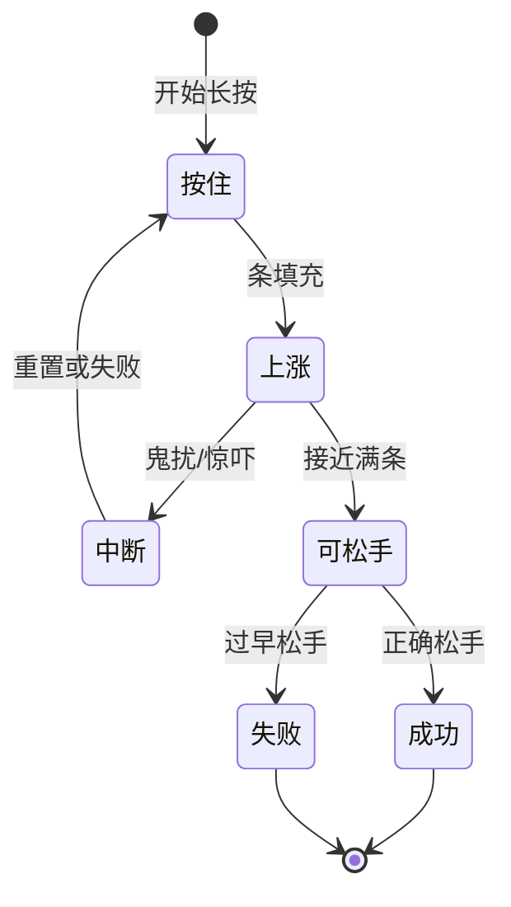

# 压力与险境

雾津不只有走路聊天。城隍庙**叫魂**、过瘴气**屏息**、贴符**念咒**——这些时刻不能光靠点选项，要**长按**蓄满一条气，在正确时机松手。松早了失败；鬼摸头还可能**打断**进度。阎王岭**鬼打墙**、义庄夜路，则整段地图变成险境。

---

## 临场长按是什么

屏幕出现**蓄力条**和提示文案（如「按住念咒」「松手唤名」）：

| 阶段 | 你要做 |
|---|---|
| 按下 | 条开始涨 |
| 按住 | 维持到接近满 |
| 松手 | 在提示的时机松开 → 成功 |
| 松太早 | 条不够 → 失败，可能重来或扣状态 |
| 被打断 | 条回退或直接失败 → 惊吓、掉血、进鬼打墙等 |

手感和秒数因场景而异——城隍庙河边叫魂与李天狗贴符，难度节奏可能不同。多试几次找节奏，或先 `F5` 存档。

---

## 雾津典型险境

| 场景 | 你在扛什么 | 提示 |
|---|---|---|
| **城隍庙叫魂** | 河边按规矩念名唤魂 | 读清「松手」提示；鬼扰时条会跳 |
| **屏息过瘴** | 阎王岭或瘴气带憋气 | 衰减快，别习惯性早松 |
| **贴符念咒** | 李天狗在场时配合术式 | 失败可能触发遭遇或位面变化 |
| **鬼打墙** | 位面切换后的迷巷 | 规矩、物品、长按可能都是出口条件 |

对白里李天狗会嘴炮；关二狗慌的时候选项也会变——险境中优先看**条和提示**，别光顾看台词。

---

## 中断与失败后果

失败不是统一「Game Over」，而是具体后果：

| 后果类型 | 你可能遇到 |
|---|---|
| 重来本段长按 | 再按一次，台词略变 |
| 惊吓演出 | 音效、画面闪、短遭遇 |
| 旗标变化 | 如「鬼扰」「失魂」类状态，影响后面选项 |
| 位面惩罚 | 生命流失、地图变样 |
| 任务分支 | 走补救线或硬闯线 |

鬼打墙激活时，长按可能在条长到一半被**强制打断**——这不是键坏了，是剧情在施压。先稳规矩、备香烛，或读档再来。

---

## 和规矩、位面的关系

- 叫魂、念咒成功往往算掌握规矩**术**层（见 [规矩系统](./rules)）。
- **位面**变化时，同一地点规则不同：探索时看不见的人、不能用的门，险境里可能全反过来。
- 遭遇里选「强行叫魂」之类，可能直接进入长按，比对话选项更狠。

---

## 应对建议（不剧透）

| 建议 | 说明 |
|---|---|
| 进庙、进岭前存档 | `F5` 见 [存档与设置](./save) |
| 戴耳机 | 按住音、惊吓音提示节奏 |
| 失败先读结果文案 | 往往提示缺规矩或缺物品 |
| 别和探索奔跑混淆 | 长按期间移动键通常无效 |

下一页：[小游戏玩法](./minigames)——糖画、扎纸、水域。
