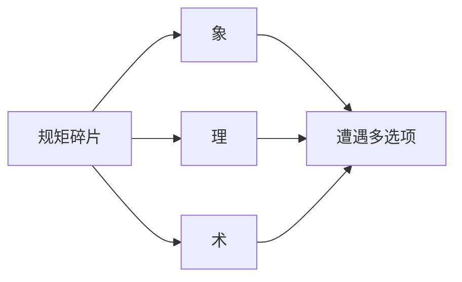
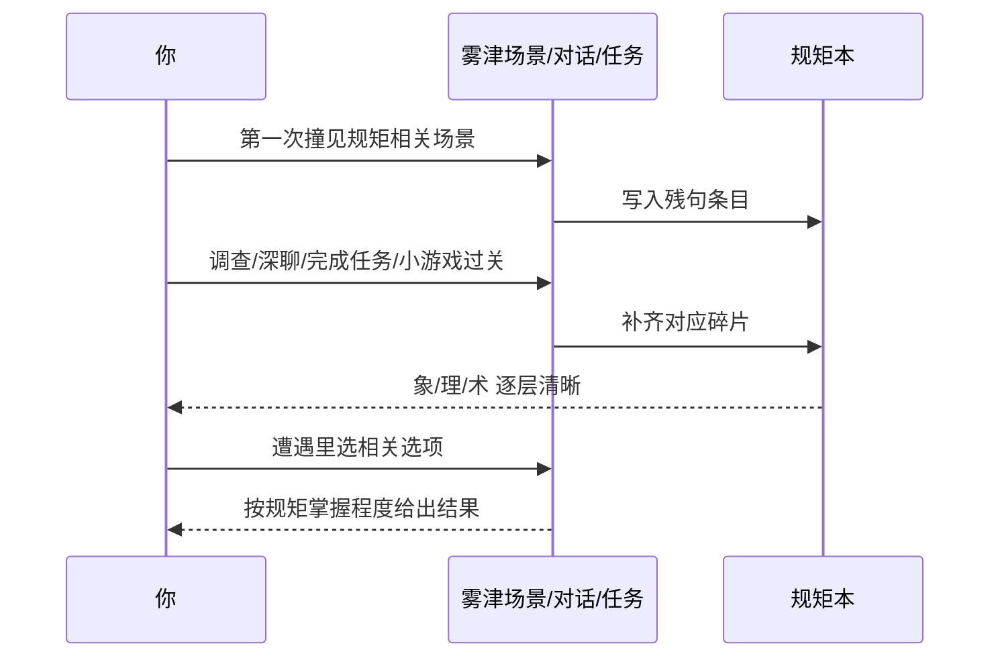

# 规矩系统

雾津人办事讲**规矩**——不只是道德，是口口相传、和鬼神打交道时**真能管用**的法则。城隍庙怎么拜、纸人不能乱撕、河边叫魂要念对词、路边的祭酒祭肉不能白吃……学对了多一条路，莽撞可能招祸。这页讲清规矩系统是什么、怎么学、怎么在关键时刻用出来。

---

## 这是什么（30 秒看懂）

把「规矩」想成雾津街坊传了几辈子的**生存手册**：不是写在纸上给你背的条款，而是散落在人嘴里、庙墙上、纸扎摊子上的一句句忌讳和窍门。关二狗自己是个不太信邪的浑人，可雾津十个有九个信——你不需要真信，但**不懂就动手**，游戏会让你付代价。

游戏把每条规矩拆成三层：

| 层 | 名称 | 你读到的大意 |
|---|---|---|
| **象** | 表象 | 外人看得见的做法、忌讳、场面话 |
| **理** | 原理 | 为什么要这么做，背后怕什么、信什么 |
| **术** | 术法 | 具体怎么操作——念词、步位、物件配合 |

不必一次学全。刚接触时规矩本里可能只是**残缺提示**；收集**碎片**、经历剧情后，逐层补全，最终能在遭遇和险境里真正用出来。

---

## 入门：手把手做第一次

以雾津随处可见的一条老规矩——**「路祭不能动」**（路边给野鬼摆的酒肉不能碰）——走一遍完整流程：

1. **第一次遇见**：探索时路过一处路边祭品，互动提示只给你一句忌讳，规矩本里新出现一条**残句**：大意是「路边的东西，不是给活人吃的」，象/理/术都还是灰的。
2. **打开规矩本**看一眼：在探索状态打开入口（见 [操作与界面](./controls)），找到这条，确认它标着「未学全」。
3. **去找碎片**：调查附近热区、跟知情的 NPC（庙祝、货郎、李天狗都可能）深聊，或做完相关任务步骤——任一途径命中，碎片自动收进规矩本。
4. **回来看变化**：条文从残句变成更完整的表述，「象」先补上（路祭为什么摆在那儿），「理」再补（不摆会怎样），「术」最后（真要动，该怎么动才不惹祸）。
5. **在遭遇里用它**：某次遭遇里出现「坐下吃这摊酒肉」这类选项，若规矩学到位，选项旁会有相应提示；学不到位，选项可能灰着或者选了就吃亏。

---

## 进阶：每一项都讲透

### 规矩本里的三种状态

| 阅读状态 | 你看到什么 |
|---|---|
| 未学全 | 暗示、残句，提醒你还缺什么层 |
| 学了一部分 | 正文层逐渐清晰，但可能只到「象」或「理」 |
| 已验证 | 更权威的表述，往往经过剧情印证，且是遭遇里最稳的解法来源 |

分类栏可能按**象理术**、**口传**、**实证**等归类（名字偏学术，当成「庙里的」「街坊传的」「亲眼见过的」三类即可，具体呈现以你游玩的版本界面为准）。养成先按分类扫一遍的习惯，比死记条目名更容易找到你正缺的那一块。

### 碎片从哪来，逐条讲

碎片不是均匀分布的，摸清来源能少走冤枉路：

| 来源 | 典型场景 |
|---|---|
| 调查热区 | 义庄棺盖、城隍庙香炉裂纹、渡口沉箱痕迹 |
| 深聊 NPC | 庙祝讲香火顺序、李天狗顺嘴带出术法门道 |
| 完成任务节点 | 有些碎片挂在任务链的某一步，不做到那步不会掉 |
| 小游戏过关奖励 | 扎纸「点睛」一类收尾问答答对，常直接给术式碎片 |
| 遭遇结果 | 硬闯或选特定选项后，作为「代价」或「意外收获」补给 |

漏了碎片，最直接的表现就是**某个遭遇选项一直灰着**；回头把上面几类来源挨个扫一遍，通常能补上。

### 象理术怎么分别派上用场

- **象**层多用在对话和调查里——决定你「看不看得懂」一个场面（比如看懂路祭为什么摆在那儿）。
- **理**层多沉淀在见闻录——解释「为什么」，帮你判断一件事值不值得冒险试。
- **术**层最实际，往往和**遭遇选项**、[压力与险境](./pressure) 的长按互动直接挂钩——叫魂念对节奏、贴符按对时机，本质都是术层落地。

三层不是必须凑齐才能用：有时候只懂「象」也够应付一个简单选择，真正的硬仗（叫魂、阎王岭）通常要术层到位才稳。

### 规矩和四个系统怎么联动

| 系统 | 联动方式 |
|---|---|
| **遭遇** | 选项旁标注需要的规矩或层数，学到位才亮、才稳 |
| **压力与险境** | 长按念咒、叫魂本质是术层的实操，见 [压力与险境](./pressure) |
| **任务** | 任务可能要求「学会某条规矩」或「持某碎片」才能继续 |
| **档案** | [见闻录](./archive) 里的风俗描述和规矩本互为参照，对照读更容易拼出全貌 |

### 守规矩 vs 破规矩：老手的取舍

游戏不强制你当好人。《寻狗记》写的是**人心**：有人借规矩吓人，有人真信。你可以：

- **守规矩**：稳，少招鬼，有时慢，往往有更体面的解法。
- **试探破规**：快，可能开出隐藏选项或省一段路，但代价落在具体后果里——不是扣一个抽象的「善恶值」，而是某个任务变难、某人不再信你、档案里多一条不太好看的印象。

没有全局道德分数；后果落在具体任务、档案、谁还愿意帮你身上。老手常见做法是：稳妥的规矩（叫魂、庙礼这类和安全直接挂钩的）老实学全，无关痛痒的忌讳（谁的忌口、哪句话不能提）可以按角色喜好试探。

### 雾津例子一览（机制说明，不剧透结局）

| 规矩主题 | 象（表面） | 术（实操）可能用在 |
|---|---|---|
| 叫魂 | 河边不可乱喊名 | [临场长按](./pressure) 念对节奏 |
| 纸人 | 义庄纸扎忌撕 | 遭遇里选「揭纸」或「绕道」 |
| 庙礼 | 城隍庙香火顺序 | 对话与调查顺序 |
| 路祭 | 路边酒肉不能动 | 遭遇里「坐下吃」这类硬闯选项 |

---

## 常见问题

**这条规矩看着都写全了，遭遇选项还是灰的，为什么？**
规矩学全只是必要条件之一，很多选项还要求**持有并消耗某件物品**（符纸、香烛之类）或**满足某个旗标**（比如先跟某人聊过）。规矩本旁边留意物品和任务提示。

**破规矩真的没有惩罚吗？**
有，只是不是统一的「Game Over」，而是散在具体后果里：某段变得更凶险、某人翻脸、档案印象变差、甚至直接触发一小段代价演出。想稳就按象→理→术老实学全。

**规矩残句一直看不懂怎么办？**
说明碎片还没收全，通常是漏了某处调查、某场深聊或某个任务节点。回头把义庄、城隍庙、渡口这几个高频地点重新走一遍，八成能补上。

**是不是有必须守规矩才能过的关卡？**
部分险境（尤其是叫魂、阎王岭一类）对术层要求较高，不学全会明显更难甚至无法稳过；但游戏没有设计成「不守规矩就卡死」，硬闯也常有对应（更凶险的）路线。

**碎片会不会因为剧情推进就永久错过？**
个别碎片确实挂在特定任务阶段，过了那一步入口会关闭；如果你追求集全，建议在推进主线大节点前，先把当前能逛的地方逛一遍（**待核实**：是否所有碎片都有后续补救渠道，以你游玩版本的实际情况为准）。

**规矩本能不能按关键词搜索？**
目前只确认有分类栏可以按主题浏览；有没有搜索框、能否排序，随版本界面可能不同，这里不作断言，请以你游玩界面上的实际控件为准。

---

## 相关

- [压力与险境](./pressure)——叫魂、长按念咒本质是术层规矩的实操。
- [物品与买卖](./items-shop)——遭遇里消耗的符纸、香烛从哪儿买。
- [档案 · 见闻录](./archive)——风俗见闻和规矩本互相印证。
- [对话与选择](./dialogue-choice)——选项旁的规矩暗示怎么看。

下一页：[物品与买卖](./items-shop)。
