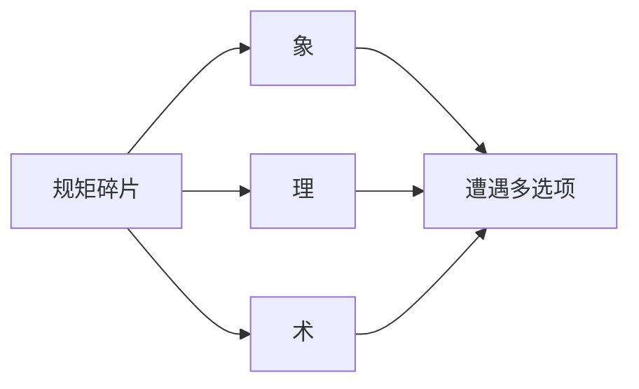

# 规矩系统

雾津人办事讲**规矩**——不只是道德，是口口相传、和鬼神打交道时**真能管用**的法则。城隍庙怎么拜、纸人不能乱撕、河边叫魂要念对词……学对了多一条路，莽撞可能招祸。

---

## 规矩是什么

游戏里每条**规矩**是一组可学习的条文，分三层理解：

| 层 | 名称 | 你读到的大意 |
|---|---|---|
| **象** | 表象 | 外人看得见的做法、忌讳、场面话 |
| **理** | 原理 | 为什么要这么做，背后怕什么、信什么 |
| **术** | 术法 | 具体怎么操作——念词、步位、物件配合 |

不必一次学全。刚接触时规矩本里可能是**残缺提示**；收集**碎片**、经历剧情后，逐层补全。

---

## 规矩本在哪

在探索状态打开**规矩本**（入口见 [操作与界面](./controls)）。里面按分类列出已接触规矩：

| 阅读状态 | 你看到什么 |
|---|---|
| 未学全 | 暗示、残句，提醒你还缺什么 |
| 学了一部分 | 正文层逐渐清晰 |
| 已验证 | 更权威的表述，往往经过剧情印证 |

分类可能包括**象理术**、**口传**、**实证**等——名字偏学术，当成「庙里的」「街坊传的」「亲眼见过的」三类即可。

---

## 碎片从哪来

**碎片**是散落各处的条文残片：

- 调查义庄、城隍庙、渡口。
- 完成任务、跟李天狗或庙祝深聊。
- 小游戏过关奖励（如扎纸点睛后得术式碎片）。

捡到即记入规矩本，推动「学全」进度。漏了碎片，遭遇里相关选项可能一直灰着。

---

## 规矩在玩法里怎么用

### 遭遇选项

**遭遇**是一页多个按钮的紧要关头。选项旁可能标：

- 需要某条规矩（或某一层）。
- 需要持有并消耗物品（符纸、香烛等）。

| 情况 | 结果 |
|---|---|
| 规矩学全、层数够 | 选项可点，往往有稳妥解法 |
| 规矩未学 | 选项灰色，或点了吃亏 |
| 故意破规矩 | 有时能硬闯，后果在结果文案和后续剧情里 |

纸人巷、城隍庙前、阎王岭口，都适合先翻规矩本再点。

### 对话与险境

- 对话选项可能带**规矩暗示**——提示你和哪条法则有关。
- [压力与险境](./pressure) 里叫魂、长按念咒，本质也是「术」层规矩的实操；失败会触发惊吓或位面惩罚。

---

## 守规矩 vs 破规矩

游戏不强制当好人。《寻狗记》写的是**人心**：有人借规矩吓人，有人真信。你可以：

- **守规矩**：稳，少招鬼，有时慢。
- **试探破规**：快，可能开隐藏，也可能付代价。

没有全局道德分数；后果落在具体任务、档案、谁能帮上忙。

---

## 雾津例子（机制说明，不剧透结局）

| 规矩主题 | 象（表面） | 术（实操）可能用在 |
|---|---|---|
| 叫魂 | 河边不可乱喊名 | [临场长按](./pressure) 念对节奏 |
| 纸人 | 义庄纸扎忌撕 | 遭遇里选「揭纸」或「绕道」 |
| 庙礼 | 城隍庙香火顺序 | 对话与调查顺序 |

---

## 和任务、档案联动

- 任务可能要求「学会某条规矩」或「持某碎片」才继续。
- [档案 · 见闻录](./archive) 里见闻与规矩本可对照，拼雾津志怪全貌。

下一页：[物品与买卖](./items-shop)。
