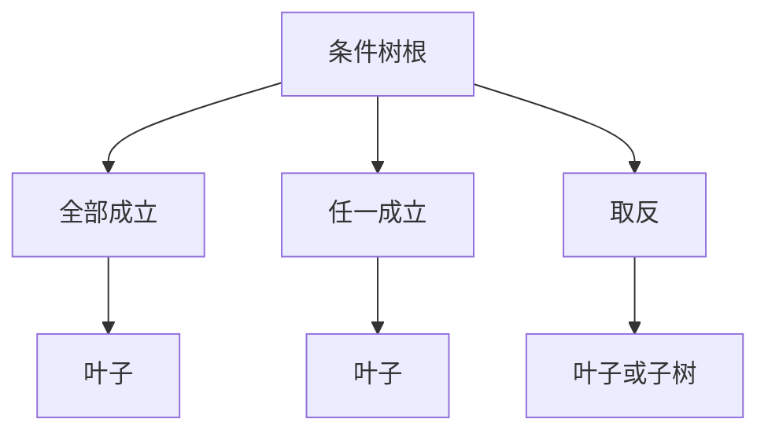

# 条件类型速查

条件决定「能不能 / 要不要」——任务能否接取、选项是否亮起、地图边是否可走。条件**独立**出现在各面板的条件槽里，**不**写进动作参数。

入门见 **[怎么设条件](../editors/concepts/conditions)**。

---

## 结构一览

- **叶子**：查一项游戏状态。
- **组合**：把多条判断套在一起；可嵌套，但不宜过深（有深度上限，极端复杂请拆旗标或任务）。

---

## 七种叶子

| 叶子 | 判断什么 | 怎么填 | 什么时候用 |
|---|---|---|---|
| **旗标** | 某个旗标当前值 | 选或填旗标名；选比较符（等于、不等于、大于、小于等）；填比较值。值里可插富文本引用。 | 通用进度开关：「已交香火钱」「好感≥3」 |
| **任务** | 某条任务进度 | 选任务；选状态：未接 / 进行中 / 已完成 | 任务门控：「寻狗记进行中才能进侧门」 |
| **剧本** | 某剧本线整体 | 选剧本；选阶段名、阶段状态；可选结局 | 多线叙事：「纸人线已到第二章」 |
| **剧本行** | 剧本里某一行的节拍 | 选剧本行；选：未触发 / 已激活 / 已完成 | 细粒度节拍：「评书段已听完」 |
| **叙事状态** | 叙事状态机是否到达某状态 | 选叙事图；选状态；选「已到达」 | 位面、章节大开关：「夜探状态已激活」 |
| **活计计数** | 某条可重复活计累计完成次数 | 选活计图 / 结算出口；选比较符；填次数 | 「背尸送义庄做过 ≥ 2 单才开新闲话」 |
| **激活位面** | 当前激活位面是否等于某 id | 选位面 id；「不是现世」用取反包一层「激活位面 = 现世」 | 「鬼打墙位面激活时才显示某热区」 |

拼写必须与游戏里登记的名称一致。编辑器不一定当场报错——错了会**静默不成立**，改完务必预览两种状态各走一遍。

---

## 三种组合

| 组合 | 意思 | 例子 |
|---|---|---|
| **全部成立** | 每一条子条件都得满足 | 任务进行中 **且** 旗标为真 |
| **任一成立** | 至少一条满足即可 | 持有道具甲 **或** 持有道具乙 |
| **取反** | 子条件不成立时才算成立 | **未**完成某任务 |

---

## 常见挂载点

| 你想… | 面板 | 字段名（界面文案） |
|---|---|---|
| 任务能否看见/接取 | [任务](../editors/panels/quest) | 前置条件 |
| 任务怎样算完成 | [任务](../editors/panels/quest) | 完成条件 |
| 地图转场是否解锁 | [地图](../editors/panels/map) | 解锁条件 |
| 遭遇选项是否可选 | [遭遇](../editors/panels/encounter) | 选项条件 |
| 热区/NPC 是否出现 | [场景](../editors/panels/scene) | 显示条件 |
| 区域是否触发 | [场景](../editors/panels/scene) | 区域条件 |
| 图对话选项是否可点 | [图对话](../editors/panels/dialogue-graph) | 选项需要条件 |
| 图分支往哪走 | [图对话](../editors/panels/dialogue-graph) | 分支条件 |
| 图整体能否进入 | [图对话](../editors/panels/dialogue-graph) | 图前置条件 |
| 物品动态描述用哪条 | [物品](../editors/panels/item) | 动态描述条件 |
| 档案条目何时解锁 | [档案](../editors/panels/archive) | 解锁条件 |
| 文档何时揭示 | [文档揭示](../editors/panels/doc-reveal) | 揭示条件 |
| 任务下一环额外要求 | [任务](../editors/panels/quest) | 下一环边上的条件 |
| 章节导演何时 live | [章节导演](../editors/panels/narrative-packages) | 激活 / 完成条件 |

---

## 分支节点的特殊口径

**图对话**里「分支」节点有两种写法：

- **结构化条件树**：与上表七种叶子相同，功能最全。
- **内联与写法**（仅部分分支）：只支持旗标、任务、剧本三类简化判断。

新内容优先用结构化树；内联适合简单二分。

---

## 和动作的分工

| 需求 | 用条件 | 用动作 |
|---|---|---|
| 选项灰掉 | 选项条件 | — |
| 点选项后给物 | — | 给予物品 |
| 满足 A 播对白 B 否则 C | 分支条件 | 各分支挂不同动作；或用「让玩家择一」 |

:::danger
动作编辑器**没有**通用「如果…则…」框。条件只在外层条件槽或分支节点上设。
:::

---

## 常见问题

**为什么我设了条件，选项还是一直亮着/一直灰着？**
最常见的原因是名字没对上——旗标、任务、剧本、位面的名字必须和登记的一模一样。逐字核对一遍，再预览试试。

**「活计计数」和「任务状态」有什么区别？**
任务状态看的是这条任务当前是未接 / 进行中 / 已完成；活计计数看的是可重复活计**历史上完成过几单**，适合做「干过两趟背尸才开新台词」这类门槛。

**「激活位面」怎么表达「不在现世」？**
用「取反」包一层「激活位面 = 现世」。

**「全部成立」和「任一成立」能不能混着套？**
能。超过三四层建议改用一个新旗标把中间结果记下来。

**同一个条件要在好几个地方判断，要不要抄好几遍？**
条件树本身不能跨面板共享，但可以让多处都判断同一个旗标或同一个任务状态。

---

## 验证清单

- [ ] 旗标/任务/剧本/位面名与登记一致
- [ ] 用了「全部」还是「任一」符合策划意图
- [ ] 保存后预览：满足与不满足各走一遍
- [ ] 活计计数用的是累计次数，不是「当前是否激活」

---

## 相关

- [怎么设条件](../editors/concepts/conditions)
- [任务与活计（玩家）](../player/quests)
- [可重复活计教程](../tutorials/repeatable-job)
- [术语表 · 旗标](./glossary)
- [危险区](./danger-zone)
