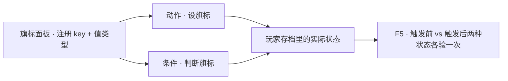

# 加一个旗标

关二狗认没认出你、庙门开没开、玩家见没见过那只湿鞋——这些「进度事实」在编辑器里都记成**旗标**。这一页从零登记一个旗标，让它在对话或任务条件里真正管住某段内容的显隐，再用运行预览把「没触发时看不到、触发后能看到」这两种状态都走一遍。

---

## 这是什么（30 秒看懂）

把旗标想成雾津剧情组桌上那本**登记名册**：名册先登记「本项目允许存在哪些进度开关、每个开关是什么类型」，比如「见过关二狗——是/否」「已交香火钱——是/否」。名册本身不记录某个具体玩家此刻是真是假，那是每一份具体存档自己的事，就像户籍簿只登记「本县可以登记姓名、年龄这两项」，不代表某个人现在几岁。

旗标面板做的就是这份名册：先登记一个键（比如 `met_guan_ergou`）、定好它的类型（多数情况下就是「真/假」这种布尔值）。名册登记好之后，游戏里真正让某次游玩里这个键变成真，要靠[动作](../editors/concepts/actions)里的「设旗标」；游戏里真正去检查这个键现在是真是假，要靠[条件](../editors/concepts/conditions)里的「旗标」这类叶子。三件事分属三个地方，缺一不可——这也是这一页要串起来的完整链路。

旗标和「规矩」不是一回事：旗标是一个简单的开关（有/没有），[规矩](./rule)是一条有深浅层次的知识，解锁到第几层还会影响显示的文字内容。只要你要的是「这件事发生过没有」这种是非题，用旗标就够了。

读完这页你能：

- 在旗标面板登记一个新的静态旗标键，定好它的类型。
- 找一个真实场景，在对话或任务里编排「设旗标」这个动作。
- 在任务、对话分支或遭遇选项的条件里引用这个旗标，做出「没触发看不到、触发了才看到」的效果。
- 用运行预览把两种状态都走一遍，确认旗标真的在控制内容显隐，而不只是摆在名册上好看。

---

## 入门：手把手做第一次

### 怎么开工具

主编辑器 → **注册与扩展 → 旗标**：

```bash
./dev.sh editor
```

### 先认几个词

| 词 | 大白话 |
|---|---|
| **旗标（flag）** | 记一件「发生过没有」的进度事实,最常见就是真/假两种状态 |
| **静态旗标** | 名册上手动登记的一条具体的键,比如 `met_guan_ergou` |
| **模式规则** | 一套自动拼键名的规则，适合「每个 NPC 都要一条」这种批量场景，本页进阶部分细讲 |
| **设旗标** | [动作](../editors/concepts/actions)的一种，真正把某个键在这次游玩里改成某个值 |
| **旗标条件** | [条件](../editors/concepts/conditions)的一种叶子，判断某个键现在是什么值 |

### 第 1 步：登记一个静态旗标

1. 旗标面板切到静态旗标表，点 **添加**。
2. **key** 填一个一看就懂的名字，比如 `met_guan_ergou`（是否认出关二狗）。命名尽量全项目统一风格——都用小写加下划线，别写 `flag1` `flag2` 这种查不出意思的名字，往后排查问题会很痛苦。
3. **值类型** 选「布尔」（真/假），这是最常见的选择；如果这项进度事实本身是个数值（比如「好感度攒了几点」），才选数字类型。
4. 点 **Apply** 保存。

到这一步，旗标只是「被允许存在」了，游戏里任何一次游玩现在都还没有人真的去改它，也没有人去检查它——接下来两步才是让它「活起来」。

### 第 2 步：在动作里设这个旗标

找一个你要绑定的时机，比如一段对白结束、一次拾取、一次遭遇选项，加一条**设旗标**动作：

1. 打开对应面板（本例用[图对话](../editors/panels/dialogue-graph)）。
2. 在关二狗认出你的那句台词节点上，添加动作，类型选 **设旗标**。
3. **key** 从下拉里选刚才注册的 `met_guan_ergou`（下拉只会列出已注册的键，这一步选不到就说明第 1 步没保存成功）。
4. **值** 填 `true`（或对应「真」的选项）。

### 第 3 步：在条件里用这个旗标

找一处要「触发前看不到、触发后能看到」的内容，加一条旗标条件：

1. 打开对应面板的条件槽——本例用任务面板的**接取条件**，或对话分支的**分支条件**皆可。
2. 添加叶子，类型选 **旗标**。
3. **key** 选 `met_guan_ergou`；**比较符** 选「等于」；**值** 填 `true`。
4. 保存。

### 第 4 步：验证

1. **Ctrl+S** 保存旗标、动作、条件三处的改动。
2. **F5** 起运行预览。
3. 用一个还没触发过这段对白的存档打开对应内容——应该判定不成立（任务接不到、分支选不到，取决于你挂在哪）。
4. 走一遍触发这句台词的流程，再回来看同一处内容——这次应该判定成立。
5. 如果趁手，读一次存档确认这个值确实持久化了下来，而不是只在这一次游玩里临时生效。

### 流程示意



---

## 雾津完整实例：关二狗认出你

从零走一遍，用「关二狗认出你之后才会提到线索」这个真实场景练手：

1. 打开旗标面板，添加静态旗标，key 填 `met_guan_ergou`，值类型选布尔，Apply 保存。
2. 打开[图对话](../editors/panels/dialogue-graph)，找到关二狗认出你的那个节点——比如他说「哟，你不是那个找狗的？」这句台词。
3. 在这个节点上添加动作，类型选**设旗标**，key 选 `met_guan_ergou`，值填 `true`。
4. 打开[任务面板](./quest)，新建（或打开已有）一条「关二狗帮你找线索」的任务，**接取条件** 加一片旗标叶子：key 选 `met_guan_ergou`，比较符「等于」，值 `true`。
5. 保存任务与对话。
6. **F5** 起运行预览，用一个还没和关二狗说过话的存档打开任务面板——「关二狗帮你找线索」应该接不到（不满足接取条件）。
7. 走到关二狗面前，把那句台词聊完。
8. 再打开任务面板——这次应该能正常接取这条任务了。
9. 如果想更进一步，可以把这个旗标同时挂在遭遇选项或对话分支上，做出「聊过关二狗前后，同一个地方能选的东西不一样」的效果，用法完全一致，换个条件槽而已。

---

## 进阶：每一项都讲透

### 静态旗标字段逐条讲透

- **key**：旗标的名字，动作、条件里都靠这个名字精确对上；一旦这个键在很多地方被引用了，不要轻易改名，改名等于让所有引用它的地方全部失效。
- **值类型**：这个键存的是什么类型的数据——布尔（真/假）最常见，也支持数字这类其他类型，具体选项以你项目界面列出的为准。选定之后尽量不要中途改类型，进阶部分会细说原因。

静态旗标适合数量不算太多、语义各自独立的场景，比如「章节完成」「见过某条线索」「某扇门开没开」——一个键对应一件具体的事。

### 模式规则：批量场景不用手写几十条

如果你要的是「每个 NPC 一条『已对话过』的旗标」「每条见闻录条目一条『首次阅读过』的旗标」这种批量重复的键，一条条手写既繁琐又容易漏。这时候该用**模式规则**：定义一套「前缀/后缀 + id 来源」的拼接规则，比如「前缀 `npc_talked_` + 来自 NPC 自身的 id」，就能自动覆盖「和关二狗说过话」拼成 `npc_talked_guan_ergou`、「和李天狗说过话」拼成 `npc_talked_li_tiangou`，不用为每个 NPC 单独登记一条静态键。

模式规则特别适合：

- 每个 NPC 一条「已对话」标记。
- 每条见闻录/档案条目一条「首次阅读」标记。
- 任何「同一类实体、同一种进度事实，只是具体对象不同」的场景。

数量一旦超过几个、而且明显是「同一种事实套在不同对象上」，先想模式规则，别急着手写一堆看起来雷同的静态键。

### 动作与条件里怎么用旗标（细节）

- **设旗标**动作里要写入的 key，应该先在旗标面板注册过——用没注册过的 key 直接设值，调试时表面可能有效，但正式协作或校验流程会拦。
- **旗标条件**这类叶子需要三样东西：**key**（从已注册的静态键或匹配某条模式规则的动态键里选）、**比较符**（等于、不等于、大于、小于等）、**值**（值里还可以插入[富文本](../editors/concepts/rich-text)标签，让条件判断和动态文案共用同一份数据源）。
- 拼写必须和登记的一致——条件编辑器**不做拼写校验**，写错了通常表现为「条件永远不成立」，不会报错弹窗，很容易被误当成逻辑问题，实际上只是名字对不上。改完条件务必用 `F5` 分别验证成立和不成立两种状态。

### 命名与开局旗标

- 全项目统一命名风格（比如都用小写加下划线，或统一的点分层级），下拉搜索和排查问题都会顺手很多。
- 玩家一开局就该带有默认值的旗标（比如「新玩家默认没交过香火钱」），记得同步去[全局配置](../editors/panels/config)对应的开局旗标设置里也登记一遍，两处要保持一致，别只顾着在旗标面板注册就以为万事大吉。

### 和其他面板/系统怎么配合

- **[剧本](../editors/panels/scenarios)**：剧本阶段推进时，常常直接在 exposes 里把某个旗标写成真值，这是「靠剧情自然推进旗标」的主力方式，而不是靠玩家手动触发一条设旗标动作。
- **[任务面板](./quest)**：旗标经常出现在任务的接取条件、完成条件里；但任务自身的完成状态和旗标容易出现重复语义——比如「任务已完成」这件事，有的地方额外用一个旗标记录，有的地方直接判断任务状态，两者若同时存在，记得对好表，避免同一件事被两套机制分别记录、彼此不同步。
- **[地图面板](../editors/panels/map)**：转场解锁条件也经常判断旗标，比如某个渡口要「已经交涉过」这个旗标为真才解锁。
- **[规矩面板](./rule)**：规矩本身的解锁进度底层往往和旗标关联，具体机制以项目实现为准，但设计上仍然建议把「规矩懂到第几层」和普通旗标区分开想——规矩是有深浅层次的知识，旗标是简单开关。
- **[遭遇](./encounter)** 与 **[临场长按](./pressure-hold-tutorial)**：遭遇结果、临场长按的完成/中断动作，也经常用「设旗标」把这一次体验的结果记下来，供后续内容判断。

### 改与删——语义变更的风险

- **改值类型**：已经跑在存档里的旗标值，语义是跟着当初定的类型走的，中途改类型会让老存档里的旧值解读错乱。稳妥做法是**只加新键，不改旧键的类型**，需要迁移语义就另起一个新 key。
- **删除静态键**：删之前要搜一遍所有引用它的条件、剧本 exposes、任务判断、地图解锁条件——删掉之后这些引用都会失效，而且引用处不一定会明确报错，多半只是表现为「条件永远判否」。

### 批量做法与老手技巧

- 提前规划好命名体系（比如给每类进度事实定一个统一前缀），批量登记时不容易手忙脚乱。
- 涉及大量重复实体（NPC、档案条目）的进度标记，优先用模式规则，而不是手写一大堆看起来雷同的静态键。
- 旗标条件的比较值支持插入富文本引用，让条件判断和文案共用同一份数据，减少两处各写一遍带来的不一致。

---

## 危险区与边界

- 旗标面板背后的注册数据里，还有**迁移块**和**运行时块**这类结构：编辑器界面上完全没有入口，翻遍每个 Tab 都看不到。它们会在数据里原样保留，不会因为你在面板里改别的部分而被清掉，但你没办法通过界面去看它、改它——需要新增或调整这两类结构，正确做法是找程序处理，而不是假装「在旗标面板里已经维护好了」。
- 改**值类型**会改变已经跑在存档里的旗标值的语义，通常应该只加新键、不改旧键类型。
- 删除静态键前要先全局排查引用——条件、剧本 exposes、任务判断、地图解锁条件都可能还在用这个 key。
- 未注册就直接在动作里设某个 key，调试时可能表面看起来有效，正式协作/校验流程通常会报警，正规做法是先在旗标面板注册，再回动作里使用。
- 更系统的「哪里改了会丢、哪里编辑器根本够不到」，见[危险区](../editors/concepts/danger-zone)与[可编辑面参考](/docs/reference/danger-zone)。

---

## 常见问题

| 现象 | 原因 | 怎么办 |
|---|---|---|
| 条件编辑器的旗标下拉里找不到这个键 | 这个键还没在静态旗标表里注册，或注册后没点 Apply | 回旗标面板确认已添加并保存 |
| 触发了动作，条件还是判否 | 动作和条件里的 key 拼写没对齐（大小写、下划线位置） | 核对两边填的 key 是否完全一致 |
| 存档里旗标语义莫名变了 | 值类型被中途改动过 | 尽量避免改类型，需要变化就另开新键并做数据迁移 |
| 设旗标动作保存后被拦/报警 | 这个 key 还没有在旗标面板注册就直接用了 | 先注册静态键或确认匹配某条模式规则，再回动作里使用 |
| 用了模式规则，但具体对象的动态键测不出来 | 模式规则里的前缀/后缀或 id 来源配置有误 | 回旗标面板核对拼接规则，挑一个具体实例单独测试 |
| 觉得该有的迁移没生效 | 迁移块是编辑器盲区，界面改不到 | 找程序处理，不要自己在界面上找这个入口 |

---

## 相关

- [旗标面板](../editors/panels/flags)
- [怎么编排动作](../editors/concepts/actions)
- [怎么设条件](../editors/concepts/conditions)
- [做一条任务线](./quest) —— 接取/完成条件常用旗标
- [立一条规矩](./rule) —— 规矩解锁进度和旗标是两套不同粒度的概念
- [按目标查：我想做…](./goal-index)
