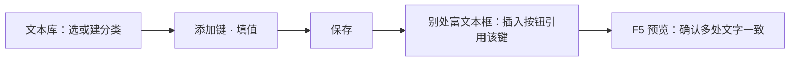

# 加一条文本

按钮上的字、系统提示、好几处都要用到的那句短话——这些不属于哪一段具体的故事，但游戏运转起来处处都在读它们，都归**文本库**管。这一页带你建一个键、填上文案，再在别的地方引用它，改一处、处处生效。

---

## 这是什么（30 秒看懂）

打个雾津的比方：文本库像衙门里挂在各处的匾额和告示牌——"内有恶犬""此路不通"这种简短、到处都要用、还得保持一致的字。结构很简单：一棵**分类树**，树下挂**键值对**——键是给系统认的名字，值是玩家真正看到的文字。

读完这页你能：

- 在合适的分类下新建一个键，填好文案。
- 用插入按钮，在别的面板（比如对话、档案）里引用这个键。
- 明白"改一次值会全站联动"这件事的好处和要注意的地方。

---

## 手把手逐步操作

### 第 1 步：选或建一个分类

打开主编辑器，进**资源 → 文本库**：

左侧是一棵分类树，选一个合适的分类，或者先想清楚这个键该归到哪一类——分类只是帮你和团队组织键名，不影响游戏逻辑本身。

### 第 2 步：新建一个键

点添加键，键名建议用点分层级的写法，比如 `ui.temple.omen_faded`，一看就懂它归哪块系统管。键名一旦定下，尽量别改。

### 第 3 步：填值

在值那一栏填上文案，比如"签文已消散"。如果这句话里要引用别的东西（比如玩家名字、另一个键），可以用带引用的文本标签。

### 第 4 步：保存

点保存这本文本库。

### 第 5 步：在别处引用这个键

去图对话的台词框、档案的正文框，或者其它接受带引用文本的地方，点框边的**插入**按钮，选**字符串**类型，在列表里选中刚建好的键，生成一段引用标签，替换掉原本手打的文字。

### 第 6 步：运行预览验证

**F5** 分别打开会读到这个键的界面，确认文字显示正确、两处内容一模一样。

---

## 流程示意

---

## 雾津完整实例：城隍庙求签的"签文已消散"

城隍庙求签失败时，图对话里有一句台词，见闻录里也有一条提到同样结果的条目——你想让这句话在两处保持完全一致，以后改一次就都跟着变：

1. **资源 → 文本库**，选到合适的分类（或新建一个"求签"分类），添加键 `ui.temple.omen_faded`。
2. 值填"签文已消散"，风格上和其它系统提示保持一致，不加多余标点。
3. 保存这本文本库。
4. 打开图对话，找到庙祝求签失败那句台词——原来是手打的"签文已消散"四个字，现在点开插入按钮，选字符串类型，选中 `ui.temple.omen_faded`，替换掉原来手打的文字。
5. 打开档案面板的见闻录条目，同样用插入按钮引用同一个键，而不是再手打一遍。
6. **F5** 分别触发那句台词、打开对应的见闻录条目，确认两处显示的字一模一样。
7. 以后想把这句话改成"签已随风而去"，只用回文本库改这一条键的值，图对话和见闻录会自动跟着变，不用两处分别去改。

一处改、处处变，这句话在雾津里才不会说着说着走了样。

---

## 进阶：每一项都讲透

### 分类树只管组织，不影响逻辑

分类树只是用来组织键名、方便你和团队找东西，不影响游戏逻辑本身。键该放哪个分类，取决于它属于哪块系统。分类越细，团队协作时越不容易互相踩键，也越方便本地化按批次导出翻译。

### 键名定下就别再改

命名建议保持稳定——一旦定下就尽量别改，因为改键名在这个面板里等价于"新建一个新键，然后自己去把所有引用它的地方手动改过来"，面板不会帮你自动搬家，旧键会孤零零地留在树里没人用。

### 值有三种类型

- **字符串**：走带引用的富文本，可以插名字、物品、旗标这些标签，也可以引用文本库里的另一个键，形成"文案套文案"的复用。
- **数字**：走数值输入。
- **布尔**：走开关输入，一般用来控制某个系统提示的显示与否。

### 谁在用文本库

游戏里的界面元素、系统菜单会直接读这里的键（这一步工程已经接好线，策划这边只管把值填对）；图对话、档案这些能写带引用文本的地方，也可以用字符串引用标签去引用文本库里的一个键，把一句反复出现的话集中改一处、处处生效。

### 改值全站联动，好处和风险各占一半

改一个键的值会立刻影响所有引用它的地方——这既是它的优点（改一处全站同步），也是它的风险（改错一处全站遭殃）。改值之前，养成先想一下"这个键还有谁在用"的习惯，避免动了一个通用键、结果好几处界面一起变了样。

### 键、分类都能删

选中键之后，删除按钮、右键菜单都能删；删掉一个分类，这个分类底下挂着的键会跟着一起被删掉，动手前想清楚这个分类下有没有别处还在用的键，免得删完某处界面突然找不到文案。

### 别拿这里存复杂结构

如果某个键的值是数组结构，保存后会被压成一整段字符串。需要存数组结构的数据，换别的地方维护，别用这个面板编辑它。

### 长文别塞进文本库

文本库放**短句**，长篇剧情文字应该放档案或图对话，别把大段说明文字硬塞进一个键里维护。

### 效率窍门

键名用点分层级（比如"分区.用途"）比拍脑袋起名更好维护，团队一眼能看出这个键归哪块系统管；批量新增时，建议先列好这一批键名和对应文案再逐条录入，比边想边填更不容易漏；长期不用的键，定期跟程序对一轮，清理掉真正废弃的部分，避免分类树越滚越大。

### 键值引用和直接手打文字的取舍

不是所有短句都值得建成键。只在一个地方出现、以后大概率也不会挪去别处用的一句话，直接在原地手打反而更省事；真正值得建键的，是那些"好几处要保持一字不差"或者"以后可能要统一改口径"的文案，比如系统提示语、常出现的称谓、按钮上的通用字样。拿不准的时候，想一想"这句话以后会不会在第二个地方原样出现"，会出现就建键，只用一次就手打。

### 和角色、物品这类引用标签一起使用

一句台词里经常不只引用一个文本库的键，还会同时引用角色名、物品名这类标签，几种标签叠着用没有问题。常见的组合是：系统提示部分用文本库的键保持统一措辞，中间夹杂的角色名、物品名用各自专门的引用标签，这样改角色名或物品名的时候，台词里对应的部分也会自动跟着变，不用去文本库和角色登记两头分别维护。

---

## 危险区与边界

- 键、分类都能删，删除按钮、右键菜单都能操作；删分类会连带删掉底下挂着的键，动手前想清楚。
- 改键名不会自动搬家，等于新建键加自己手动改所有引用处，旧键留在树里，要清理得自己动手删。
- 需要存数组结构的数据，换别处维护，不要用这个面板编辑——保存后会被压成一整段字符串。
- 改值全站联动，改之前先搜一下这个键还有谁在引用。
- 更完整的编辑器风险说明，见[危险区](../editors/concepts/danger-zone)。

---

## 常见问题

| 现象 | 原因 | 怎么办 |
|---|---|---|
| 界面显示一片空白 | 键名打错，或忘了保存 | 核对键名拼写，确认已保存 |
| 改了一个键，好几处界面都变了样 | 多处界面共用同一个键 | 要么接受联动，要么拆成各自独立的键 |
| 找不到当初建的那个键了 | 归到了别的分类，或键名和预想的不一样 | 用分类树逐层找，或按点分层级的写法回忆键名 |
| 引用标签显示成空白或原样显示 | 引用的键名拼错，或键已被删除 | 优先用插入按钮生成引用，避免手打出错 |
| 想存一组列表数据，保存后变成一整段字符串 | 这个面板不适合存数组结构 | 换别处维护这条数据 |
| 过时的键越堆越多 | 没人去清理，界面本身有删除入口 | 选中直接删，删前先确认没别处还在引用 |
| 不确定一句话该建键还是直接手打 | 没想清楚这句话会不会在第二个地方原样出现 | 只用一次就手打，好几处要保持一致才建键 |

---

## 相关

- [文本库面板](../editors/panels/strings)
- [怎么写带引用的文本](../editors/concepts/rich-text)
- [全局配置](../editors/panels/config)
- [档案](../editors/panels/archive)
- [按目标查：我想做…](./goal-index)
