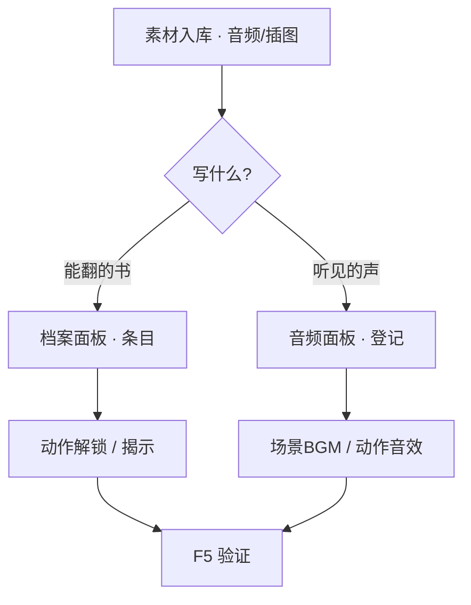

# 加旁白、见闻录与音效

雾津不止眼前一条路——**档案**里收人物簿、见闻录、杂书；**音频**里铺街声、堂乐、按键音。这一页分两块：写玩家能翻的文本条目，配场景与界面听得见的声音。

---

## 读完你能做到什么

- 在**档案**面板新增或修改见闻录、人物条目
- 在正文里插图片、引用（档案是唯一带插图按钮的面板）
- 在**音频**面板登记 BGM、环境声、音效
- 把 BGM 挂到场景，把音效挂到动作或过场
- 运行预览里翻档案、听声音

---

## 档案：见闻录与旁白文本

> **[档案](../reference/glossary)**：游戏内「书本」系统——人物簿、见闻录、文档揭示等，玩家从菜单翻开看。

```bash
./dev.sh editor
```

左侧 → **资源与本地化 → 档案**。

### 加一条见闻录

1. 选分类（见闻录、人物、杂书等）
2. 新建条目，填**标题**与**正文**（支持富文本）
3. 需要插图时，用检查器里的**插图按钮**——别在别的面板手搓图片标签，档案才顺手
4. **Ctrl+S** 保存

:::warning[档案的当心项]
- 书籍**某一页**删不得，只能改内容
- 「印象」类条目只能加、不能单条删
- 切换条目若没保存就丢了——改完先存再换页
:::

### 让玩家在游戏里看到

常见做法：

| 做法 | 说明 |
|---|---|
| 动作「解锁档案条目」 | 剧情到点把条目放进玩家书匣 |
| 文档揭示 | 模糊图渐显类演出，另有过场面板 |
| 富文本引用 | 对话里提 `[名字]` 等，见 [富文本](../editors/main-editor/shared-rich-text) |

旁白若只是过场里念一句，不一定进档案——过场面板写呈现步骤即可；**见闻录**适合「玩家事后能翻查」的设定与线索。

---

## 音频：BGM 与音效

> **BGM**：场景背景音乐；**环境声**：循环的街声、雨声；**音效**：一次性的门响、脚步、UI 咔哒。

同一导航组 → **音频**面板，分标签管理：

| 标签 | 放什么 |
|---|---|
| BGM | 各场景或情境的背景乐 |
| 环境声 | 循环氛围 |
| 音效 | 短促触发声 |
| 系统音效 | 菜单、确认等 UI 声 |

### 登记一段声音

1. 音频文件先用 [导入一张素材](./import-art) 选「游戏 / 音频」入库
2. **音频**面板对应标签 → 新建条目 → 选声音文件
3. 保存

:::danger[音频条目是危险区]
保存时条目会被**重建**，只保留编辑器认识的项。别在条目里塞音量、循环等编辑器没给的字段——会被抹掉。要改播放方式，在场景、动作或过场里配，而不是硬塞音频条目。
:::

### 挂到游戏里

| 声音类型 | 常见挂法 |
|---|---|
| 场景 BGM | **场景**面板 → 背景音乐项 |
| 环境声 | 场景面板环境声列表 |
| 一次性音效 | 过场步骤、图对话动作、信号 |
| 系统音 | 音频面板系统音效区 |

---

## 操作示意

<svg viewBox="0 0 700 340" xmlns="http://www.w3.org/2000/svg" role="img" aria-label="档案与音频示意" style={{width:'100%', height:'auto'}}>
  <rect width="700" height="340" fill="#1a1510" rx="8"/>
  <rect x="20" y="20" width="310" height="300" fill="#1f1810" stroke="#e0a44e" rx="8"/>
  <text x="175" y="52" textAnchor="middle" fill="#e0a44e" fontSize="14" fontFamily="serif">档案</text>
  <text x="40" y="84" fill="#c9bda1" fontSize="11">人物簿 · 见闻录 · 杂书</text>
  <rect x="40" y="100" width="270" height="80" fill="#2a2218" rx="4"/>
  <text x="175" y="145" textAnchor="middle" fill="#8a7a5c" fontSize="11">富文本 + 插图按钮</text>
  <rect x="370" y="20" width="310" height="300" fill="#1f1810" stroke="#5a8a86" rx="8"/>
  <text x="525" y="52" textAnchor="middle" fill="#5a8a86" fontSize="14" fontFamily="serif">音频</text>
  <text x="390" y="84" fill="#c9bda1" fontSize="11">BGM · 环境 · 音效 · 系统</text>
  <rect x="390" y="100" width="270" height="36" fill="#2a2218" rx="4"/>
  <text x="525" y="123" textAnchor="middle" fill="#f0e7d2" fontSize="10">选已入库音频文件</text>
  <text x="525" y="280" textAnchor="middle" fill="#8a7a5c" fontSize="11">↓ 场景 / 动作 / 过场引用</text>
</svg>

---

## 流程示意



---

## 雾津小例子

**城隍庙**夜祭两场戏：

1. **档案**加见闻录《庙规三则》，插图用庙门线稿，任务中途动作解锁
2. **音频**登记 `bgm_temple_night`，挂到城隍庙场景；登记锣声效，过场「鸣锣」步播放
3. **F5** 夜探：进庙听 BGM，触发过场听锣，打开书匣查《庙规三则》图文是否在

字与声都齐了，庙才庄严。

---

## 接下来读什么

| 页面 | 内容 |
|---|---|
| [档案面板](../editors/panels/archive) | 分类与字段 |
| [音频面板](../editors/panels/audio) | 四类声音 |
| [富文本字段](../editors/main-editor/shared-rich-text) | 引用与标签 |
| [危险区](../editors/concepts/danger-zone) | 音频重建区 |
