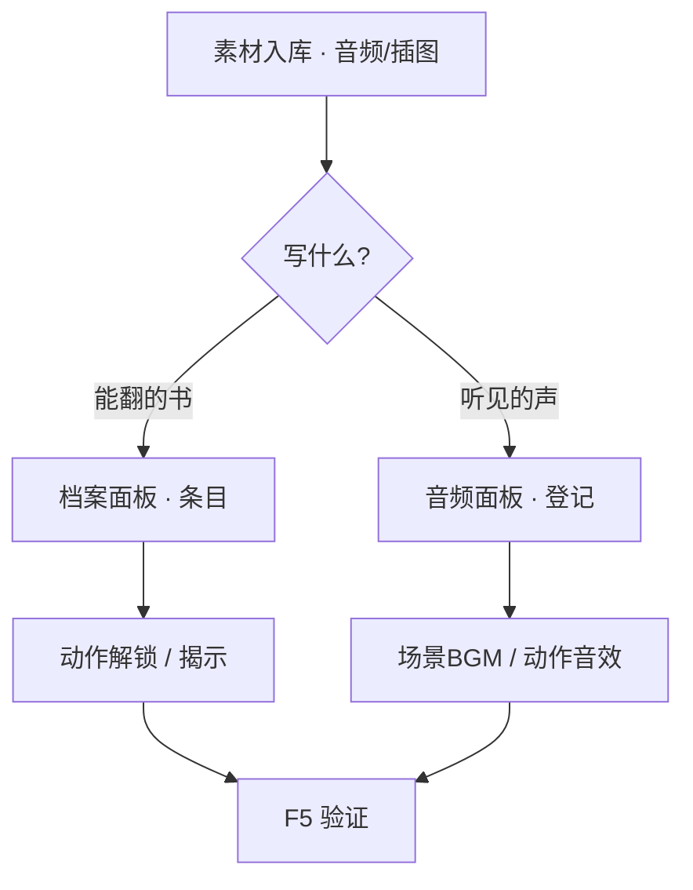

# 加旁白、见闻录与音效

雾津不止眼前一条路——**档案**里收人物簿、见闻录、杂书；**音频**里铺街声、堂乐、按键音。这一页分两块：写玩家能翻的文本条目，配场景与界面听得见的声音。

---

## 读完你能做到什么


*档案面板：Characters 标签下是人物簿条目（王大爷、说书人张叨叨等）。*

- 在**档案**面板新增或修改见闻录、人物条目
- 在正文里插图片、引用（档案是唯一带插图按钮的面板）
- 在**音频**面板登记 BGM、环境声、音效
- 把 BGM 挂到场景，把音效挂到动作或过场
- 运行预览里翻档案、听声音

---

## 档案：见闻录与旁白文本

> **[档案](../reference/glossary)**：游戏内「书本」系统——人物簿、见闻录、文档揭示等，玩家从菜单翻开看。

```bash
./dev.sh editor
```

左侧 → **资源与本地化 → 档案**。

### 加一条见闻录

1. 选分类（见闻录、人物、杂书等）
2. 新建条目，填**标题**与**正文**（支持富文本）
3. 需要插图时，用检查器里的**插图按钮**——别在别的面板手搓图片标签，档案才顺手
4. **Ctrl+S** 保存

:::tip[档案的当心项]
- 书籍的**页**和「印象」类条目都能单条删除，写错了直接删掉重写，不用只靠新增覆盖
- 切换条目时，编辑器会自动提交当前正在编辑的内容
:::

### 让玩家在游戏里看到

常见做法：

| 做法 | 说明 |
|---|---|
| 动作「解锁档案条目」 | 剧情到点把条目放进玩家书匣 |
| 文档揭示 | 模糊图渐显类演出，另有过场面板 |
| 富文本引用 | 对话里提 `[名字]` 等，见 [富文本](../editors/main-editor/shared-rich-text) |

旁白若只是过场里念一句，不一定进档案——过场面板写呈现步骤即可；**见闻录**适合「玩家事后能翻查」的设定与线索。

---

## 音频：BGM 与音效

> **BGM**：场景背景音乐；**环境声**：循环的街声、雨声；**音效**：一次性的门响、脚步、UI 咔哒。

同一导航组 → **音频**面板，分标签管理：

| 标签 | 放什么 |
|---|---|
| BGM | 各场景或情境的背景乐 |
| 环境声 | 循环氛围 |
| 音效 | 短促触发声 |
| 系统音效 | 菜单、确认等 UI 声 |

### 登记一段声音

1. 音频文件先用 [导入一张素材](./import-art) 选「游戏 / 音频」入库
2. **音频**面板对应标签 → 新建条目 → 选声音文件
3. 保存

:::tip[音频条目管登记，不管播放参数]
保存时编辑器只更新音源路径，其余已填字段维持原样。这个面板**没有**音量、循环这类播放参数的输入口，想控制音量/循环，去场景、动作或过场里配对应的播放设置。
:::

### 挂到游戏里

| 声音类型 | 常见挂法 |
|---|---|
| 场景 BGM | **场景**面板 → 背景音乐项 |
| 环境声 | 场景面板环境声列表 |
| 一次性音效 | 过场步骤、图对话动作、信号 |
| 系统音 | 音频面板系统音效区 |

---

## 进阶：档案与音频的深水区

### 档案：三种条目，各有各的坑

- **人物簿的印象（impressions）**是一组「条件 + 一段文字」，随剧情推进逐条追加，玩家会看到印象越写越厚。**写错的条目能删**，每条都有删除按钮；不想删也可以照旧加一条去覆盖观感。下笔前先想好推进顺序（比如「初见→熟识→知晓身世」），能省不少返工。
- **已知信息**同样是条件加文字的分段列表，适合拆成「外貌」「脾气」「来历」这种小节，每段各自的解锁条件互不影响。
- **书籍**是书（Book）→ 页（Page）→ 条（Entry）三级结构，适合装线装古卷这类需要「翻页」体验的长文。**页（Page）和条目（Entry）都能删**，规划书籍结构时不用过度保守。
- **切换人物/见闻/文档/书籍这几个子 Tab** 时，编辑器会自动提交正在编辑的条目内容。
- 每条见闻/文档最好配上**解锁条件**和**首次阅读动作**：前者决定玩家什么时候能翻到，后者决定「读过了」这件事有没有在游戏里留痕迹（比如记一个旗标）。首次阅读动作漏填，等于玩家读了但游戏当他没读过。

### 音频：登记简单，播放参数不归它管

- 面板保存时会复制条目原有的全部字段，只更新音源路径——但这个面板本身**没提供**音量、循环这类参数的输入口。要控制音量/循环，走场景、动作或过场自己的播放设置，而不是指望音频条目本身管这些。
- **环境声（ambient）和 BGM 是分开叠加播放的**——设计时要留意两路会不会互相打架（比如细雨环境声叠加庙钟 BGM 时听感是否清晰），场景里静止十几秒试听最容易发现问题。
- **系统音效** 是系统按键音的映射表（比如 UI 确认音），改动这里会影响全局所有菜单交互的声音，别和场景专属音效搞混。
- 老手做法：登记音频条目时 id 尽量**语义化且稳定**（比如 `bgm_temple_night`），以后换文件不用换 id，避免到处找引用。

### 和别的面板配合

- 档案的解锁条件、首次阅读动作大多落在[旗标](../editors/panels/flags)上，先想清楚用哪个旗标记录「读过没读过」。
- 长旁白如果只是过场里念一句，直接写在过场步骤里就够，不必进档案——**档案适合「玩家事后能翻查」的设定与线索**，过场适合「当场演一遍就过去」的内容。
- 音效要接进游戏，离不开 [信号 Cue](../editors/panels/cue-signal)、过场步骤、图对话动作三个挂载点——音频面板本身只是登记表，不会自己响。

---

## 危险区与边界

| 边界 | 说明 |
|---|---|
| **音频条目没有音量/循环输入口** | 这个面板管不了播放参数，去场景/动作/过场配 |
| **档案印象能删单条** | 每条都有删除按钮，写错了直接删，不用只能新增覆盖 |
| **书籍的 Page 能删** | 界面就有删除入口，不用刻意保守规划页数 |
| **切换档案子 Tab 会自动提交** | 切走前正在编辑的内容照常保留 |
| **插图按钮只有档案有** | 别的富文本框想插图得手打标签，没有便捷按钮 |

更完整的说明见 [危险区](../editors/concepts/danger-zone)。

---

## 操作示意

<svg viewBox="0 0 700 340" xmlns="http://www.w3.org/2000/svg" role="img" aria-label="档案与音频示意" style={{width:'100%', height:'auto'}}>
  <rect width="700" height="340" fill="#1a1510" rx="8"/>
  <rect x="20" y="20" width="310" height="300" fill="#1f1810" stroke="#e0a44e" rx="8"/>
  <text x="175" y="52" textAnchor="middle" fill="#e0a44e" fontSize="14" fontFamily="serif">档案</text>
  <text x="40" y="84" fill="#c9bda1" fontSize="11">人物簿 · 见闻录 · 杂书</text>
  <rect x="40" y="100" width="270" height="80" fill="#2a2218" rx="4"/>
  <text x="175" y="145" textAnchor="middle" fill="#8a7a5c" fontSize="11">富文本 + 插图按钮</text>
  <rect x="370" y="20" width="310" height="300" fill="#1f1810" stroke="#5a8a86" rx="8"/>
  <text x="525" y="52" textAnchor="middle" fill="#5a8a86" fontSize="14" fontFamily="serif">音频</text>
  <text x="390" y="84" fill="#c9bda1" fontSize="11">BGM · 环境 · 音效 · 系统</text>
  <rect x="390" y="100" width="270" height="36" fill="#2a2218" rx="4"/>
  <text x="525" y="123" textAnchor="middle" fill="#f0e7d2" fontSize="10">选已入库音频文件</text>
  <text x="525" y="280" textAnchor="middle" fill="#8a7a5c" fontSize="11">↓ 场景 / 动作 / 过场引用</text>
</svg>

---

## 流程示意



---

## 雾津小例子

**城隍庙**夜祭两场戏：

1. **档案**加见闻录《庙规三则》，插图用庙门线稿，任务中途动作解锁
2. **音频**登记 `bgm_temple_night`，挂到城隍庙场景；登记锣声效，过场「鸣锣」步播放
3. **F5** 夜探：进庙听 BGM，触发过场听锣，打开书匣查《庙规三则》图文是否在

字与声都齐了，庙才庄严。

---

## 常见问题

| 现象 | 原因 | 怎么办 |
|---|---|---|
| 插图插不进对话框/其它面板 | 插图按钮只有档案编辑器有 | 把这段文字改放到档案里做，或退而求其次手打插图短名 |
| 印象条目写错了想删掉 | 界面只加不删单条 | 加一条新的去覆盖观感，或联系程序清理数据 |
| 切换档案子 Tab 后编辑不见了 | 忘了先 Apply | 养成编完立刻 Apply 的习惯，重新补录 |
| 条目在游戏里一直不解锁 | 解锁条件没满足，或条件本身填错 | 用满足/不满足两种存档在预览里分别测试 |
| 玩家读过了但旗标没变 | 首次阅读动作没填或填错 | 回条目补上对应的记旗标动作 |
| 改了音量，保存后又恢复默认 | 音频面板不持久化音量、循环等字段 | 接受默认值，或改到场景/动作/过场自己的播放设置里 |
| 游戏里完全无声 | 音频文件没入库，或 id 引用写错 | 同步资源并核对 id 是否与音频面板一致 |

---

## 接下来读什么

| 页面 | 内容 |
|---|---|
| [档案面板](../editors/panels/archive) | 分类与字段 |
| [音频面板](../editors/panels/audio) | 四类声音 |
| [富文本字段](../editors/main-editor/shared-rich-text) | 引用与标签 |
| [危险区](../editors/concepts/danger-zone) | 危险区速查 |
