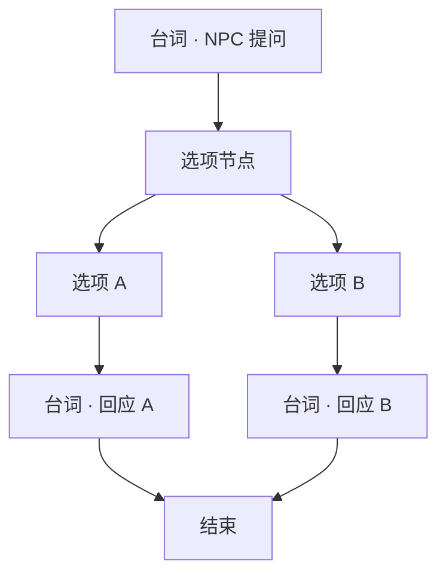

# 写一段带选择的对白

雾津里的人精着呢——你夸他，他顺杆爬；你损他，他跟你急。这种分岔用**选项节点**做：玩家点不同选项，后面接不同**台词节点**，甚至接不同的**跑动作**。

---

## 这是什么（30 秒看懂）

普通台词是唱本上一条直线的词，念完翻下一页。**带选择的对白**在唱本里插了一个岔路口：玩家读到这里，得自己点一个选项，唱本才知道接下来翻到哪一页。这个岔路口在图对话里就是**选项节点**——它列出两条或更多选项，每条各自连着后面不同的台词，甚至有的选项压根点不了（因为你没攒够钱、没学到那条规矩、任务还没推到那一步）。

除了「玩家自己点」的岔路，还有一种「系统自己判断」的岔路——**分支节点**：不问玩家，直接按当前的旗标、任务状态自动分流到不同台词。两种都是分岔，区别只在于「谁来做决定」。

## 读完你能做到什么

- 在对白图里串起：台词 → 选项 → 分支台词 → 结束
- 给选项加显示文字、门槛（旗标 / 条件 / 规矩提示）
- 预览里逐条选项走一遍，确认分支都对

---

## 怎么开工具

主编辑器 → **叙事编排 → 图对话**

```bash
./dev.sh dialogue-graph
```

节点类型大白话对照：

| 节点 | 用途 |
|---|---|
| **台词节点** | 谁说了什么 |
| **选项节点** | 列出 2～N 个可点选项 |
| **分支节点** | 不按玩家点选、按任务/旗标自动分流 |
| **跑动作** | 给物品、改旗标、开过场等 |
| **结束** | 关对话框 |

---

## 手把手逐步操作


*图对话面板：选项分支就在这张节点画布上牵线连接。*

### 第 1 步：开头台词

1. 选对白图（或新建——在项目工作流允许的前提下）
2. 画布放 **台词节点**，写 NPC 抛出来的问题
   例：李天狗说——「你寻狗，还是寻别的？」
3. 设好「下一跳」暂时留空，后面接选项

### 第 2 步：加选项节点

1. 从上一台词节点的「下一跳」**选…** → 新建 **选项节点**
2. 检查器里：
   - **提示台词**（可选）：选项上方再飘半句，如「你怎么答？」
   - **选项列表**：每条有 **显示文字** 和 **下一跳**

添加至少两条，例如：

| 选项文字 | 下一跳 |
|---|---|
| 「就寻狗，别绕弯。」 | → 台词节点 A（李天狗冷淡回） |
| 「顺便打听神仙顶。」 | → 台词节点 B（李天狗眯眼） |

### 第 3 步：接分支台词

1. 每个选项的「下一跳」各连一个 **台词节点**，写不同回应
2. 两条线最后都连到 **结束**，或汇到同一句收尾台词再 **结束**

### 第 4 步：选项门槛（可选）

某选项要「有钱」「懂规矩」「任务进行中」才可选：

- **需要旗标** / **需要条件** —— 检查器里对应项
- **禁点提示** —— 条件不满足时玩家点了显示的说明
- **规矩提示** —— 跟规矩系统联动（见 [做一个遭遇](./encounter)）

灰掉的选项仍可见或完全隐藏，视你填的条件与项目表现而定。

### 第 5 步：连线方式

两种都行：

- 检查器「下一跳」框旁 **选…** 点目标节点
- 画布上从节点**出口拖线**到下一个节点**入口**

### 第 6 步：保存与验证

1. **Ctrl+S**
2. 确认 NPC 或热区引用的仍是这张图
3. **F5** 触发对话，**每个选项都点一遍**，走到底

:::tip[节点保存不丢字段]
检查器覆盖了该节点类型的全部活字段，保存后都会保留；改结构还是走检查器里的选项，别在外部手改。
:::

---

## 流程示意



带 **分支节点** 时：某台词后不接选项，接 **分支节点**，按任务状态自动跳到不同台词——适合「已经见过面」和「第一次见面」两套词。

---

## 雾津完整实例

**任务**：关二狗在茶馆听评书，玩家可选硬夸或装穷，两条线各自记不同旗标；如果玩家兜里没钱，「装穷」选项要显示禁点提示而不是直接灰掉隐藏。

1. 台词：关二狗嘀咕「先生这段值不值得赏？」
2. 选项节点：
   - 「〔硬夸〕全雾津头一份！」→ 关二狗得意，旁白加一句
   - 「〔装穷〕茶钱都不够……」→ 需要旗标「持有铜钱数量为 0」，否则显示禁点提示「你兜里明明有钱」
3. 两线各一句 **跑动作**（设旗标 `tea_praised` 或 `tea_cheap`）再 **结束**
4. **F5** 在茶馆触发，先带钱进去试一次（应该看到禁点提示，点不了装穷），再清空钱包试一次（装穷可选）

---

## 常见卡点

**选项列表里加了新的一条，游戏里却没显示？**
检查选项自己的「显示条件」有没有意外被设成了某个不成立的判断——条件不满足时，有的项目表现是灰掉，有的是彻底不显示，取决于你有没有勾隐藏。先把条件清空测一遍，确认选项本身没问题，再一步步加条件。

**点了选项，对话直接跳到最后或者卡住不动？**
多半是选项的「下一跳」没接对——要么指向了一个不存在的节点，要么压根没设。回去逐条选项检查下一跳，画布上重新拖一次连线更保险。

**灰掉的选项，玩家点了却毫无反应，也没有提示？**
「禁点提示」是单独一个字段，条件不满足不会自动生成提示文字——你得自己在检查器里把这句提示写好，否则玩家只会觉得点了没用，不知道为什么。

**分支节点没有按预期分流，走到了默认分支？**
分支节点的 CASE 是按顺序匹配的，第一个条件成立的分支生效；如果你想要的分支排在了另一个更宽泛的条件后面，可能永远轮不到它。检查 CASE 的排列顺序，把更具体的条件放前面。

**保存后发现某个选项的门槛设置消失了？**
先确认门槛条件用的旗标/任务/物品 id 是不是被删了或改了名——这是最常见的原因。选项的全部字段（文案、下一跳、门槛、消耗、提示）检查器都覆盖，保存后会保留；只通过检查器里提供的选项填写，别手动在别处拼凑。

---

## 进阶变体

- **选项花费**：想让某个选项「点一下要花钱」，选项上有专门的花费字段，玩家钱不够时会连带门槛一起判定不可选，不用你自己另写一条条件去查钱包余额。
- **规矩提示做暗示**：选项可以挂一个规矩提示 id——玩家还没点，先看到一句和某条规矩相关的暗示文字，常用来引导玩家「这里好像该用点什么手段」，跟 [立一条规矩](./rule) 配合最合适。
- **分支节点用来做"已认识"分支**：同一个 NPC，第一次见面和后来再聊，台词应该不一样。做法是台词节点后接**分支节点**，按「是否已经完整聊过一次」的旗标分流，而不是为每次相遇各画一张新图。
- **主人态 / 上下文态节点联动叙事状态机**：更复杂的项目里，对话的走向可能要跟着整体剧情进度走，而不是靠对话图自己攒的旗标判断——这时用主人态或上下文态节点，直接读叙事状态机当前停在哪个状态来分支，具体配合方式见 [叙事状态机](../editors/narrative-domain/narrative-editor-web)。
- **选项后接跑动作再结束**：分支选完不一定马上结束，可以先接一个跑动作节点做点「隐藏」的事——加个旗标、给点道具、悄悄推进任务——再走向结束，玩家感觉是自然聊完，其实背后已经记录了选择。
- **两条分支汇成同一句收尾**：不想为每条分支各写一句结束语，可以让两条不同的回应台词最后都指向同一个收尾台词节点再结束——省事，也能让玩家感觉「不管怎么选，故事都会回到同一个节奏上」。

---

## 相关手册

- [图对话面板](../editors/panels/dialogue-graph)
- [图对话编辑器](../editors/narrative-domain/dialogue-graph-editor)
- [怎么设条件](../editors/concepts/conditions)
- [怎么编排动作](../editors/concepts/actions) —— 选项后接 **跑动作**
- [放一个会说话的 NPC](./place-npc) —— 把图挂到 NPC 上
- [立一条规矩](./rule) —— 选项门槛常用规矩层级判断
