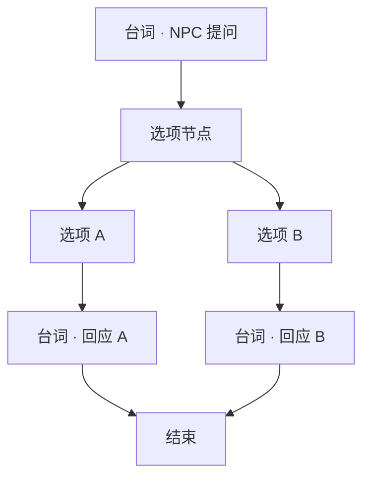

# 写一段带选择的对白

雾津里的人精着呢——你夸他，他顺杆爬；你损他，他跟你急。这种分岔用**选项节点**做：玩家点不同选项，后面接不同**台词节点**，甚至接不同的**跑动作**。

---

## 读完你能做到什么

- 在对白图里串起：台词 → 选项 → 分支台词 → 结束
- 给选项加显示文字、门槛（旗标 / 条件 / 规矩提示）
- 预览里逐条选项走一遍，确认分支都对

---

## 怎么开工具

主编辑器 → **叙事编排 → 图对话**

```bash
./dev.sh dialogue-graph
```

节点类型大白话对照：

| 节点 | 用途 |
|---|---|
| **台词节点** | 谁说了什么 |
| **选项节点** | 列出 2～N 个可点选项 |
| **分支节点** | 不按玩家点选、按任务/旗标自动分流 |
| **跑动作** | 给物品、改旗标、开过场等 |
| **结束** | 关对话框 |

---

## 逐步操作

### 第 1 步：开头台词

1. 选对白图（或新建——在项目工作流允许的前提下）
2. 画布放 **台词节点**，写 NPC 抛出来的问题  
   例：李天狗说——「你寻狗，还是寻别的？」
3. 设好「下一跳」暂时留空，后面接选项

### 第 2 步：加选项节点

1. 从上一台词节点的「下一跳」**选…** → 新建 **选项节点**
2. 检查器里：
   - **提示台词**（可选）：选项上方再飘半句，如「你怎么答？」
   - **选项列表**：每条有 **显示文字** 和 **下一跳**

添加至少两条，例如：

| 选项文字 | 下一跳 |
|---|---|
| 「就寻狗，别绕弯。」 | → 台词节点 A（李天狗冷淡回） |
| 「顺便打听神仙顶。」 | → 台词节点 B（李天狗眯眼） |

### 第 3 步：接分支台词

1. 每个选项的「下一跳」各连一个 **台词节点**，写不同回应
2. 两条线最后都连到 **结束**，或汇到同一句收尾台词再 **结束**

### 第 4 步：选项门槛（可选）

某选项要「有钱」「懂规矩」「任务进行中」才可选：

- **需要旗标** / **需要条件** —— 检查器里对应项
- **禁点提示** —— 条件不满足时玩家点了显示的说明
- **规矩提示** —— 跟规矩系统联动（见 [做一个遭遇](./encounter)）

灰掉的选项仍可见或完全隐藏，视你填的条件与项目表现而定。

### 第 5 步：连线方式

两种都行：

- 检查器「下一跳」框旁 **选…** 点目标节点
- 画布上从节点**出口拖线**到下一个节点**入口**

### 第 6 步：保存与验证

1. **Ctrl+S**
2. 确认 NPC 或热区引用的仍是这张图
3. **F5** 触发对话，**每个选项都点一遍**，走到底

:::warning[改过的节点会重建]
保存时，被编辑过的节点只保留检查器认识的字段。别在外部乱改节点结构。
:::

---

## 流程示意



带 **分支节点** 时：某台词后不接选项，接 **分支节点**，按任务状态自动跳到不同台词——适合「已经见过面」和「第一次见面」两套词。

---

## 雾津小例子

**任务**：关二狗在茶馆听评书，玩家可选硬夸或装穷。

1. 台词：关二狗嘀咕「先生这段值不值得赏？」
2. 选项节点：
   - 「〔硬夸〕全雾津头一份！」→ 关二狗得意，旁白加一句
   - 「〔装穷〕茶钱都不够……」→ 邻桌茶客斜眼
3. 两线各一句 **跑动作**（设旗标 `tea_praised` 或 `tea_cheap`）再 **结束**
4. **F5** 在茶馆触发，两条都试

---

## 相关手册

- [图对话面板](../editors/panels/dialogue-graph)
- [图对话编辑器](../editors/narrative-domain/dialogue-graph-editor)
- [怎么设条件](../editors/concepts/conditions)
- [怎么编排动作](../editors/concepts/actions) —— 选项后接 **跑动作**
- [放一个会说话的 NPC](./place-npc) —— 把图挂到 NPC 上
